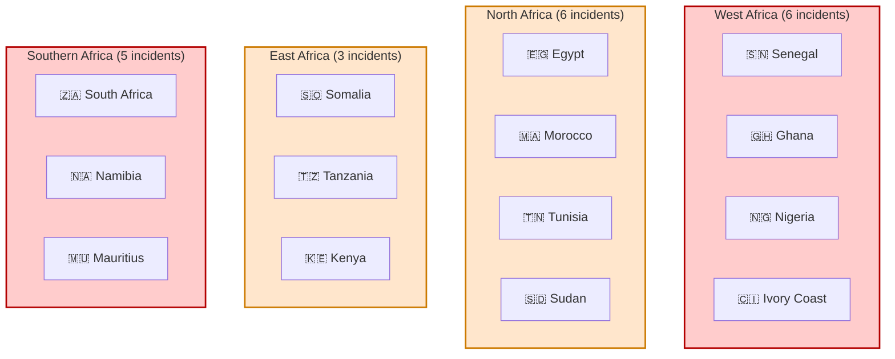
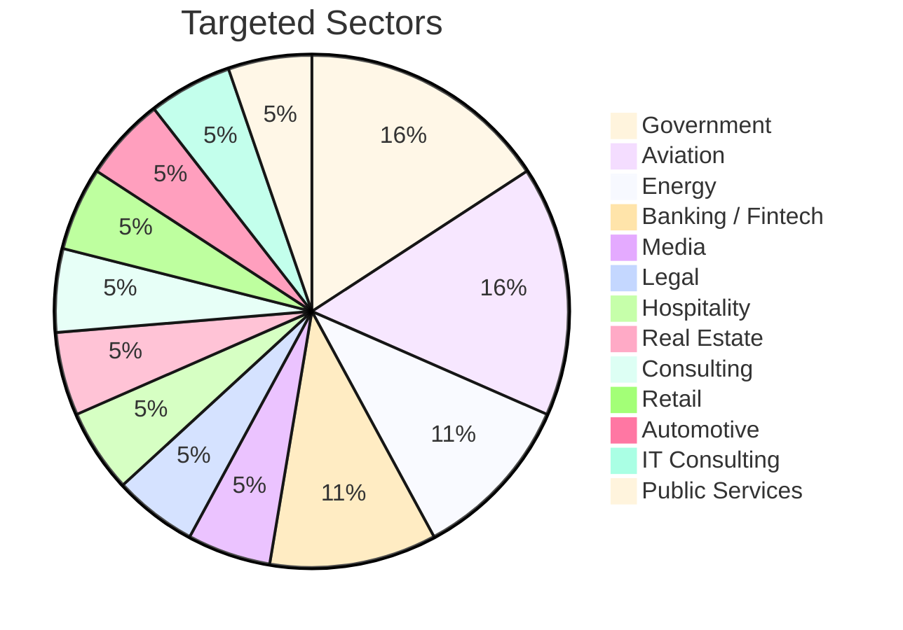

# AFRINTEL - Statistics by Actor and by Country (February 2026)
👉🏾 [**French version available here** ](./README_FR.md)

This folder contains detailed statistics of ransomware incidents recorded across Africa for February 2026.

---

## 📊 Overview

| Metric | Value |
|----------|--------|
| **Total incidents** | 20 |
| **Countries impacted** | 14 |
| **Active threat actors** | 11 |
| **Largest claimed volume** | 139 TB, DAF Senegal |

---

## 🗺️ Country Distribution

| Country | Number of Incidents | Main Actors |
|------|-------------------|---------------------|
| 🇿🇦 **South Africa** | 3 | `thegentlemen` (1), `lockbit5` (1), `vect` (1) |
| 🇪🇬 **Egypt** | 3 | `thegentlemen` (1), `lockbit5` (1), `payload` (1) |
| 🇳🇬 **Nigeria** | 2 | `killsec` (1), `incransom` (1) |
| 🇬🇭 **Ghana** | 2 | `0APT` (1), `thegentlemen` (1) |
| 🇸🇳 **Senegal** | 1 | `The Green Blood Group` (1) ⚠️ **139 TB** |
| 🇸🇴 **Somalia** | 1 | `0APT` (1) |
| 🇹🇿 **Tanzania** | 1 | `0APT` (1) |
| 🇰🇪 **Kenya** | 1 | `thegentlemen` (1) |
| 🇲🇺 **Mauritius** | 1 | `lockbit5` (1) |
| 🇹🇳 **Tunisia** | 1 | `thegentlemen` (1) |
| 🇸🇩 **Sudan** | 1 | `apt73/bashe` (1) |
| 🇨🇮 **Ivory Coast** | 1 | `incransom` (1) |
| 🇲🇦 **Morocco** | 1 | `tengu` (1) |
| 🇳🇦 **Namibia** | 1 | `qilin` (1) |

---

## 🎯 Distribution by threat actor

| Actor | Incidents | Targeted Countries | Total Volume |
|--------|-----------|-------------|--------------|
| `thegentlemen` | **5** | Kenya, Ghana, Egypt, South Africa (×2), Tunisia | ~? |
| `0APT` | **3** | Somalia, Ghana, Tanzania | **~7 TB** |
| `lockbit5` | **3** | Mauritius, Egypt, South Africa | Not aggregated |
| `incransom` | **2** | Nigeria, Ivory Coast | **~210 GB** |
| `The Green Blood Group` | **1** | Senegal | **139 TB** ⚠️ |
| `killsec` | **1** | Nigeria | ~? |
| `vect` | **1** | South Africa | 151 GB |
| `qilin` | **1** | Namibia | ~? |
| `payload` | **1** | Egypt | ~? |
| `tengu` | **1** | Morocco | ~? |
| `apt73/bashe` | **1** | Sudan | ~? |

---

## 📈 Sector analysis

| Sector | Incidents | Main Actors |
|---------|-----------|---------------------|
| **Government** | 3 | `The Green Blood Group`, `lockbit5`, `thegentlemen` |
| **Aviation** | 3 | `0APT` (2), `thegentlemen`, `incransom` |
| **Energy** | 2 | `incransom`, `vect` |
| **Banking / Fintech** | 2 | `thegentlemen`, `killsec` |
| **Media** | 1 | `0APT` |
| **Legal** | 1 | `0APT` |
| **Hospitality** | 1 | `lockbit5` |
| **Real Estate** | 1 | `payload` |
| **Consulting** | 1 | `apt73/bashe` |
| **Retail / Commerce** | 1 | `qilin` |
| **Automotive** | 1 | `lockbit5` |
| **IT Consulting** | 1 | `thegentlemen` |
| **Public Services** | 1 | `thegentlemen` |

---

## 🔍 Top 5 Most targeted countries - February 2026

- South Africa ████████████░░░░ 3  
- Egypt ████████████░░░░ 3  
- Nigeria ████████░░░░░░░░ 2  
- Ghana ████████░░░░░░░░ 2  
- Senegal ████░░░░░░░░░░░░ 1 (139 TB)

---

## Actor → victim mapping

```mermaid
flowchart LR

  %% ===== STYLE =====
  classDef actor fill:#ffe6cc,stroke:#cc7a00,stroke-width:2px;
  classDef victim fill:#e6f2ff,stroke:#0066cc,stroke-width:2px;

  %% ===== ACTORS =====
  A1["The Green Blood Group"]:::actor
  A2["0APT"]:::actor
  A3["thegentlemen"]:::actor
  A4["lockbit5"]:::actor
  A5["incransom"]:::actor
  A6["payload"]:::actor
  A7["tengu"]:::actor
  A8["qilin"]:::actor
  A9["vect"]:::actor
  A10["apt73 / bashe"]:::actor
  A11["killsec"]:::actor

  %% ===== VICTIMS =====
  V1["DAF Senegal\n(daf.sn)\n🇸🇳 Senegal"]:::victim
  V2["BlueSky Aviation\n(bluesky-air.com)\n🇸🇴 Somalia"]:::victim
  V3["Global Media Alliance\n(globalmediaalliance.com)\n🇬🇭 Ghana"]:::victim
  V4["Vertex Law Chambers\n(vertexlaw.co.tz)\n🇹🇿 Tanzania"]:::victim
  V5["Wells Fargo Kenya\n(fargo.co.ke)\n🇰🇪 Kenya"]:::victim
  V6["Ghana Bauxite\n(ghanabauxite.com)\n🇬🇭 Ghana"]:::victim
  V7["Nile Air\n(nileair.com)\n🇪🇬 Egypt"]:::victim
  V8["Intsika Yethu Municipality\n(intsikayethu.gov.za)\n🇿🇦 South Africa"]:::victim
  V9["BITS\n(bits.com.tn)\n🇹🇳 Tunisia"]:::victim
  V10["Sands Suites Resort\n(sands.mu)\n🇲🇺 Mauritius"]:::victim
  V11["Ministry of Agriculture\n(moa.gov.eg)\n🇪🇬 Egypt"]:::victim
  V12["Diesel-Electric\n(diesel-electric.co.za)\n🇿🇦 South Africa"]:::victim
  V13["Midwestern Oil & Gas\n(midwesternog.com)\n🇳🇬 Nigeria"]:::victim
  V14["Air Côte d’Ivoire\n(aircotedivoire.com)\n🇨🇮 Ivory Coast"]:::victim
  V15["SODIC\n(sodic.com)\n🇪🇬 Egypt"]:::victim
  V16["Shora Advisory\n(shora.ma)\n🇲🇦 Morocco"]:::victim
  V17["CYMOT\n(cymot.com)\n🇳🇦 Namibia"]:::victim
  V18["EnerTec\n(enertec.co.za)\n🇿🇦 South Africa"]:::victim
  V19["AMTAAR\n(amtaar.com)\n🇸🇩 Sudan"]:::victim
  V20["Getly\n(getly.app)\n🇳🇬 Nigeria"]:::victim

  %% ===== RELATIONSHIPS =====
  A1 --> V1
  A2 --> V2
  A2 --> V3
  A2 --> V4
  A3 --> V5
  A3 --> V6
  A3 --> V7
  A3 --> V8
  A3 --> V9
  A4 --> V10
  A4 --> V11
  A4 --> V12
  A5 --> V13
  A5 --> V14
  A6 --> V15
  A7 --> V16
  A8 --> V17
  A9 --> V18
  A10 --> V19
  A11 --> V20
```

---
## 📊 Visual intelligence layer
### 🗺️ Heatmap - Regional Threat Intensity Overview

---

## Sector distribution

---
## 🔴 Critical incident: DAF SENEGAL

- **Actor**: `The Green Blood Group`
- **Volume**: 139 TB
- **Country**: Senegal
- **Sector**: Government
- **Data**: Citizen database, biometric data, immigration records

⚠️ Largest data leak ever recorded in Africa.

---
## 🔗 Quick links

- [Full report (FR)](../../../CyberAttackAfrica/2026/02-february/README_FR.md)
- [Full report (EN)](../../../CyberAttackAfrica/2026/02-february/README.md)
---
## ✍🏿 Author

**Adama ASSIONGBON**  
SOC & Cyber Threat Intelligence Consultant
[LinkedIn Profile](https://www.linkedin.com/in/adama-assiongbon-9029893a/)

---

*AFRINTEL - Open CTI Monitoring Initiative*  
*TLP:CLEAR - Public Sharing Permitted*
