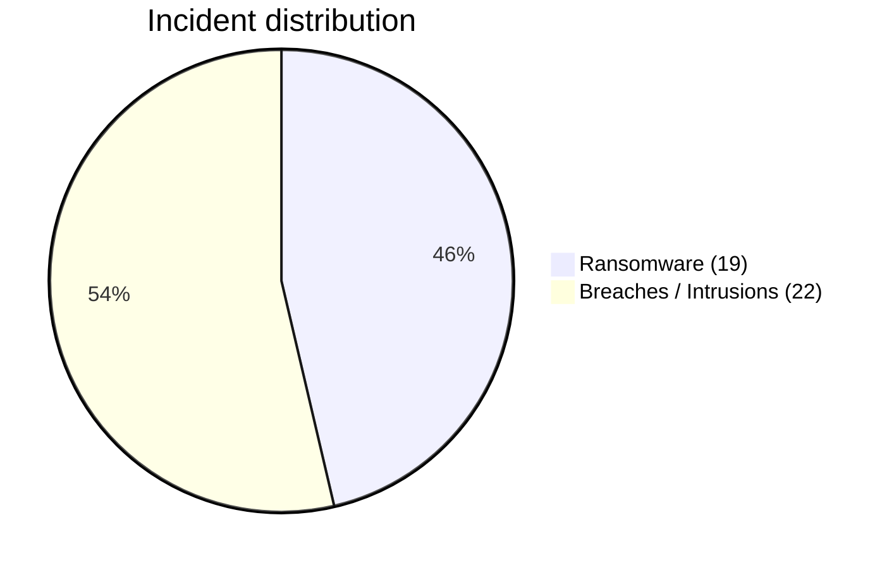
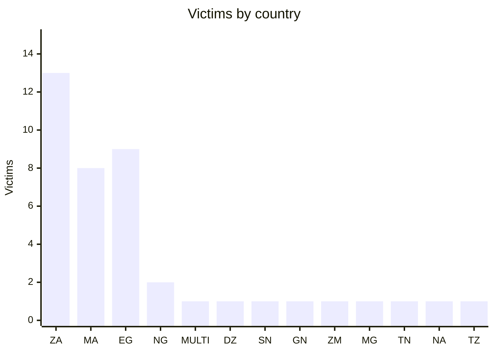
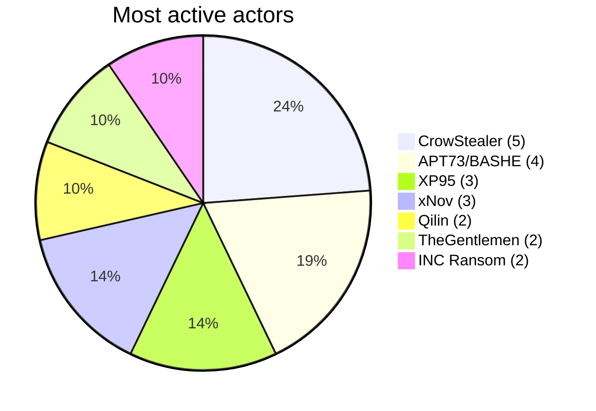
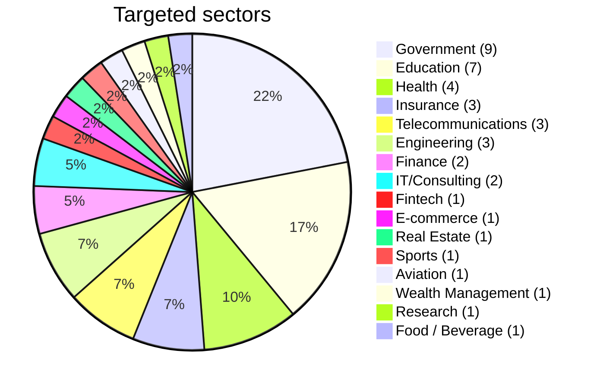

# AFRINTEL - Africa Cyber Statistics (March 2026)

## Global overview

| Indicator | Value |
|---|---|
| Victims recorded | 41 |
| Countries affected | 12 (plus 1 multi-country incident) |
| Attributed threat actors | 26 |
| Incidents without public attribution | 1 |
| Ransomware incidents | 19 |
| Data breaches / intrusions | 22 |

## Most affected countries

| Country | Victims |
|---|---|
| 🇿🇦 South Africa | 13 |
| 🇲🇦 Morocco | 8 |
| 🇪🇬 Egypt | 9 |
| 🇳🇬 Nigeria | 2 |
| 🌍 Multi-country | 1 |
| 🇩🇿 Algeria | 1 |
| 🇸🇳 Senegal | 1 |
| 🇬🇳 Guinea | 1 |
| 🇿🇲 Zambia | 1 |
| 🇲🇬 Madagascar | 1 |
| 🇹🇳 Tunisia | 1 |
| 🇳🇦 Namibia | 1 |
| 🇹🇿 Tanzania | 1 |

## Threat actor distribution

| Actor | Victims |
|---|---|
| CrowStealer | 5 |
| APT73/BASHE | 4 |
| XP95 | 3 |
| xNov | 3 |
| Qilin | 2 |
| TheGentlemen | 2 |
| INC Ransom | 2 |

## Sector distribution

| Sector | Incidents |
|---|---|
| Government / Administration | 9 |
| Education / University | 7 |
| Health | 4 |
| Insurance | 3 |
| Telecommunications | 3 |
| Engineering / Construction | 3 |
| Finance / Banking | 2 |
| IT / Consulting | 2 |
| Fintech | 1 |
| E-commerce / Classifieds | 1 |
| Real Estate / Classifieds | 1 |
| Sports / Leisure | 1 |
| Aviation | 1 |
| Wealth Management | 1 |
| Research / Think tank | 1 |
| Food / Beverage | 1 |

## Ransomware vs Breaches by country

| Country | Ransomware | Breaches |
|---|---|---|
| 🇿🇦 South Africa | 7 | 6 |
| 🇲🇦 Morocco | 5 | 3 |
| 🇪🇬 Egypt | 3 | 6 |
| 🇳🇬 Nigeria | 0 | 2 |

```mermaid
xychart-beta
    title "Ransomware vs Breaches"
    x-axis ["South Africa","Morocco","Egypt","Nigeria"]
    y-axis "Incidents" 0 --> 8
    bar [7,5,3,0]
    bar [6,3,5,2]
```

## CTI Trends

- South Africa recorded the highest March volume, with 13 records.
- Morocco recorded 8 records and Egypt 9, including publications concerning state institutions.
- Government and education sectors account for over 40% of incidents.
- Data breaches and intrusions represented 22 of 41 March records.
- Supply-chain exposure and a direct financial intrusion were documented during the month.

---

AFRINTEL - African Cyber Threat Intelligence
