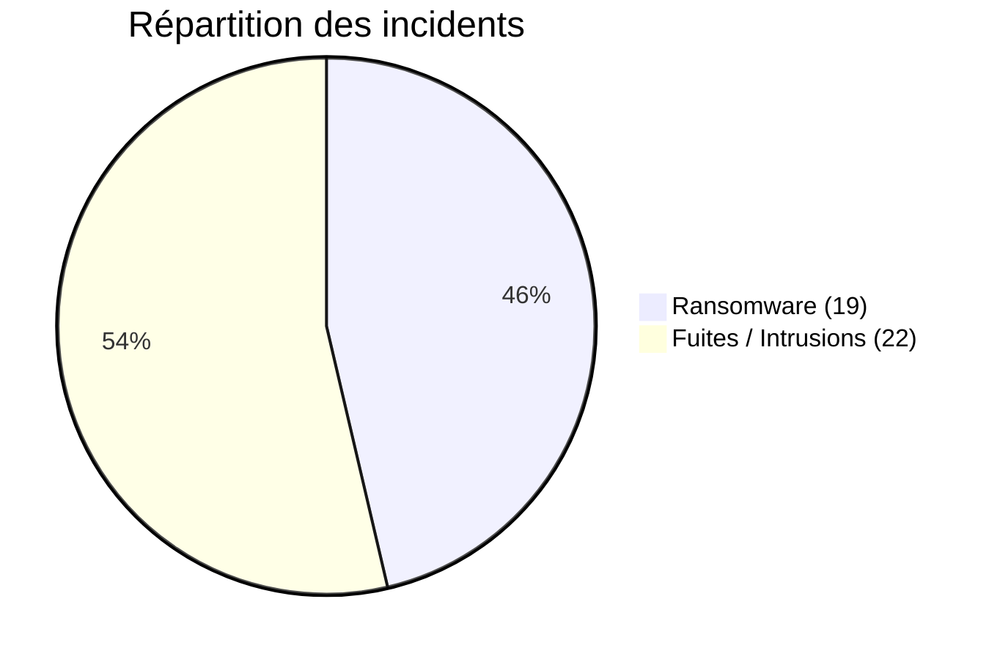
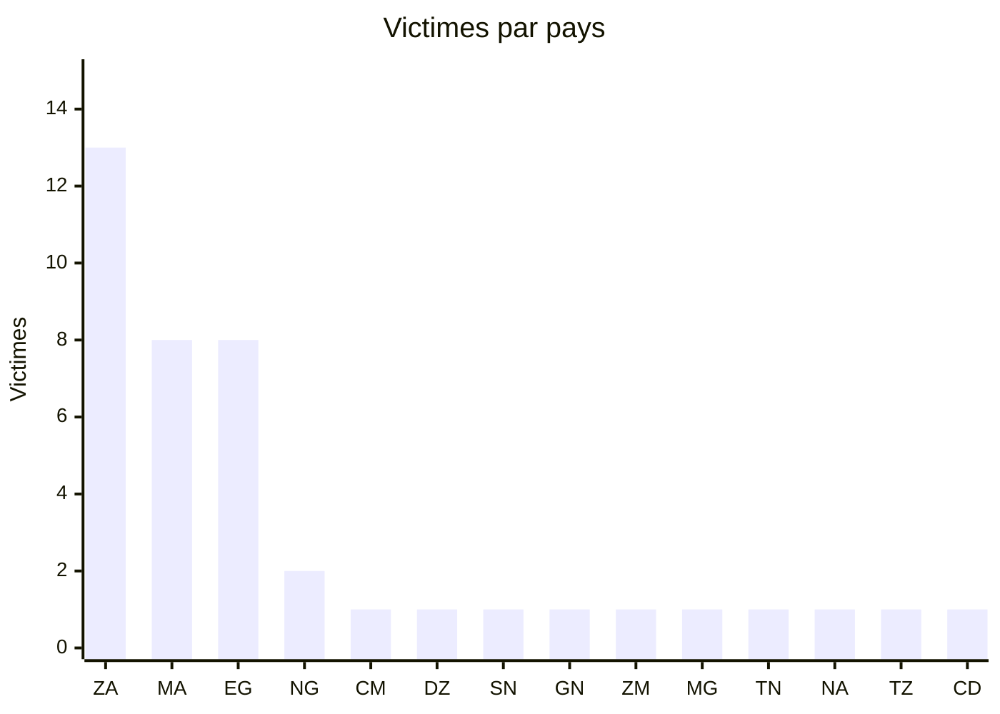
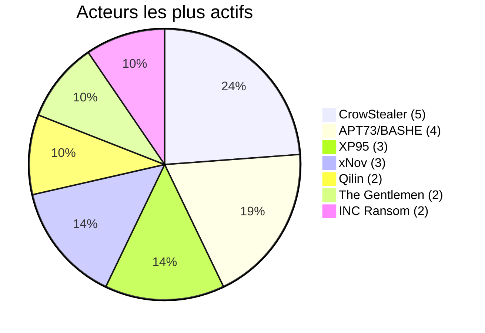
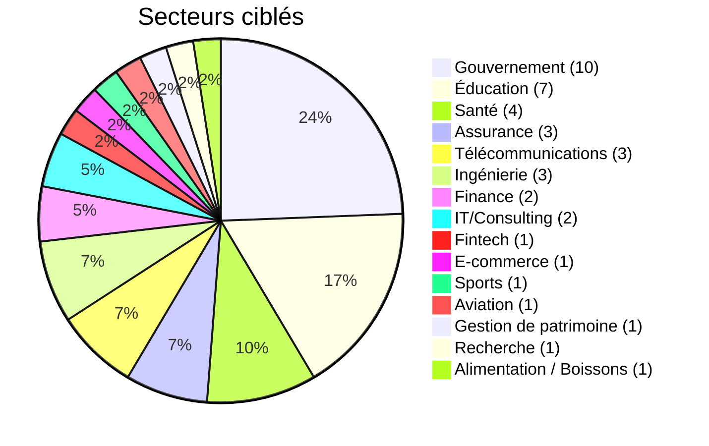

# AFRINTEL - Statistiques Cyber Afrique (Mars 2026)

## Résumé global

| Indicateur | Valeur |
|---|---|
| Victimes recensées | 41 |
| Pays touchés | 14 |
| Acteurs attribués | 26 |
| Incidents sans attribution publique | 1 |
| Incidents ransomware | 19 |
| Fuites de données / intrusions | 22 |

## Pays les plus touchés

| Pays | Victimes |
|---|---|
| 🇿🇦 Afrique du Sud | 13 |
| 🇲🇦 Maroc | 8 |
| 🇪🇬 Égypte | 8 |
| 🇳🇬 Nigeria | 2 |
| 🇨🇲 Cameroun | 1 |
| 🇩🇿 Algérie | 1 |
| 🇸🇳 Sénégal | 1 |
| 🇬🇳 Guinée | 1 |
| 🇿🇲 Zambie | 1 |
| 🇲🇬 Madagascar | 1 |
| 🇹🇳 Tunisie | 1 |
| 🇳🇦 Namibie | 1 |
| 🇹🇿 Tanzanie | 1 |
| 🇨🇩 RDC | 1 |

## Répartition par acteur

| Acteur | Victimes |
|---|---|
| CrowStealer | 5 |
| APT73/BASHE | 4 |
| XP95 | 3 |
| xNov | 3 |
| Qilin | 2 |
| The Gentlemen | 2 |
| INC Ransom | 2 |

## Répartition sectorielle

| Secteur | Incidents |
|---|---|
| Gouvernement / Administration | 10 |
| Éducation / Université | 7 |
| Santé | 4 |
| Assurance | 3 |
| Télécommunications | 3 |
| Ingénierie / Construction | 3 |
| Finance / Banque | 2 |
| IT / Consulting | 2 |
| Fintech | 1 |
| E-commerce / Classifieds | 1 |
| Sports / Leisure | 1 |
| Aviation | 1 |
| Gestion de patrimoine | 1 |
| Recherche / Think tank | 1 |
| Alimentation / Boissons | 1 |

## Ransomware vs Fuites par pays

| Pays | Ransomware | Fuites |
|---|---|---|
| 🇿🇦 Afrique du Sud | 7 | 6 |
| 🇲🇦 Maroc | 5 | 3 |
| 🇪🇬 Égypte | 3 | 5 |
| 🇳🇬 Nigeria | 0 | 2 |

```mermaid
xychart-beta
    title "Ransomware vs Fuites"
    x-axis ["Afrique du Sud","Maroc","Égypte","Nigeria"]
    y-axis "Incidents" 0 --> 8
    bar [7,5,3,0]
    bar [6,3,5,2]
```

## Tendances CTI

- L’Afrique du Sud enregistre le volume le plus élevé en mars, avec 13 fiches.
- Le Maroc et l’Égypte comptent chacun 8 fiches, dont des publications concernant des institutions publiques.
- Les secteurs gouvernementaux et éducatifs représentent plus de 40 % des incidents.
- Les fuites et intrusions représentent 22 des 41 fiches de mars.
- Une exposition de chaîne d’approvisionnement et une intrusion financière directe sont documentées pendant le mois.

---

AFRINTEL - African Cyber Threat Intelligence
