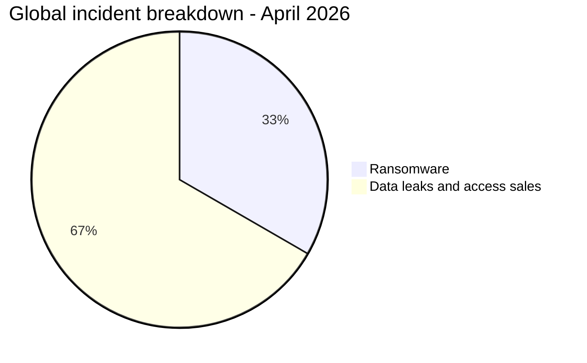
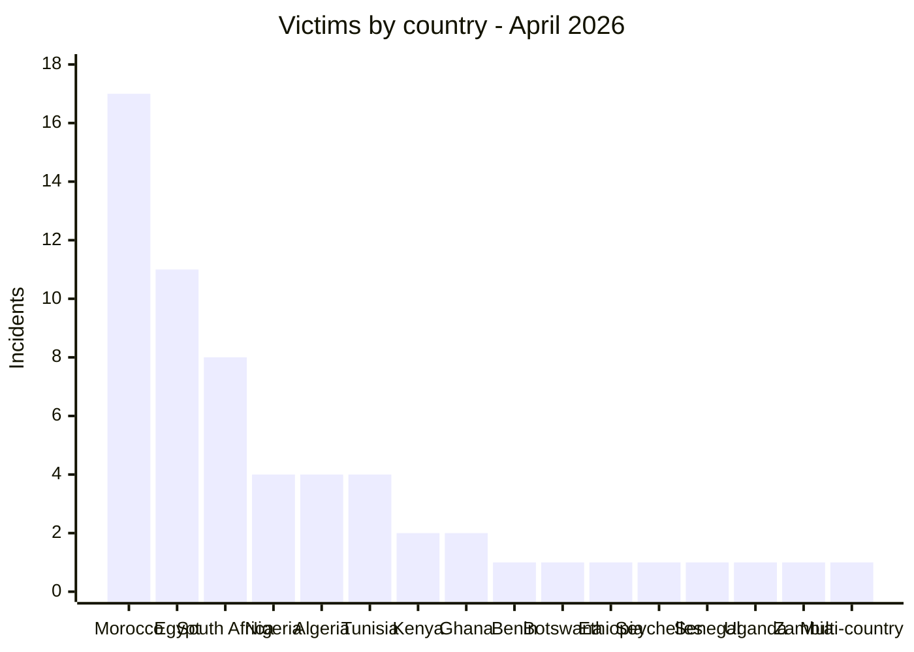
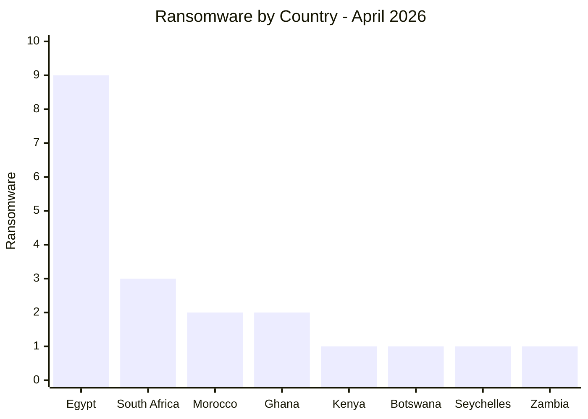
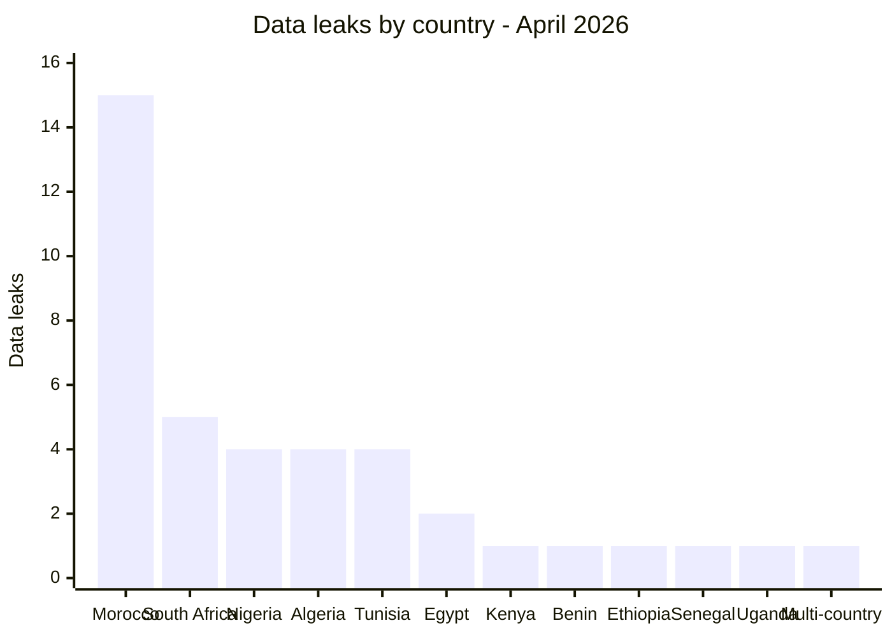
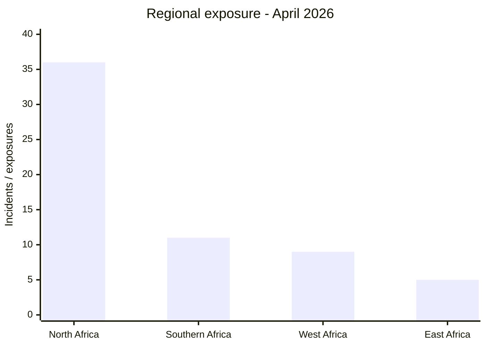
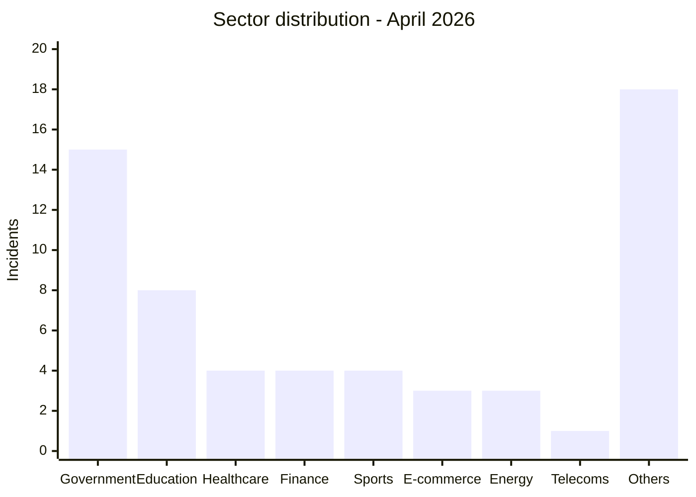
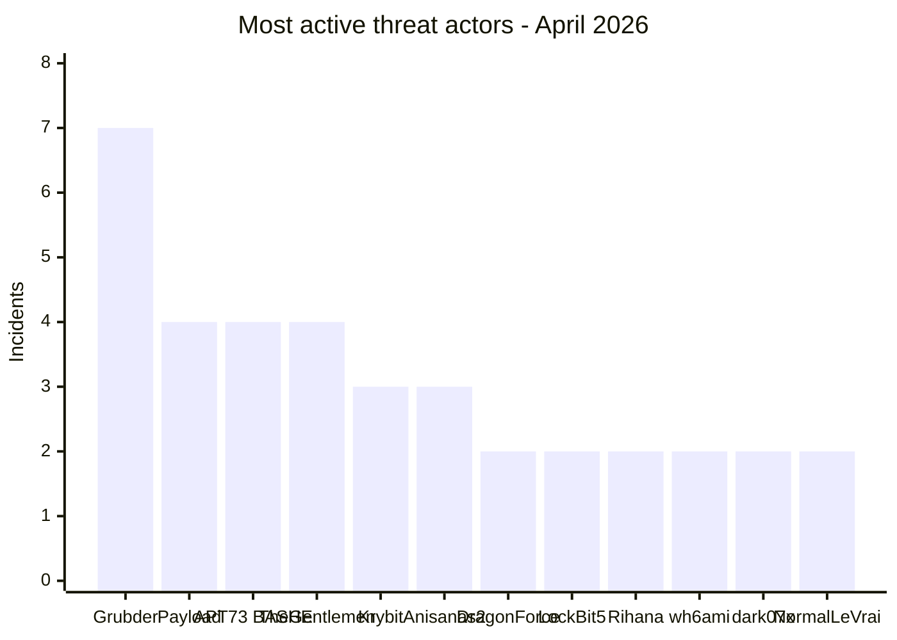

# AFRINTEL - Africa cyber statistics
## April 2026

👉🏾 [**French version available here**](./README_FR.md)

## Methodology note

These statistics are based on publicly claimed or observed incidents within the AFRINTEL monitoring scope for April 2026. Content originating from cybercriminal forums, leak sites, or underground channels is treated as a **claim** unless independently confirmed by the victim or supported by verifiable technical evidence.

The multi-country incident involving `Angola / South Africa / Nigeria` is counted as **1 incident** in the global total of 60. For regional exposure analysis, it is also mapped to each affected geographic region.

---

## 1. Statistical summary

| Indicator | Value |
|---|---:|
| Total incidents | 60 |
| Ransomware attacks | 20 |
| Data leaks / access sales | 40 |
| Countries affected | 16 |
| Distinct threat actors | 30+ |
| Most affected country | Morocco |
| Main ransomware country | Egypt |
| Main data leak country | Morocco |

### Global breakdown

| Incident type | Count | Percentage |
|---|---:|---:|
| Ransomware | 20 | 33.3% |
| Data leaks / access sales | 40 | 66.7% |
| **Total** | **60** | **100%** |

---

## 2. Victim distribution by country

| Country | Incidents |
|---|---:|
| 🇲🇦 Morocco | 17 |
| 🇪🇬 Egypt | 11 |
| 🇿🇦 South Africa | 8 |
| 🇳🇬 Nigeria | 4 |
| 🇩🇿 Algeria | 4 |
| 🇹🇳 Tunisia | 4 |
| 🇰🇪 Kenya | 2 |
| 🇬🇭 Ghana | 2 |
| 🇧🇯 Benin | 1 |
| 🇧🇼 Botswana | 1 |
| 🇪🇹 Ethiopia | 1 |
| 🇸🇨 Seychelles | 1 |
| 🇸🇳 Senegal | 1 |
| 🇺🇬 Uganda | 1 |
| 🇿🇲 Zambia | 1 |
| 🌍 Multi-country Africa | 1 |
| **Total** | **60** |

---

## 3. Ransomware vs data leaks by country

| Country | Ransomware | Data Leaks / Access Sales | Total |
|---|---:|---:|---:|
| 🇲🇦 Morocco | 2 | 15 | 17 |
| 🇪🇬 Egypt | 9 | 2 | 11 |
| 🇿🇦 South Africa | 3 | 5 | 8 |
| 🇳🇬 Nigeria | 0 | 4 | 4 |
| 🇩🇿 Algeria | 0 | 4 | 4 |
| 🇹🇳 Tunisia | 0 | 4 | 4 |
| 🇰🇪 Kenya | 1 | 1 | 2 |
| 🇬🇭 Ghana | 2 | 0 | 2 |
| 🇧🇯 Benin | 0 | 1 | 1 |
| 🇧🇼 Botswana | 1 | 0 | 1 |
| 🇪🇹 Ethiopia | 0 | 1 | 1 |
| 🇸🇨 Seychelles | 1 | 0 | 1 |
| 🇸🇳 Senegal | 0 | 1 | 1 |
| 🇺🇬 Uganda | 0 | 1 | 1 |
| 🇿🇲 Zambia | 1 | 0 | 1 |
| 🌍 Multi-country Africa | 0 | 1 | 1 |
| **Total** | **20** | **40** | **60** |

### Ransomware by country

### Data leaks by country

---

## 4. Geographic breakdown

| Region | Countries Included | Total Incidents | Ransomware | Data Leaks |
|---|---|---:|---:|---:|
| North Africa | 🇲🇦 Morocco, 🇩🇿 Algeria, 🇹🇳 Tunisia, 🇪🇬 Egypt | 36 geographic occurrences | 11 | 25 |
| West Africa | 🇳🇬 Nigeria, 🇧🇯 Benin, 🇸🇳 Senegal, 🇬🇭 Ghana | 9 (15%) | 2 | 7 |
| Southern Africa | 🇿🇦 South Africa, 🇧🇼 Botswana, 🇿🇲 Zambia | 11 (18%) | 5 | 6 |
| East Africa | 🇪🇹 Ethiopia, 🇰🇪 Kenya, 🇸🇨 Seychelles, 🇺🇬 Uganda | 5 (8%) | 2 | 3 |
| Central Africa | 🇦🇴 Angola | 1 geographic occurrence | 0 | 1 |

> Note: the multi-country incident involving Angola, South Africa, and Nigeria is counted within affected regions for regional exposure analysis. This view reflects exposure distribution, not a strictly deduplicated total.

---

## 5. Sector distribution

| Sector | Incidents | Percentage |
|---|---:|---:|
| Government / Administration | 15 | 25.0% |
| Education / University | 8 | 13.3% |
| Healthcare / Medical | 4 | 6.7% |
| Finance / Banking | 4 | 6.7% |
| Sports / Federations | 4 | 6.7% |
| E-commerce / Retail | 3 | 5.0% |
| Oil & Energy | 3 | 5.0% |
| Telecommunications | 1 | 1.7% |
| Other sectors | 18 | 30.0% |
| **Total** | **60** | **100%** |

---

## 6. Most active threat actors

| Threat Actor / Group | Incidents | Dominant Type |
|---|---:|---|
| Grubder | 7 | Data leaks |
| Payload | 4 | Ransomware |
| APT73 / BASHE | 4 | Ransomware |
| TheGentlemen | 4 | Ransomware |
| Krybit | 3 | Ransomware |
| Anisanas2 | 3 | Data leaks |
| DragonForce | 2 | Ransomware |
| LockBit5 | 2 | Ransomware |
| Rihana | 2 | Data leaks |
| wh6ami | 2 | Data leaks |
| dark07x | 2 | Data leaks |
| NormalLeVrai | 2 | Data leaks |
| Other actors | 23 | Mixed |

---

## 7. CTI Trend analysis

### 7.1 Data leaks dominate the threat landscape

Data leaks and access sales represent **66.7%** of observed incidents. This indicates that the African cybercrime ecosystem is not limited to ransomware: customer databases, government access, KYC documents, and application dumps have become monetizable assets.

### 7.2 Morocco as the main data leak hotspot

Morocco accounts for **17 incidents**, including **15 data leaks**. Affected sectors include healthcare, education, sports, banking, personal data, and public institutions.

### 7.3 Egypt as the main ransomware hotspot

Egypt accounts for **9 ransomware incidents**, representing **45%** of ransomware activity observed during the month. Targeted sectors include finance, oil, automotive, construction, and manufacturing.

### 7.4 Pressure on public institutions

Government / administration is the most exposed sector with **15 incidents**. These include data leaks, access sales, exposed mailboxes, and claims of access to sensitive systems.

### 7.5 Identity and KYC data exposure

Several incidents exposed identity documents, KYC data, national IDs, passports, banking data, or sensitive personal information. These datasets can support document fraud, targeted phishing, identity theft, SIM swapping, or BEC operations.

---

## 8. SOC Monitoring priorities

| Priority | Monitoring focus |
|---|---|
| High | Unusual access to government portals |
| High | Bulk exports from education, healthcare, and CRM databases |
| High | Abnormal privileged account usage |
| Medium | SQL dumps, ZIP/RAR archives, and application source code leaks |
| Medium | Reuse of exposed credentials |
| Medium | Large outbound transfers or compressed data exfiltration |
| Medium | VPN, RDP, and Domain Controller access anomalies |

---

## 9. Conclusion

April 2026 confirms an intensification of cyber threats targeting Africa. The statistics show a clear dominance of data leaks and access sales, with significant exposure across government, education, and healthcare sectors.

Morocco, Egypt, and South Africa represent the three main exposure hotspots. AFRINTEL observations also indicate a maturing underground market targeting African organizations through the resale of databases, identity documents, and administrative access.

**AFRINTEL** - [African Cyber Threat Intelligence](https://github.com/Hatchepsoute/AFRINTEL)
