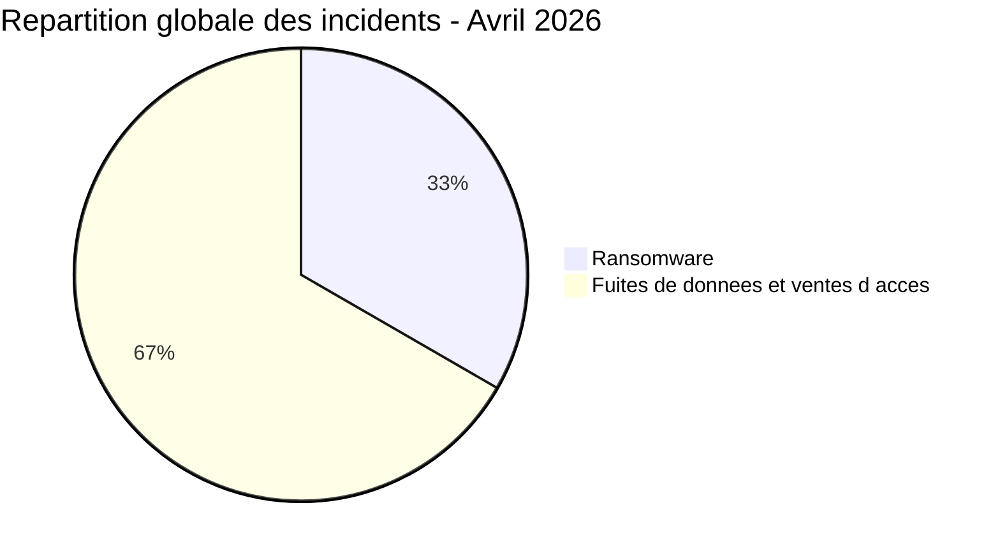
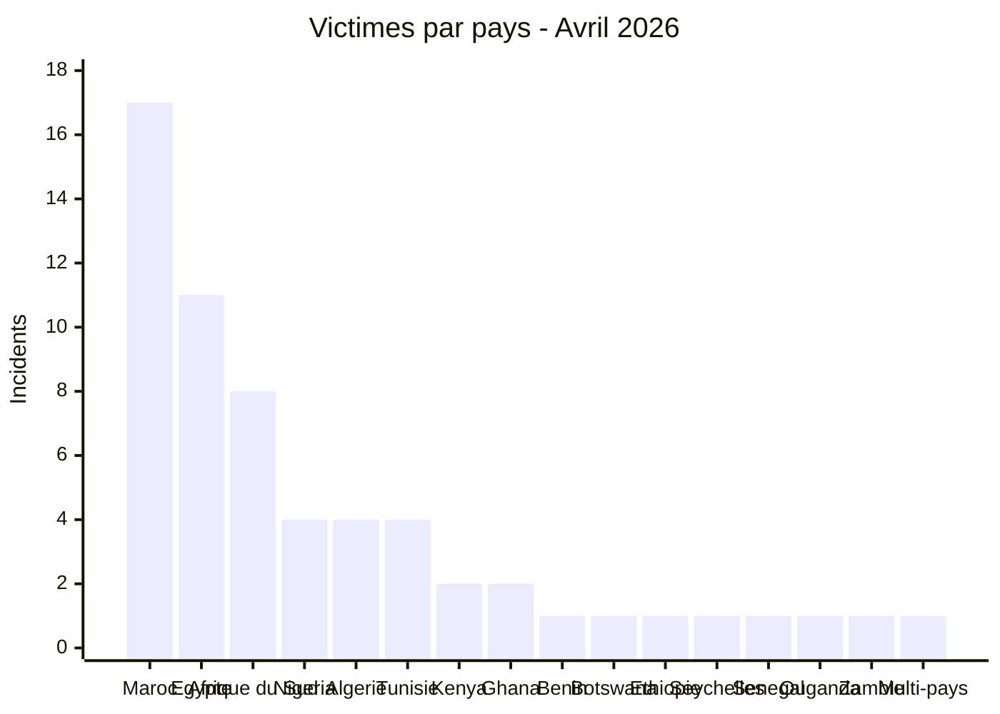
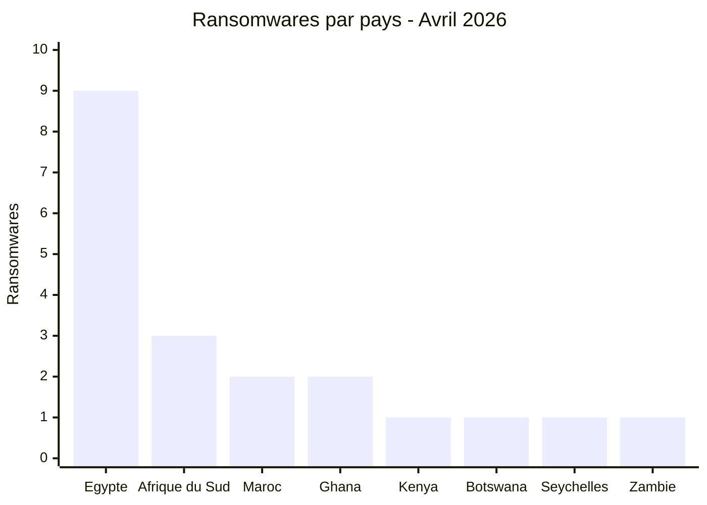
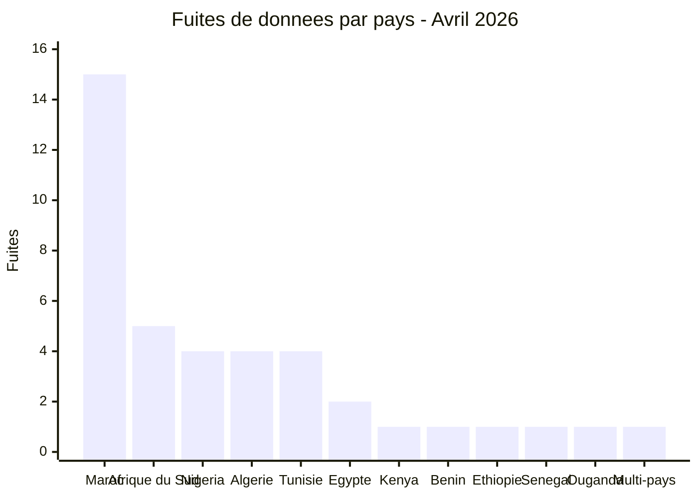
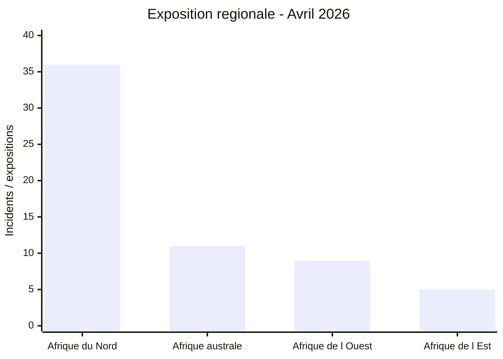
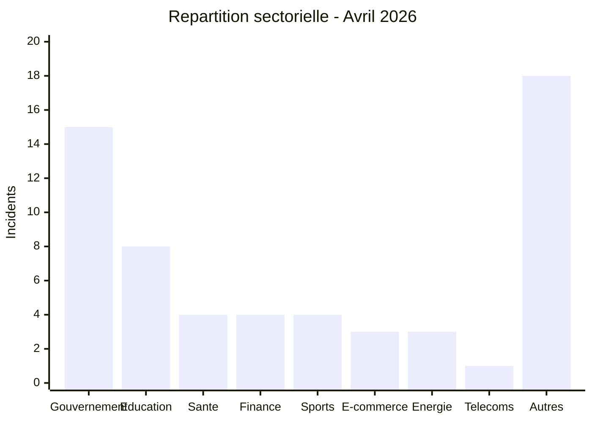
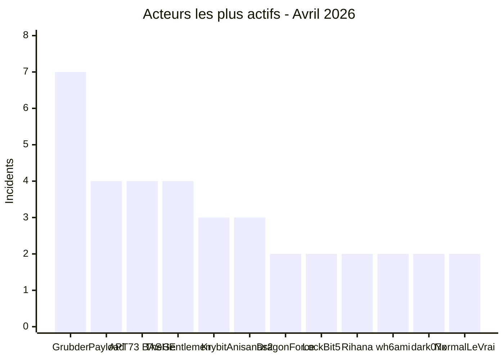

# AFRINTEL - Statistiques cyber Afrique
## Avril 2026

👉🏾 [**English version available here**](./README.md)

## Note méthodologique

Ces statistiques sont basées sur les incidents publiquement revendiqués ou observés dans le périmètre AFRINTEL pour avril 2026. Les contenus issus de forums cybercriminels, leak sites ou canaux underground sont traités comme des **revendications** tant qu’ils ne sont pas confirmés indépendamment par la victime ou par des preuves techniques vérifiables.

L’incident multi-pays `Angola / Afrique du Sud / Nigeria` est comptabilisé comme **1 incident** dans le total global de 60. Pour l’analyse régionale, il est également projeté dans les zones géographiques concernées afin de refléter l’exposition régionale réelle.

---

## 1. Synthèse statistique

| Indicateur | Valeur |
|---|---:|
| Total incidents | 60 |
| Attaques ransomware | 20 |
| Fuites de données / ventes d’accès | 40 |
| Pays touchés | 16 |
| Acteurs distincts | 30+ |
| Pays le plus touché | Maroc |
| Principal pays ransomware | Égypte |
| Principal pays fuites de données | Maroc |

### Répartition globale

| Type d’incident | Nombre | Pourcentage |
|---|---:|---:|
| Ransomware | 20 | 33,3 % |
| Fuites de données / ventes d’accès | 40 | 66,7 % |
| **Total** | **60** | **100 %** |

---

## 2. Répartition des victimes par pays

| Pays | Incidents |
|---|---:|
| 🇲🇦 Maroc | 17 |
| 🇪🇬 Égypte | 11 |
| 🇿🇦 Afrique du Sud | 8 |
| 🇳🇬 Nigeria | 4 |
| 🇩🇿 Algérie | 4 |
| 🇹🇳 Tunisie | 4 |
| 🇰🇪 Kenya | 2 |
| 🇬🇭 Ghana | 2 |
| 🇧🇯 Bénin | 1 |
| 🇧🇼 Botswana | 1 |
| 🇪🇹 Éthiopie | 1 |
| 🇸🇨 Seychelles | 1 |
| 🇸🇳 Sénégal | 1 |
| 🇺🇬 Ouganda | 1 |
| 🇿🇲 Zambie | 1 |
| 🌍 Multi-pays Afrique | 1 |
| **Total** | **60** |

---

## 3. Ransomware vs fuites de données par pays

| Pays | Ransomware | Fuites de données / ventes d’accès | Total |
|---|---:|---:|---:|
| 🇲🇦 Maroc | 2 | 15 | 17 |
| 🇪🇬 Égypte | 9 | 2 | 11 |
| 🇿🇦 Afrique du Sud | 3 | 5 | 8 |
| 🇳🇬 Nigeria | 0 | 4 | 4 |
| 🇩🇿 Algérie | 0 | 4 | 4 |
| 🇹🇳 Tunisie | 0 | 4 | 4 |
| 🇰🇪 Kenya | 1 | 1 | 2 |
| 🇬🇭 Ghana | 2 | 0 | 2 |
| 🇧🇯 Bénin | 0 | 1 | 1 |
| 🇧🇼 Botswana | 1 | 0 | 1 |
| 🇪🇹 Éthiopie | 0 | 1 | 1 |
| 🇸🇨 Seychelles | 1 | 0 | 1 |
| 🇸🇳 Sénégal | 0 | 1 | 1 |
| 🇺🇬 Ouganda | 0 | 1 | 1 |
| 🇿🇲 Zambie | 1 | 0 | 1 |
| 🌍 Multi-pays Afrique | 0 | 1 | 1 |
| **Total** | **20** | **40** | **60** |

### Ransomware par pays

### Fuites de données par pays

---

## 4. Répartition géographique

| Région | Pays inclus | Incidents totaux | Ransomwares | Fuites de données |
|---|---|---:|---:|---:|
| Afrique du Nord | 🇲🇦 Maroc, 🇩🇿 Algérie, 🇹🇳 Tunisie, 🇪🇬 Égypte | 36 (60 %) | 13 | 23 |
| Afrique de l’Ouest | 🇳🇬 Nigeria, 🇧🇯 Bénin, 🇸🇳 Sénégal, 🇬🇭 Ghana | 9 (15 %) | 2 | 7 |
| Afrique australe | 🇿🇦 Afrique du Sud, 🇦🇴 Angola, 🇧🇼 Botswana, 🇿🇲 Zambie | 11 (18 %) | 5 | 6 |
| Afrique de l’Est | 🇪🇹 Éthiopie, 🇰🇪 Kenya, 🇸🇨 Seychelles, 🇺🇬 Ouganda | 5 (8 %) | 2 | 3 |

> Note : l’incident multi-pays impliquant l’Angola, l’Afrique du Sud et le Nigeria est comptabilisé dans les régions concernées pour l’analyse d’exposition régionale. Cette vue régionale représente donc une lecture d’exposition, pas un total dédupliqué strict.

---

## 5. Répartition sectorielle

| Secteur | Incidents | Pourcentage |
|---|---:|---:|
| Gouvernement / Administration | 15 | 25,0 % |
| Éducation / Université | 8 | 13,3 % |
| Santé / Médical | 4 | 6,7 % |
| Finance / Banque | 4 | 6,7 % |
| Sports / Fédérations | 4 | 6,7 % |
| E-commerce / Retail | 3 | 5,0 % |
| Pétrole & Énergie | 3 | 5,0 % |
| Télécommunications | 1 | 1,7 % |
| Autres secteurs | 18 | 30,0 % |
| **Total** | **60** | **100 %** |

---

## 6. Acteurs les plus actifs

| Acteur / Groupe | Incidents | Type dominant |
|---|---:|---|
| Grubder | 7 | Fuites de données |
| Payload | 4 | Ransomware |
| APT73 / BASHE | 4 | Ransomware |
| TheGentlemen | 4 | Ransomware |
| Krybit | 3 | Ransomware |
| Anisanas2 | 3 | Fuites de données |
| DragonForce | 2 | Ransomware |
| LockBit5 | 2 | Ransomware |
| Rihana | 2 | Fuites de données |
| wh6ami | 2 | Fuites de données |
| dark07x | 2 | Fuites de données |
| NormalLeVrai | 2 | Fuites de données |
| Autres acteurs | 23 | Mixte |

---

## 7. Lecture CTI des tendances

### 7.1 Domination des fuites de données

Les fuites de données et ventes d’accès représentent **66,7 %** des incidents observés. Cette tendance montre que l’écosystème cybercriminel africain ne se limite pas au ransomware : les bases clients, les accès gouvernementaux, les documents KYC et les dumps applicatifs sont devenus des actifs monétisables.

### 7.2 Maroc : principal foyer de fuites

Le Maroc concentre **17 incidents**, dont **15 fuites de données**. Les secteurs touchés incluent santé, éducation, sport, banque, données personnelles et institutions publiques.

### 7.3 Égypte : principal foyer ransomware

L’Égypte représente **9 incidents ransomware**, soit **45 %** des attaques ransomware observées sur le mois. Les secteurs visés couvrent finance, pétrole, automobile, construction et industrie.

### 7.4 Pression sur les institutions publiques

Le secteur gouvernemental / administratif est le plus exposé avec **15 incidents**. Les incidents incluent des fuites de données, des ventes d’accès, des boîtes mail exposées et des revendications d’accès à des systèmes critiques.

### 7.5 Données d’identité et KYC

Plusieurs incidents exposent des documents d’identité, données KYC, CIN, passeports, cartes bancaires ou données personnelles sensibles. Ces données peuvent alimenter fraude documentaire, phishing ciblé, usurpation d’identité, SIM swapping ou attaques BEC.

---

## 8. Points d’attention SOC

| Priorité | Axe de surveillance |
|---|---|
| Haute | Accès anormaux aux portails gouvernementaux |
| Haute | Export massif de bases de données éducatives, santé et CRM |
| Haute | Connexions privilégiées inhabituelles |
| Moyenne | Fuites de fichiers SQL, archives ZIP/RAR et dumps applicatifs |
| Moyenne | Réutilisation d’identifiants exposés |
| Moyenne | Trafic sortant volumineux ou compressé |
| Moyenne | Activité liée aux comptes VPN, RDP et Domain Controller |

---

## 9. Conclusion

Avril 2026 confirme une intensification des menaces cyber visant l’Afrique. Les statistiques montrent une domination claire des fuites de données et ventes d’accès, avec un poids significatif des secteurs gouvernemental, éducatif et santé.

Le Maroc, l’Égypte et l’Afrique du Sud constituent les trois principaux pôles d’exposition. Les observations AFRINTEL indiquent également une maturation des marchés underground ciblant les organisations africaines, notamment via la revente de bases de données, de documents d’identité et d’accès administratifs.

**AFRINTEL** - [Cyber Threat Intelligence africaine](https://github.com/Hatchepsoute/AFRINTEL)
