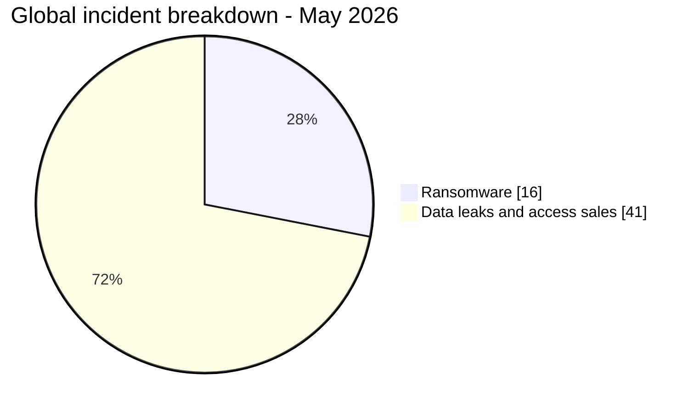
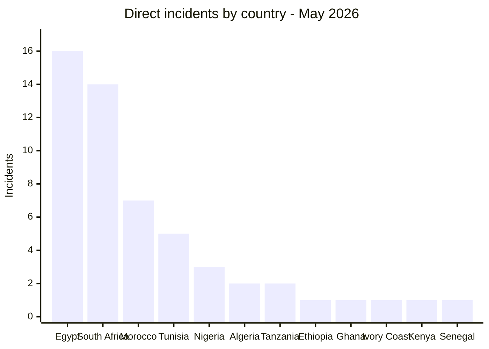
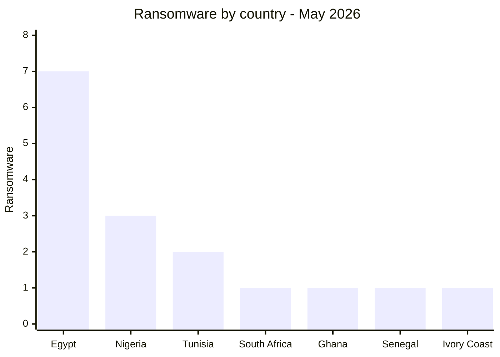
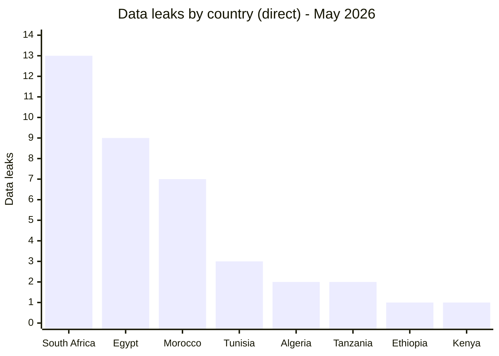
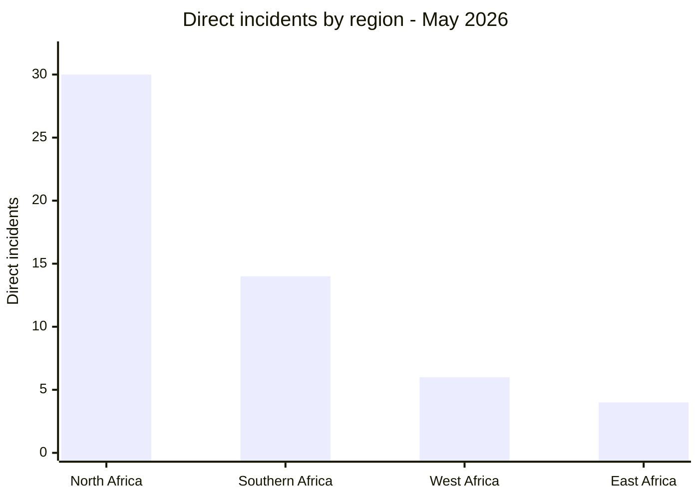
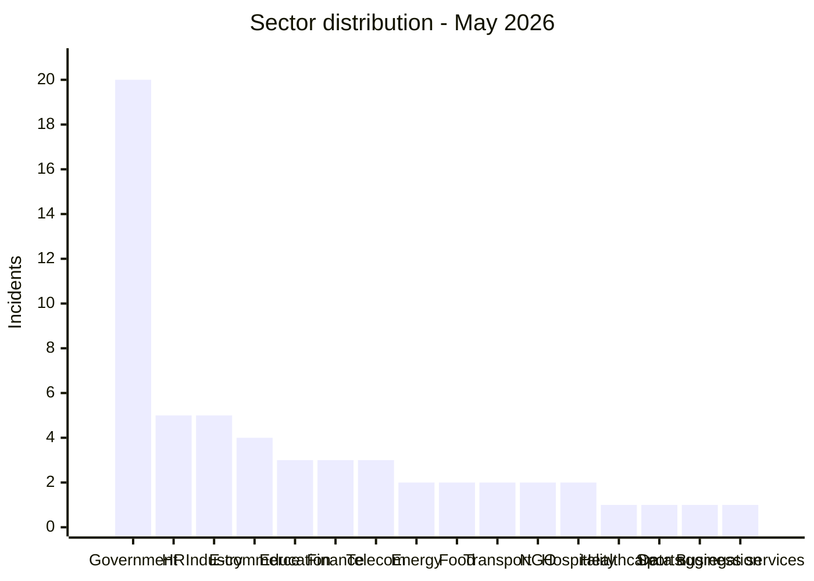
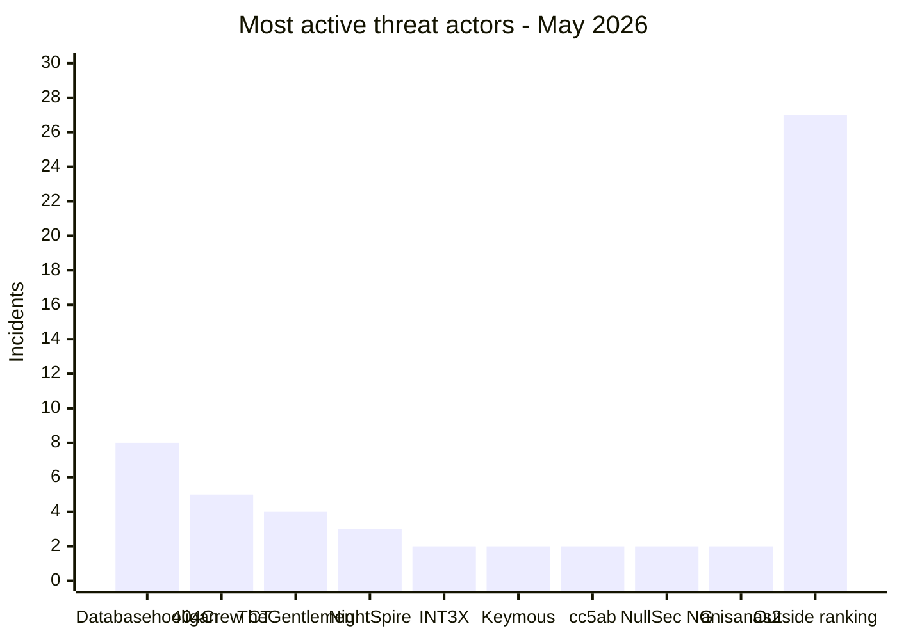

# AFRINTEL - Africa cyber statistics
## May 2026

👉🏾 [**French version available here**](./README_FR.md)

## Methodology note

These statistics are based on publicly claimed or observed incidents within the AFRINTEL monitoring scope for May 2026. Content originating from cybercriminal forums, leak sites, or underground channels is treated as a **claim** unless independently confirmed by the victim or supported by verifiable technical evidence.

The three multi-country incidents (Resume Docs, DHIS2, Passport Scans) are counted as **1 incident each** in the global total of 57. In the victim files, each entry lists the specific countries affected rather than a generic "Multi-country" label, to allow per-country identification. In the geographic exposure table (section 2.2), each affected country is listed individually. The sum of country exposures therefore exceeds 57 incidents.

---

## 1. Statistical summary

| Indicator | Value |
|---|---:|
| Total incidents | 57 |
| Ransomware listings or disclosures | 16 |
| Data leaks / access sales | 41 |
| Countries affected | 18 (12 direct + 6 via multi-country incidents) |
| Distinct named sources or actors | 31 |
| Most affected country | Egypt |
| Main ransomware country | Egypt |
| Main data leak country | South Africa |

### Global breakdown

| Incident type | Count | Percentage |
|---|---:|---:|
| Ransomware | 16 | 28.1% |
| Data leaks / access sales | 41 | 71.9% |
| **Total** | **57** | **100%** |

---

## 2. Victim distribution by country

### 2.1 Direct incidents by country

These 54 incidents have a single identified victim country. The 3 multi-country incidents are detailed in section 2.2.

| Country | Incidents |
|---|---:|
| 🇪🇬 Egypt | 16 |
| 🇿🇦 South Africa | 14 |
| 🇲🇦 Morocco | 7 |
| 🇹🇳 Tunisia | 5 |
| 🇳🇬 Nigeria | 3 |
| 🇩🇿 Algeria | 2 |
| 🇹🇿 Tanzania | 2 |
| 🇪🇹 Ethiopia | 1 |
| 🇬🇭 Ghana | 1 |
| 🇨🇮 Ivory Coast | 1 |
| 🇰🇪 Kenya | 1 |
| 🇸🇳 Senegal | 1 |
| **Subtotal (direct)** | **54** |

### 2.2 Geographic exposure from multi-country incidents

3 incidents affected multiple countries simultaneously. Each is counted once in the global total of 57 but exposes several countries.

| Incident | Actor | Countries affected |
|---|---|---|
| Resume docs data leak | attackercompany | 🇰🇪 Kenya, 🇪🇹 Ethiopia, 🇳🇬 Nigeria, 🇿🇼 Zimbabwe |
| DHIS2 / Ministries of Health | Keymous | 🇲🇿 Mozambique, 🇱🇷 Liberia, 🇳🇬 Nigeria, 🇹🇬 Togo, 🇸🇱 Sierra Leone |
| Passport Scans | raylie | 🇪🇬 Egypt, 🇱🇾 Libya |

### 2.3 Total geographic exposure (all 18 countries)

> The "Multi-country exposure" column counts how many times a country appears in a multi-country incident. Column sums exceed 57 because multi-country incidents touch several countries simultaneously.

| Country | Direct incidents | Multi-country exposure | Total exposure |
|---|---:|---:|---:|
| 🇪🇬 Egypt | 16 | 1 (Passport Scans) | 17 |
| 🇿🇦 South Africa | 14 | 0 | 14 |
| 🇲🇦 Morocco | 7 | 0 | 7 |
| 🇹🇳 Tunisia | 5 | 0 | 5 |
| 🇳🇬 Nigeria | 3 | 2 (Resume docs, DHIS2) | 5 |
| 🇩🇿 Algeria | 2 | 0 | 2 |
| 🇹🇿 Tanzania | 2 | 0 | 2 |
| 🇬🇭 Ghana | 1 | 0 | 1 |
| 🇨🇮 Ivory Coast | 1 | 0 | 1 |
| 🇰🇪 Kenya | 1 | 1 (Resume docs) | 2 |
| 🇸🇳 Senegal | 1 | 0 | 1 |
| 🇪🇹 Ethiopia | 1 | 1 (Resume docs) | 2 |
| 🇿🇼 Zimbabwe | 0 | 1 (Resume docs) | 1 |
| 🇲🇿 Mozambique | 0 | 1 (DHIS2) | 1 |
| 🇱🇷 Liberia | 0 | 1 (DHIS2) | 1 |
| 🇹🇬 Togo | 0 | 1 (DHIS2) | 1 |
| 🇸🇱 Sierra Leone | 0 | 1 (DHIS2) | 1 |
| 🇱🇾 Libya | 0 | 1 (Passport Scans) | 1 |
| **Total** | **54 direct incidents** | **11 country exposures** | **18 distinct countries** |

---

## 3. Ransomware vs data leaks by country

| Country | Ransomware | Data Leaks / Access Sales | Total |
|---|---:|---:|---:|
| 🇪🇬 Egypt | 7 | 9 | 16 |
| 🇿🇦 South Africa | 1 | 13 | 14 |
| 🇲🇦 Morocco | 0 | 7 | 7 |
| 🇹🇳 Tunisia | 2 | 3 | 5 |
| 🇳🇬 Nigeria | 3 | 0 | 3 |
| 🇩🇿 Algeria | 0 | 2 | 2 |
| 🇹🇿 Tanzania | 0 | 2 | 2 |
| 🇪🇹 Ethiopia | 0 | 1 | 1 |
| 🇬🇭 Ghana | 1 | 0 | 1 |
| 🇨🇮 Ivory Coast | 1 | 0 | 1 |
| 🇰🇪 Kenya | 0 | 1 | 1 |
| 🇸🇳 Senegal | 1 | 0 | 1 |
| **Subtotal (direct)** | **16** | **38** | **54** |
| 🇰🇪🇪🇹🇳🇬🇿🇼 Resume docs | 0 | 1 | 1 |
| 🇲🇿🇱🇷🇳🇬🇹🇬🇸🇱 DHIS2 | 0 | 1 | 1 |
| 🇪🇬🇱🇾 Passport Scans | 0 | 1 | 1 |
| **Total** | **16** | **41** | **57** |

### Ransomware by country

### Data leaks by country

---

## 4. Geographic breakdown

| Region | Countries included | Direct incidents | Multi-country exposure |
|---|---|---:|---:|
| North Africa | 🇪🇬 Egypt, 🇲🇦 Morocco, 🇹🇳 Tunisia, 🇩🇿 Algeria, 🇱🇾 Libya | 30 | +2 (Egypt via Passport Scans, Libya via Passport Scans) |
| Southern Africa | 🇿🇦 South Africa, 🇿🇼 Zimbabwe, 🇲🇿 Mozambique | 14 | +2 (Zimbabwe via Resume docs, Mozambique via DHIS2) |
| West Africa | 🇳🇬 Nigeria, 🇬🇭 Ghana, 🇨🇮 Ivory Coast, 🇸🇳 Senegal, 🇱🇷 Liberia, 🇹🇬 Togo, 🇸🇱 Sierra Leone | 6 | +5 (Nigeria x2 via Resume docs + DHIS2, Liberia, Togo, Sierra Leone via DHIS2) |
| East Africa | 🇹🇿 Tanzania, 🇰🇪 Kenya, 🇪🇹 Ethiopia | 4 | +2 (Kenya via Resume docs, Ethiopia via Resume docs) |

> Multi-country incidents are counted once in the global total of 57. The "Multi-country exposure" column shows additional country-level touches from those incidents. Total distinct countries: 18 across 4 regions.

---

## 5. Sector distribution

| Sector | Incidents | Percentage |
|---|---:|---:|
| Government / Administration | 20 | 35.09% |
| Human Resources / Recruitment | 5 | 8.77% |
| Industry / Automotive / Manufacturing | 5 | 8.77% |
| E-commerce / Retail | 4 | 7.02% |
| Education / University | 3 | 5.26% |
| Finance / Banking | 3 | 5.26% |
| Telecommunications | 3 | 5.26% |
| Oil & Energy | 2 | 3.51% |
| Food / Beverage / Restaurants | 2 | 3.51% |
| Transport / Logistics | 2 | 3.51% |
| NGO / Social Welfare | 2 | 3.51% |
| Hospitality / Events | 2 | 3.51% |
| Healthcare / Medical | 1 | 1.75% |
| Sports / Federations | 1 | 1.75% |
| Personal Data Aggregation | 1 | 1.75% |
| Business Services | 1 | 1.75% |
| **Total** | **57** | **100%** |

---

## 6. Most active threat actors

| Threat actor / Group | Incidents | Dominant type |
|---|---:|---|
| Databasehooligan | 8 | Data leaks |
| 404Crew Cyber Team | 5 | Data leaks (coalitions) |
| TheGentlemen | 4 | Ransomware |
| NightSpire | 3 | Ransomware |
| INT3X | 2 | Data leaks |
| Keymous | 2 | Access sales / data leaks |
| cc5ab | 2 | Data leaks |
| NullSec Nigeria | 2 | Data leaks (coalitions) |
| anisanas2 | 2 | Data leaks / data sales (Morocco) |
| Records outside displayed ranking | 27 | Mixed |

---

## 7. CTI trend analysis

### 7.1 Egypt recorded the highest May ransomware volume

Egypt accounts for **7 ransomware incidents**, representing **43.8%** of ransomware activity. NightSpire alone claimed three Egyptian targets in a single month. Targeted sectors include finance, food, chemical industry, logistics, agriculture, and hospitality.

### 7.2 South Africa: 14 records including OpSouthAfrica publications

South Africa recorded **14 incidents**, including 13 data leaks. At least eight institution-related publications were associated with the OpSouthAfrica banner and participating actors such as 404Crew Cyber Team, NullSec Nigeria, NullSec Philippines and Infernalis. The remaining records involved other actors.

### 7.3 Education sector as a strategic target

Claims concerning Egyptian education referenced the Ministry of Education, Professional Academy for Teachers, Mansoura University and a combined Educational & HR dataset. The full volumes claimed by the actors were not independently confirmed.

### 7.4 Databasehooligan dataset sale offers

Eight structured CRM or consumer datasets concerning organizations in Tunisia, South Africa, Egypt and Algeria were offered for sale by the Databasehooligan account, at advertised prices of $900 to $1,400 each. The source records do not establish a shared platform or common access vector.

### 7.5 Government credential exposure

Moroccan government platforms (827K credential lines), the Tanzania Police webmail (10,000+ officer accounts with plaintext passwords), and Stats SA admin access represent high-value targets for social engineering, EDR fraud, and law enforcement impersonation.

### 7.6 Multi-country health system compromise

The DHIS2 offer referenced five African countries, Mozambique, Liberia, Nigeria, Togo and Sierra Leone. Bhutan and Honduras were present in the source but remain outside AFRINTEL’s African statistics. AFRINTEL did not test the advertised credentials.

---

## 8. SOC monitoring priorities

| Priority | Monitoring focus |
|---|---|
| Critical | Credential exposure in government and law enforcement systems |
| Critical | Education database access patterns (Egypt: Ministry of Education, PAT, Mansoura) |
| High | CRM / recruitment platform bulk exports (Databasehooligan targets) |
| High | Ransomware early indicators: shadow copy deletion, volume encryption, lateral RDP/SMB |
| High | Government credential reuse from Moroccan government platform leaks |
| Medium | NightSpire / TheGentlemen target profile alignment (finance, food, automotive) |
| Medium | DHIS2 / health system admin panel anomalies |
| Medium | Multi-country EDR fraud account listings |

---

## 9. Conclusion

May 2026 recorded **57 publicly reported or claimed incidents** concerning **18 African countries** when direct and multi-country exposure is combined, compared with 60 incidents in April (-3; -5.0%). Ransomware records decreased from 20 to 16 (-20.0%), while data leaks and access sales increased from 40 to 41 (+2.5%). Egypt and South Africa accounted for 52.6% of direct incidents. Repeated education-related claims, OpSouthAfrica publications and dataset sale offers associated with Databasehooligan were the main observed patterns.

**AFRINTEL** - [African Cyber Threat Intelligence](https://github.com/Hatchepsoute/AFRINTEL)
