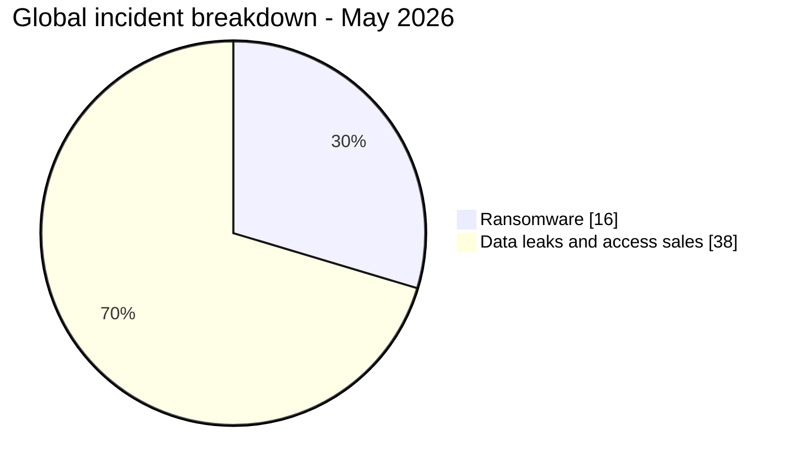
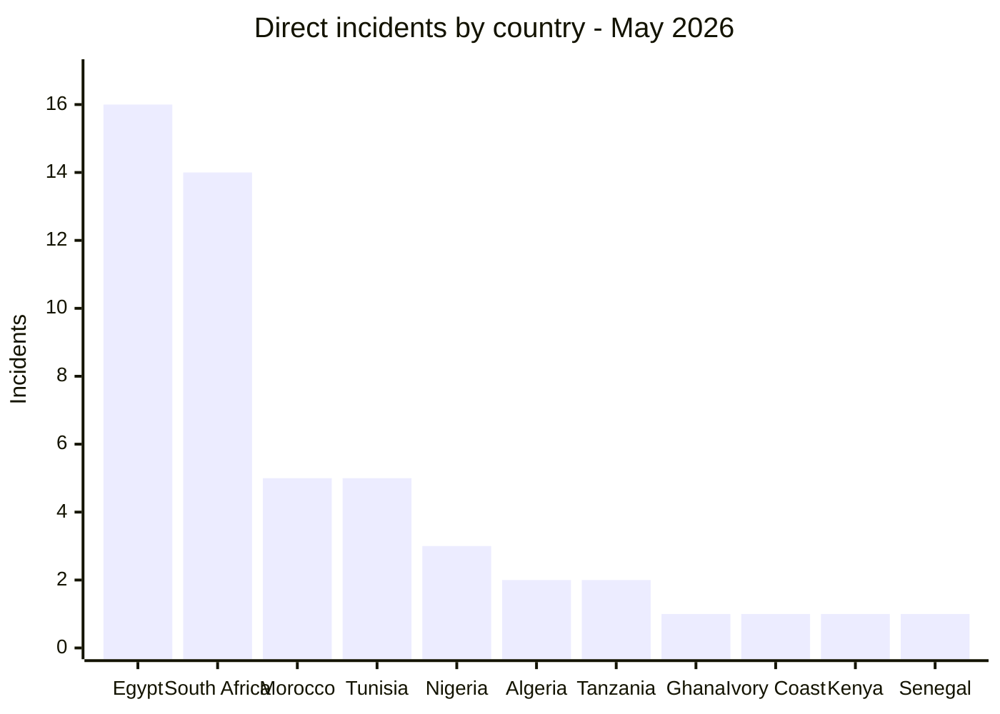
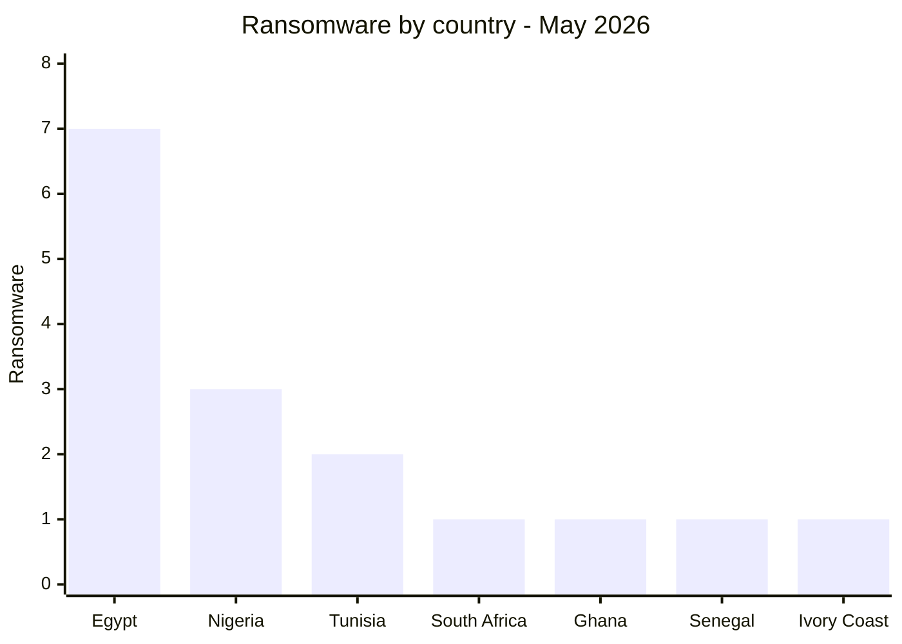
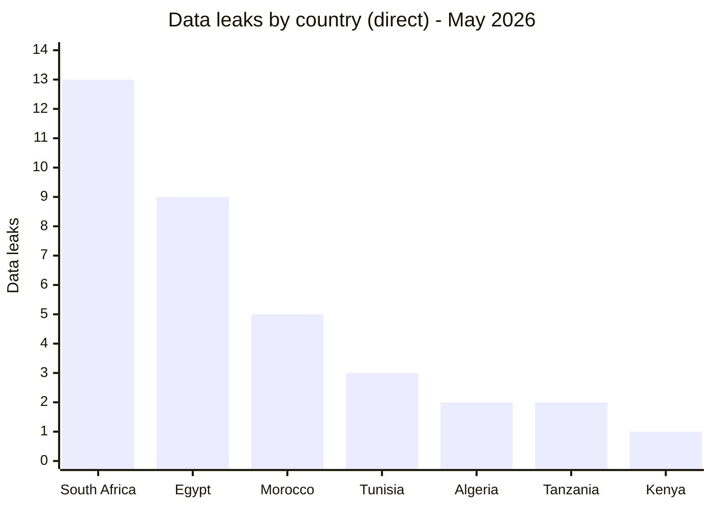
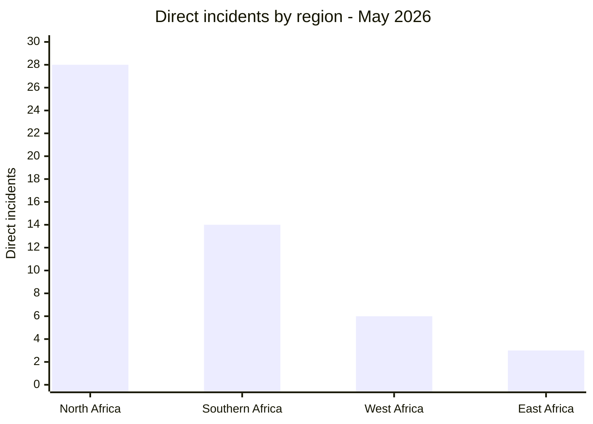
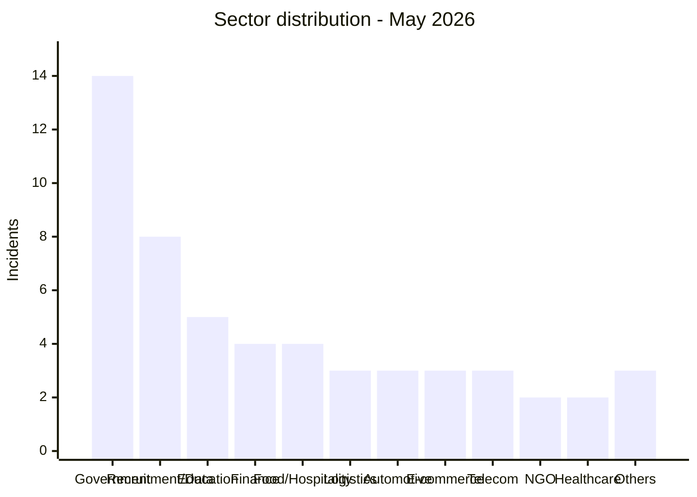
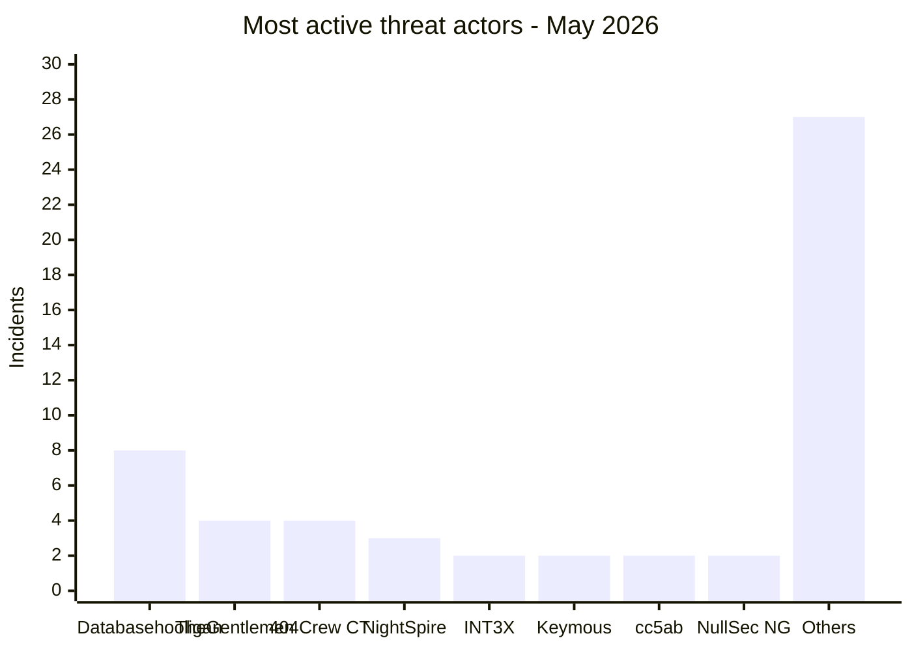

# AFRINTEL - Africa cyber statistics
## May 2026

👉🏾 [**French version available here**](./README_FR.md)

## Methodology note

These statistics are based on publicly claimed or observed incidents within the AFRINTEL monitoring scope for May 2026. Content originating from cybercriminal forums, leak sites, or underground channels is treated as a **claim** unless independently confirmed by the victim or supported by verifiable technical evidence.

The three multi-country incidents (Resume Docs, DHIS2, Passport Scans) are counted as **1 incident each** in the global total of 54. In the victim files, each entry lists the specific countries affected rather than a generic "Multi-country" label, to allow per-country identification. In the geographic exposure table (section 2.2), each affected country is listed individually. The sum of country exposures therefore exceeds 54 incidents.

---

## 1. Statistical summary

| Indicator | Value |
|---|---:|
| Total incidents | 54 |
| Ransomware attacks | 16 |
| Data leaks / access sales | 38 |
| Countries affected | 18 (11 direct + 7 via multi-country incidents) |
| Distinct threat actors | 25+ |
| Most affected country | Egypt |
| Main ransomware country | Egypt |
| Main data leak country | South Africa |

### Global breakdown

| Incident type | Count | Percentage |
|---|---:|---:|
| Ransomware | 16 | 29.6% |
| Data leaks / access sales | 38 | 70.4% |
| **Total** | **54** | **100%** |

---

## 2. Victim distribution by country

### 2.1 Direct incidents by country

These 51 incidents have a single identified victim country. The 3 multi-country incidents are detailed in section 2.2.

| Country | Incidents |
|---|---:|
| 🇪🇬 Egypt | 16 |
| 🇿🇦 South Africa | 14 |
| 🇲🇦 Morocco | 5 |
| 🇹🇳 Tunisia | 5 |
| 🇳🇬 Nigeria | 3 |
| 🇩🇿 Algeria | 2 |
| 🇹🇿 Tanzania | 2 |
| 🇬🇭 Ghana | 1 |
| 🇨🇮 Ivory Coast | 1 |
| 🇰🇪 Kenya | 1 |
| 🇸🇳 Senegal | 1 |
| **Subtotal (direct)** | **51** |

### 2.2 Geographic exposure from multi-country incidents

3 incidents affected multiple countries simultaneously. Each is counted once in the global total of 54 but exposes several countries.

| Incident | Actor | Countries affected |
|---|---|---|
| Resume docs data leak | attackercompany | 🇰🇪 Kenya, 🇪🇹 Ethiopia, 🇳🇬 Nigeria, 🇿🇼 Zimbabwe |
| DHIS2 / Ministries of Health | Keymous | 🇲🇿 Mozambique, 🇱🇷 Liberia, 🇳🇬 Nigeria, 🇹🇬 Togo, 🇸🇱 Sierra Leone |
| Passport Scans | raylie | 🇪🇬 Egypt, 🇱🇾 Libya |

### 2.3 Total geographic exposure (all 18 countries)

> The "Multi-country exposure" column counts how many times a country appears in a multi-country incident. Column sums exceed 54 because multi-country incidents touch several countries simultaneously.

| Country | Direct incidents | Multi-country exposure | Total exposure |
|---|---:|---:|---:|
| 🇪🇬 Egypt | 16 | 1 (Passport Scans) | 17 |
| 🇿🇦 South Africa | 14 | 0 | 14 |
| 🇲🇦 Morocco | 5 | 0 | 5 |
| 🇹🇳 Tunisia | 5 | 0 | 5 |
| 🇳🇬 Nigeria | 3 | 2 (Resume docs, DHIS2) | 5 |
| 🇩🇿 Algeria | 2 | 0 | 2 |
| 🇹🇿 Tanzania | 2 | 0 | 2 |
| 🇬🇭 Ghana | 1 | 0 | 1 |
| 🇨🇮 Ivory Coast | 1 | 0 | 1 |
| 🇰🇪 Kenya | 1 | 1 (Resume docs) | 2 |
| 🇸🇳 Senegal | 1 | 0 | 1 |
| 🇪🇹 Ethiopia | 0 | 1 (Resume docs) | 1 |
| 🇿🇼 Zimbabwe | 0 | 1 (Resume docs) | 1 |
| 🇲🇿 Mozambique | 0 | 1 (DHIS2) | 1 |
| 🇱🇷 Liberia | 0 | 1 (DHIS2) | 1 |
| 🇹🇬 Togo | 0 | 1 (DHIS2) | 1 |
| 🇸🇱 Sierra Leone | 0 | 1 (DHIS2) | 1 |
| 🇱🇾 Libya | 0 | 1 (Passport Scans) | 1 |
| **Total** | **51 direct incidents** | **11 country exposures** | **18 distinct countries** |

---

## 3. Ransomware vs data leaks by country

| Country | Ransomware | Data Leaks / Access Sales | Total |
|---|---:|---:|---:|
| 🇪🇬 Egypt | 7 | 9 | 16 |
| 🇿🇦 South Africa | 1 | 13 | 14 |
| 🇲🇦 Morocco | 0 | 5 | 5 |
| 🇹🇳 Tunisia | 2 | 3 | 5 |
| 🇳🇬 Nigeria | 3 | 0 | 3 |
| 🇩🇿 Algeria | 0 | 2 | 2 |
| 🇹🇿 Tanzania | 0 | 2 | 2 |
| 🇬🇭 Ghana | 1 | 0 | 1 |
| 🇨🇮 Ivory Coast | 1 | 0 | 1 |
| 🇰🇪 Kenya | 0 | 1 | 1 |
| 🇸🇳 Senegal | 1 | 0 | 1 |
| **Subtotal (direct)** | **16** | **35** | **51** |
| 🇰🇪🇪🇹🇳🇬🇿🇼 Resume docs | 0 | 1 | 1 |
| 🇲🇿🇱🇷🇳🇬🇹🇬🇸🇱 DHIS2 | 0 | 1 | 1 |
| 🇪🇬🇱🇾 Passport Scans | 0 | 1 | 1 |
| **Total** | **16** | **38** | **54** |

### Ransomware by country

### Data leaks by country

---

## 4. Geographic breakdown

| Region | Countries included | Direct incidents | Multi-country exposure |
|---|---|---:|---:|
| North Africa | 🇪🇬 Egypt, 🇲🇦 Morocco, 🇹🇳 Tunisia, 🇩🇿 Algeria, 🇱🇾 Libya | 28 | +2 (Egypt via Passport Scans, Libya via Passport Scans) |
| Southern Africa | 🇿🇦 South Africa, 🇿🇼 Zimbabwe, 🇲🇿 Mozambique | 14 | +2 (Zimbabwe via Resume docs, Mozambique via DHIS2) |
| West Africa | 🇳🇬 Nigeria, 🇬🇭 Ghana, 🇨🇮 Ivory Coast, 🇸🇳 Senegal, 🇱🇷 Liberia, 🇹🇬 Togo, 🇸🇱 Sierra Leone | 6 | +5 (Nigeria x2 via Resume docs + DHIS2, Liberia, Togo, Sierra Leone via DHIS2) |
| East Africa | 🇹🇿 Tanzania, 🇰🇪 Kenya, 🇪🇹 Ethiopia | 3 | +2 (Kenya via Resume docs, Ethiopia via Resume docs) |

> Multi-country incidents are counted once in the global total of 54. The "Multi-country exposure" column shows additional country-level touches from those incidents. Total distinct countries: 18 across 4 regions.

---

## 5. Sector distribution

| Sector | Incidents | Percentage |
|---|---:|---:|
| Government / Administration | 14 | 25.9% |
| Recruitment / Personal Data | 8 | 14.8% |
| Education / University | 5 | 9.3% |
| Finance / Banking | 4 | 7.4% |
| Food / Beverage / Hospitality | 4 | 7.4% |
| Logistics / Transport | 3 | 5.6% |
| Automotive | 3 | 5.6% |
| E-commerce / Digital | 3 | 5.6% |
| Telecom / ICT | 3 | 5.6% |
| NGO / Charity | 2 | 3.7% |
| Healthcare | 2 | 3.7% |
| Others | 3 | 5.6% |
| **Total** | **54** | **100%** |

---

## 6. Most active threat actors

| Threat actor / Group | Incidents | Dominant type |
|---|---:|---|
| Databasehooligan | 8 | Data leaks |
| TheGentlemen | 4 | Ransomware |
| 404Crew Cyber Team | 4 | Data leaks (coalitions) |
| NightSpire | 3 | Ransomware |
| INT3X | 2 | Data leaks |
| Keymous | 2 | Access sales / data leaks |
| cc5ab | 2 | Data leaks |
| NullSec Nigeria | 2 | Data leaks (coalitions) |
| Other actors | 27 | Mixed |

---

## 7. CTI trend analysis

### 7.1 Egypt as the main ransomware hotspot

Egypt accounts for **7 ransomware incidents**, representing **43.8%** of ransomware activity. NightSpire alone claimed three Egyptian targets in a single month. Targeted sectors include finance, food, chemical industry, logistics, agriculture, and hospitality.

### 7.2 South Africa under coordinated pressure

South Africa recorded **14 incidents** including 13 data leaks driven by the 404Crew Cyber Team coalition (with NullSec Nigeria, NullSec Philippines, and Infernalis) under the "OpSouthAfrica" banner. Targeted institutions include municipalities, correctional services, tax authority, and state IT infrastructure.

### 7.3 Education sector as a strategic target

Egypt's education system faced systemic exposure: Ministry of Education (26.8M student records), Professional Academy for Teachers (1.2M teacher records), Mansoura University (989K records), and a combined Educational & HR database (37 GB). Total exposure exceeds 28 million records.

### 7.4 Databasehooligan dominance in CRM / recruitment platforms

A single data broker targeted eight organizations across four countries (Tunisia, South Africa, Egypt, Algeria), selling structured CRM and consumer databases for $900-$1,400 each. This suggests systematic exploitation of a shared vulnerability or a common SaaS platform.

### 7.5 Government credential exposure

Moroccan government platforms (827K credential lines), the Tanzania Police webmail (10,000+ officer accounts with plaintext passwords), and Stats SA admin access represent high-value targets for social engineering, EDR fraud, and law enforcement impersonation.

### 7.6 Multi-country health system compromise

The DHIS2 admin access sale (seven countries: Mozambique, Liberia, Nigeria, Bhutan, Honduras, Togo, Sierra Leone) poses a critical threat to national public health surveillance infrastructure.

---

## 8. SOC monitoring priorities

| Priority | Monitoring focus |
|---|---|
| Critical | Credential exposure in government and law enforcement systems |
| Critical | Education database access patterns (Egypt: Ministry of Education, PAT, Mansoura) |
| High | CRM / recruitment platform bulk exports (Databasehooligan targets) |
| High | Ransomware early indicators: shadow copy deletion, volume encryption, lateral RDP/SMB |
| High | Government credential reuse from Moroccan government platform leaks |
| Medium | NightSpire / TheGentlemen target profile alignment (finance, food, automotive) |
| Medium | DHIS2 / health system admin panel anomalies |
| Medium | Multi-country EDR fraud account listings |

---

## 9. Conclusion

May 2026 recorded **54 incidents** affecting **18 distinct countries** (11 with direct incidents, 7 additional via multi-country events). Egypt and South Africa jointly absorbed 56% of direct incidents, confirming their status as primary targets on the continent. The systematic targeting of Egypt's education sector, the coordinated OpSouthAfrica campaign, and Databasehooligan's CRM sweep across four countries are the defining patterns of the month.

**AFRINTEL** - [African Cyber Threat Intelligence](https://github.com/Hatchepsoute/AFRINTEL)
