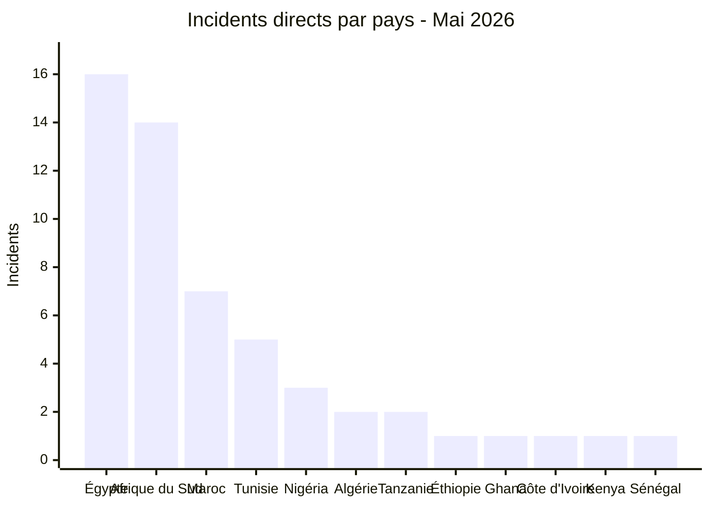
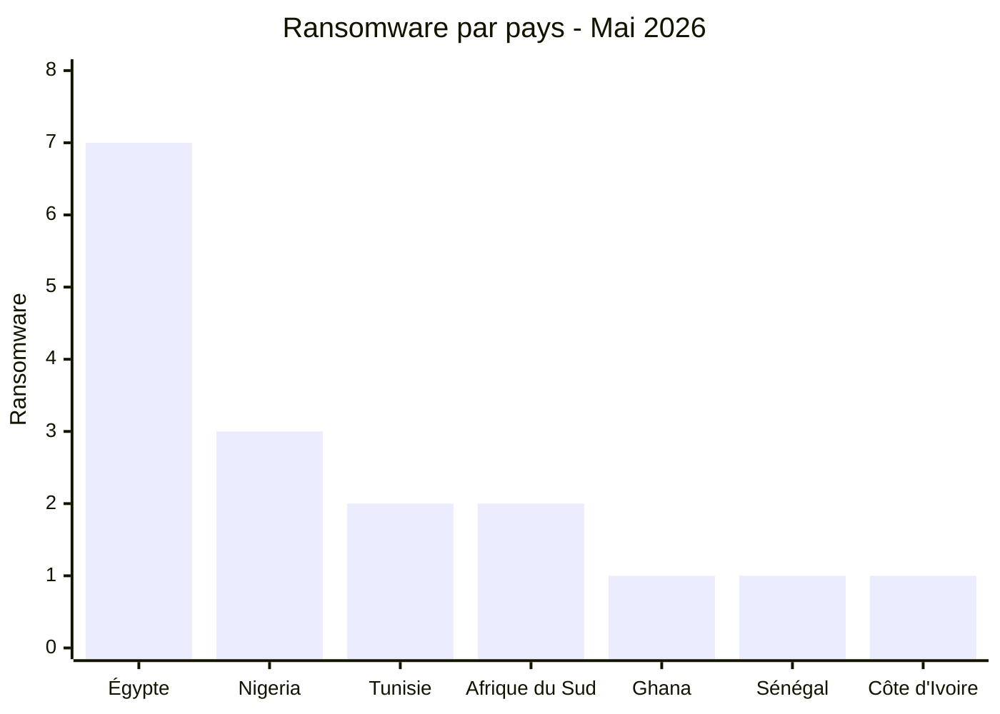
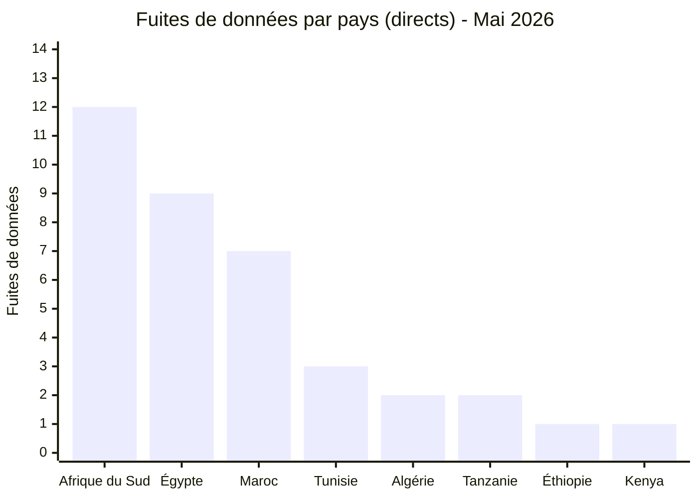
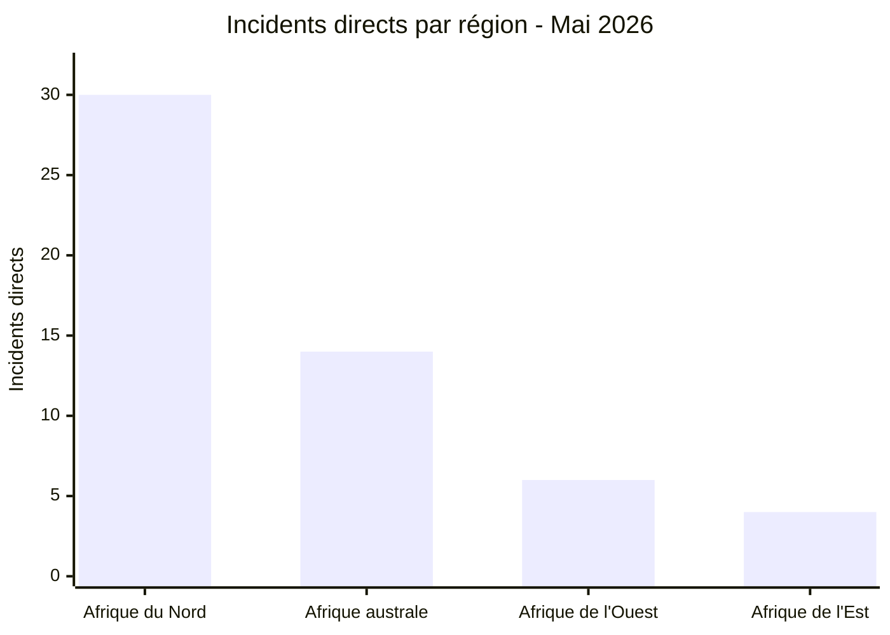
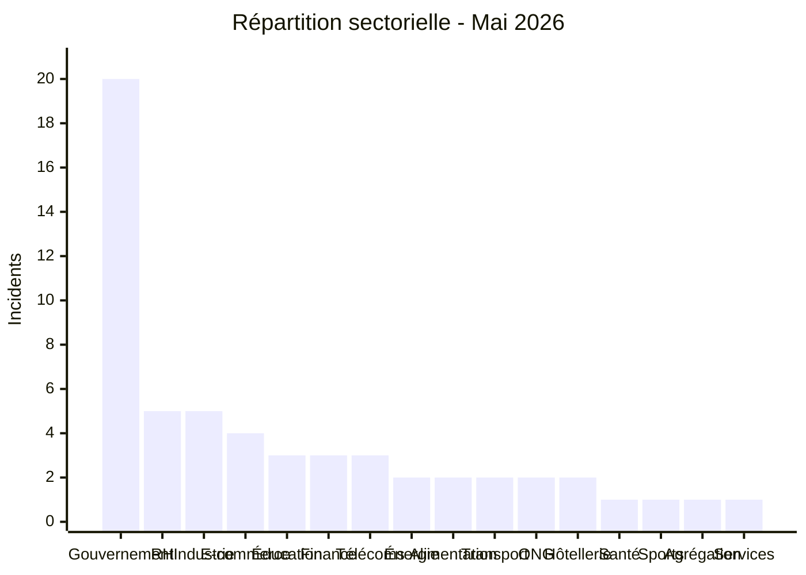
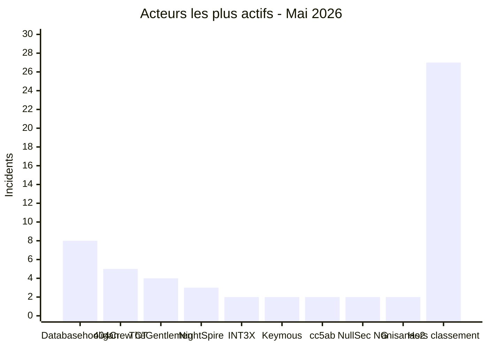

# AFRINTEL - Statistiques cyber Afrique
## Mai 2026

👉🏾 [**English version available here**](./README.md)

## Note méthodologique

Ces statistiques couvrent les publications observées dans le périmètre AFRINTEL pour mai 2026. Chaque fiche conserve le statut documenté dans le fichier des victimes.

Les trois incidents multi-pays (Resume Docs, DHIS2, Scans de passeports) sont comptabilisés comme **1 incident chacun** dans le total global de 57. Dans les fichiers victimes, chaque entrée liste désormais les pays concernés explicitement plutôt qu'un label générique "Multi-pays", afin de permettre l'identification par pays. Dans le tableau d'exposition géographique (section 2.2), chaque pays touché est listé individuellement. La somme des expositions par pays dépasse donc le total de 57 incidents.

---

## 1. Synthèse statistique

| Indicateur | Valeur |
|---|---:|
| Total incidents | 57 |
| Publications ou divulgations ransomware | 17 |
| Fuites de données / ventes d'accès | 40 |
| Pays touchés | 18 (12 directs + 6 via incidents multi-pays) |
| Acteurs ou sources nommés distincts | 31 |
| Pays le plus touché | Égypte |
| Principal pays ransomware | Égypte |
| Principal pays fuites de données | Afrique du Sud |

### Répartition globale

| Type d'incident | Nombre | Pourcentage |
|---|---:|---:|
| Ransomware | 17 | 29,8 % |
| Fuites de données / ventes d'accès | 40 | 70,2 % |
| **Total** | **57** | **100 %** |

---

## 2. Répartition des victimes par pays

### 2.1 Incidents directs par pays

Ces 54 incidents ont une seule victime identifiée par pays. Les 3 incidents multi-pays sont détaillés en section 2.2.

| Pays | Incidents |
|---|---:|
| 🇪🇬 Égypte | 16 |
| 🇿🇦 Afrique du Sud | 14 |
| 🇲🇦 Maroc | 7 |
| 🇹🇳 Tunisie | 5 |
| 🇳🇬 Nigéria | 3 |
| 🇩🇿 Algérie | 2 |
| 🇹🇿 Tanzanie | 2 |
| 🇪🇹 Éthiopie | 1 |
| 🇬🇭 Ghana | 1 |
| 🇨🇮 Côte d'Ivoire | 1 |
| 🇰🇪 Kenya | 1 |
| 🇸🇳 Sénégal | 1 |
| **Sous-total (directs)** | **54** |

### 2.2 Exposition géographique des incidents multi-pays

3 incidents ont touché plusieurs pays simultanément. Chacun est comptabilisé une seule fois dans le total global de 57, mais expose plusieurs pays.

| Incident | Acteur | Pays concernés |
|---|---|---|
| Fuite de CV (Resume docs) | attackercompany | 🇰🇪 Kenya, 🇪🇹 Éthiopie, 🇳🇬 Nigéria, 🇿🇼 Zimbabwe |
| DHIS2 / Ministères de la Santé | Keymous | 🇲🇿 Mozambique, 🇱🇷 Liberia, 🇳🇬 Nigéria, 🇹🇬 Togo, 🇸🇱 Sierra Leone |
| Scans de passeports | raylie | 🇪🇬 Égypte, 🇱🇾 Libye |

### 2.3 Exposition géographique totale (18 pays)

> La colonne "Exposition multi-pays" comptabilise le nombre d'incidents multi-pays touchant chaque pays. Les sommes de colonnes dépassent 57 car ces incidents concernent plusieurs pays simultanément.

| Pays | Incidents directs | Exposition multi-pays | Exposition totale |
|---|---:|---:|---:|
| 🇪🇬 Égypte | 16 | 1 (Scans passeports) | 17 |
| 🇿🇦 Afrique du Sud | 14 | 0 | 14 |
| 🇲🇦 Maroc | 7 | 0 | 7 |
| 🇹🇳 Tunisie | 5 | 0 | 5 |
| 🇳🇬 Nigéria | 3 | 2 (Resume docs, DHIS2) | 5 |
| 🇩🇿 Algérie | 2 | 0 | 2 |
| 🇹🇿 Tanzanie | 2 | 0 | 2 |
| 🇬🇭 Ghana | 1 | 0 | 1 |
| 🇨🇮 Côte d'Ivoire | 1 | 0 | 1 |
| 🇰🇪 Kenya | 1 | 1 (Resume docs) | 2 |
| 🇸🇳 Sénégal | 1 | 0 | 1 |
| 🇪🇹 Éthiopie | 1 | 1 (Resume docs) | 2 |
| 🇿🇼 Zimbabwe | 0 | 1 (Resume docs) | 1 |
| 🇲🇿 Mozambique | 0 | 1 (DHIS2) | 1 |
| 🇱🇷 Liberia | 0 | 1 (DHIS2) | 1 |
| 🇹🇬 Togo | 0 | 1 (DHIS2) | 1 |
| 🇸🇱 Sierra Leone | 0 | 1 (DHIS2) | 1 |
| 🇱🇾 Libye | 0 | 1 (Scans passeports) | 1 |
| **Total** | **54 incidents directs** | **11 expositions pays** | **18 pays distincts** |

---

## 3. Ransomware vs fuites de données par pays

| Pays | Ransomware | Fuites de données / ventes d'accès | Total |
|---|---:|---:|---:|
| 🇪🇬 Égypte | 7 | 9 | 16 |
| 🇿🇦 Afrique du Sud | 2 | 12 | 14 |
| 🇲🇦 Maroc | 0 | 7 | 7 |
| 🇹🇳 Tunisie | 2 | 3 | 5 |
| 🇳🇬 Nigéria | 3 | 0 | 3 |
| 🇩🇿 Algérie | 0 | 2 | 2 |
| 🇹🇿 Tanzanie | 0 | 2 | 2 |
| 🇪🇹 Éthiopie | 0 | 1 | 1 |
| 🇬🇭 Ghana | 1 | 0 | 1 |
| 🇨🇮 Côte d'Ivoire | 1 | 0 | 1 |
| 🇰🇪 Kenya | 0 | 1 | 1 |
| 🇸🇳 Sénégal | 1 | 0 | 1 |
| **Sous-total (directs)** | **17** | **37** | **54** |
| 🇰🇪🇪🇹🇳🇬🇿🇼 Resume docs | 0 | 1 | 1 |
| 🇲🇿🇱🇷🇳🇬🇹🇬🇸🇱 DHIS2 | 0 | 1 | 1 |
| 🇪🇬🇱🇾 Scans de passeports | 0 | 1 | 1 |
| **Total** | **17** | **40** | **57** |

### Ransomware par pays

### Fuites de données par pays

---

## 4. Répartition géographique

| Région | Pays inclus | Incidents directs | Exposition multi-pays |
|---|---|---:|---:|
| Afrique du Nord | 🇪🇬 Égypte, 🇲🇦 Maroc, 🇹🇳 Tunisie, 🇩🇿 Algérie, 🇱🇾 Libye | 30 | +2 (Égypte via Scans passeports, Libye via Scans passeports) |
| Afrique australe | 🇿🇦 Afrique du Sud, 🇿🇼 Zimbabwe, 🇲🇿 Mozambique | 14 | +2 (Zimbabwe via Resume docs, Mozambique via DHIS2) |
| Afrique de l'Ouest | 🇳🇬 Nigéria, 🇬🇭 Ghana, 🇨🇮 Côte d'Ivoire, 🇸🇳 Sénégal, 🇱🇷 Liberia, 🇹🇬 Togo, 🇸🇱 Sierra Leone | 6 | +5 (Nigéria x2 via Resume docs + DHIS2, Liberia, Togo, Sierra Leone via DHIS2) |
| Afrique de l'Est | 🇹🇿 Tanzanie, 🇰🇪 Kenya, 🇪🇹 Éthiopie | 4 | +2 (Kenya via Resume docs, Éthiopie via Resume docs) |

> Les incidents multi-pays sont comptabilisés une seule fois dans le total global de 57. La colonne "Exposition multi-pays" indique les touches additionnelles par région issues de ces incidents. Total pays distincts : 18 répartis sur 4 régions.

---

## 5. Répartition sectorielle

| Secteur | Incidents | Pourcentage |
|---|---:|---:|
| Government / Administration | 20 | 35,09 % |
| Ressources humaines / Recrutement | 5 | 8,77 % |
| Industrie / Automobile / Fabrication | 5 | 8,77 % |
| E-commerce / Retail | 4 | 7,02 % |
| Education / University | 3 | 5,26 % |
| Finance / Banking | 3 | 5,26 % |
| Telecommunications | 3 | 5,26 % |
| Oil & Energy | 2 | 3,51 % |
| Alimentation / Boissons / Restauration | 2 | 3,51 % |
| Transport / Logistique | 2 | 3,51 % |
| ONG / Action sociale | 2 | 3,51 % |
| Hôtellerie / Événementiel | 2 | 3,51 % |
| Healthcare / Medical | 1 | 1,75 % |
| Sports / Federations | 1 | 1,75 % |
| Agrégation de données personnelles | 1 | 1,75 % |
| Services aux entreprises | 1 | 1,75 % |
| **Total** | **57** | **100 %** |

---

## 6. Acteurs de menaces les plus actifs

| Acteur / Groupe | Incidents | Type dominant |
|---|---:|---|
| Databasehooligan | 8 | Fuites de données |
| 404Crew Cyber Team | 5 | Fuites de données (coalitions) |
| TheGentlemen | 4 | Ransomware |
| NightSpire | 3 | Ransomware |
| INT3X | 2 | Fuites de données |
| Keymous | 2 | Ventes d'accès / fuites |
| cc5ab | 2 | Fuites de données |
| NullSec Nigeria | 2 | Fuites de données (coalitions) |
| anisanas2 | 2 | Fuites / ventes de données (Maroc) |
| Fiches hors classement affiché | 27 | Mixte |

---

## 7. Analyse des tendances CTI

### 7.1 L'Égypte enregistre le plus grand volume ransomware en mai

L'Égypte concentre **7 incidents ransomware**, soit **41,2 %** de l'activité ransomware du mois. NightSpire a revendiqué à lui seul trois cibles égyptiennes en un mois. Les secteurs visés incluent la finance, la restauration, l'industrie chimique, la logistique, l'agriculture et l'hôtellerie.

### 7.2 Afrique du Sud : 14 fiches dont les publications OpSouthAfrica

L'Afrique du Sud enregistre **14 incidents**, dont 12 fuites de données et 2 publications ransomware (PrinzEugen, Stormous). Au moins huit publications concernant des institutions sont associées à la bannière OpSouthAfrica et à des acteurs participants tels que 404Crew Cyber Team, NullSec Nigeria, NullSec Philippines et Infernalis. Les autres fiches impliquent d'autres acteurs.

### 7.3 Le secteur éducatif comme cible stratégique

Les revendications concernant l’éducation égyptienne mentionnent le Ministère de l’Éducation, la Professional Academy for Teachers, l’Université de Mansoura et une base combinée éducation/RH. Les volumes complets revendiqués ne sont pas confirmés indépendamment.

### 7.4 Offres de vente associées à Databasehooligan

Huit jeux de données CRM ou consommateurs structurés concernant des organisations en Tunisie, Afrique du Sud, Égypte et Algérie ont été proposés à la vente par le compte Databasehooligan, à des prix annoncés de 900 à 1 400 dollars chacun. Les fiches sources n'établissent ni plateforme partagée ni vecteur d'accès commun.

### 7.5 Exposition des identifiants gouvernementaux

Les plateformes gouvernementales marocaines (827 000 lignes d'identifiants), la messagerie de la police tanzanienne (10 000+ comptes officiers avec mots de passe en clair) et l'accès administrateur de Stats SA représentent des cibles à forte valeur pour l'ingénierie sociale, la fraude EDR et l'usurpation d'identité institutionnelle.

### 7.6 Compromission multi-pays du système de santé DHIS2

L’offre DHIS2 mentionne cinq pays africains : Mozambique, Liberia, Nigeria, Togo et Sierra Leone. Le Bhoutan et le Honduras figurent dans la source mais sont exclus des statistiques africaines AFRINTEL. AFRINTEL n’a pas testé les identifiants proposés.

---

## 8. Priorités de surveillance SOC

| Priorité | Axe de surveillance |
|---|---|
| Critique | Exposition d'identifiants gouvernementaux et des forces de l'ordre |
| Critique | Patterns d'accès aux bases éducatives (Égypte : Ministère, PAT, Mansoura) |
| Élevée | Exports massifs depuis des plateformes CRM / recrutement (cibles Databasehooligan) |
| Élevée | Indicateurs précoces de ransomware : suppression de copies shadow, chiffrement volumétrique, mouvement latéral RDP/SMB |
| Élevée | Réutilisation d'identifiants exposés dans les fuites gouvernementales marocaines |
| Moyenne | Alignement du profil de cibles NightSpire / TheGentlemen (finance, agroalimentaire, automobile) |
| Moyenne | Anomalies sur les panneaux d'administration DHIS2 / systèmes de santé |
| Moyenne | Annonces de comptes pour fraude EDR multi-pays |

---

## 9. Conclusion

Mai 2026 recense **57 incidents signalés ou revendiqués publiquement** concernant **18 pays africains** lorsque les incidents directs et les expositions multi-pays sont combinés, contre 60 incidents en avril (-3 ; -5,0 %). Les fiches ransomware passent de 20 à 17 (-15,0 %), tandis que les fuites de données et ventes d'accès restent stables à 40 (0,0 %). L’Égypte et l’Afrique du Sud représentent 52,6 % des incidents directs. Les revendications liées à l’éducation, les publications OpSouthAfrica et les offres de vente associées à Databasehooligan sont les principaux schémas observés.

**AFRINTEL** - [African Cyber Threat Intelligence](https://github.com/Hatchepsoute/AFRINTEL)
