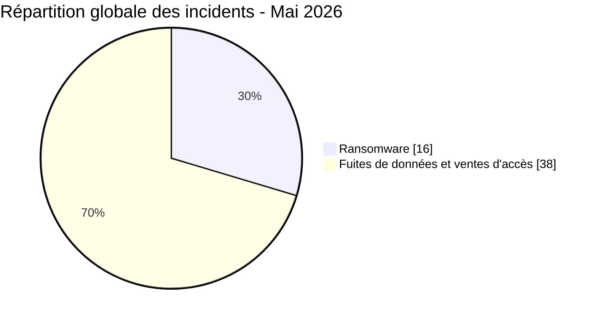
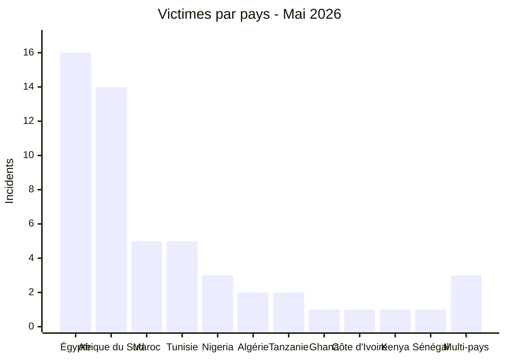
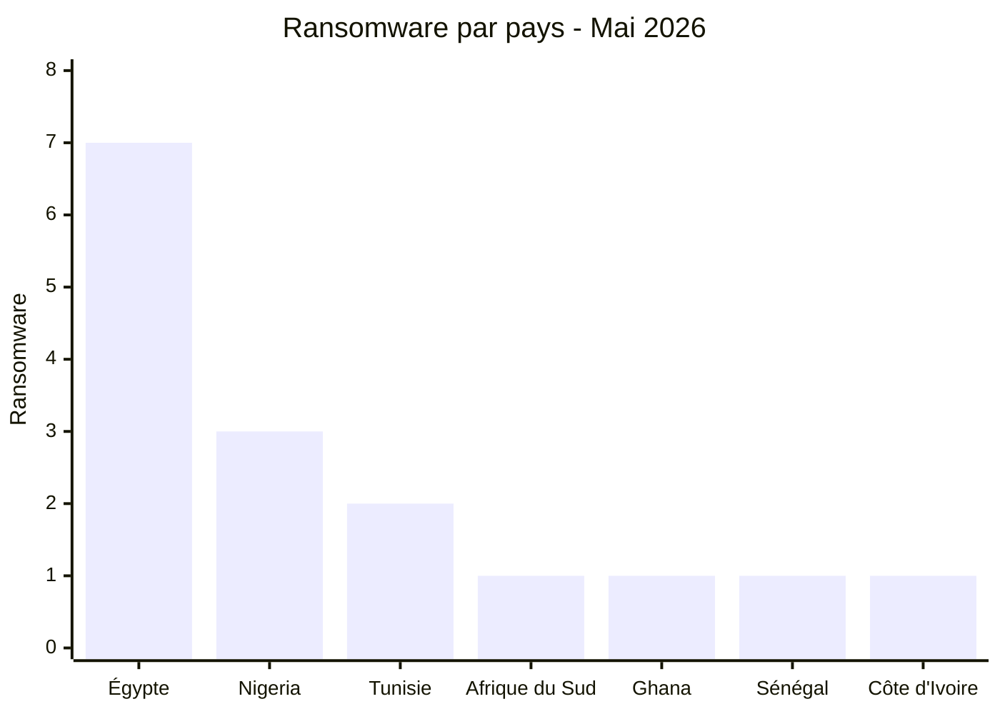
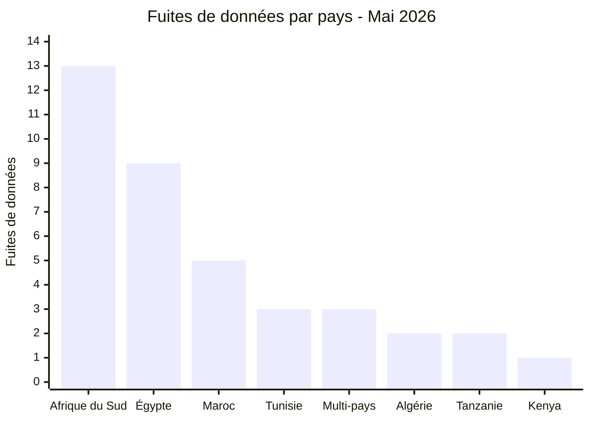
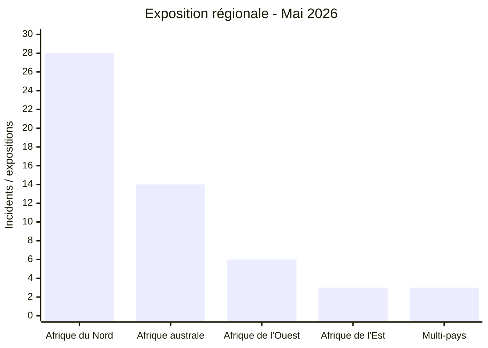
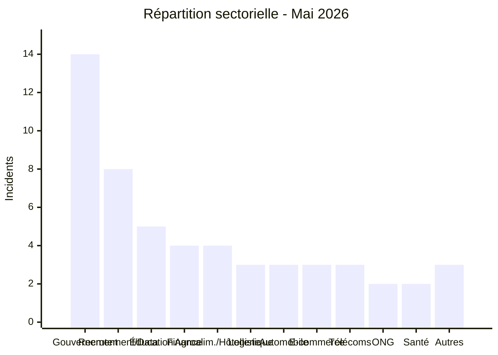
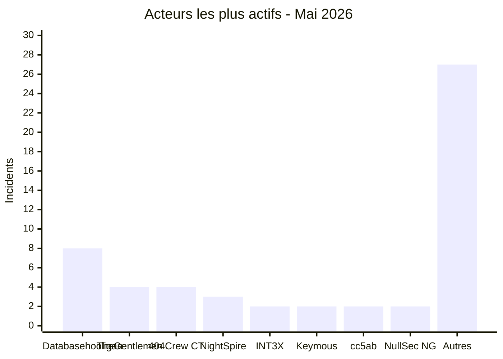

# AFRINTEL - Statistiques cyber Afrique
## Mai 2026

👉🏾 [**English version available here**](./README.md)

## Note méthodologique

Ces statistiques sont basées sur les incidents publiquement revendiqués ou observés dans le périmètre AFRINTEL pour mai 2026. Les contenus issus de forums cybercriminels, leak sites ou canaux underground sont traités comme des **revendications** tant qu'ils ne sont pas confirmés indépendamment par la victime ou par des preuves techniques vérifiables.

Les trois incidents multi-pays (Resume Docs, DHIS2, Scans de passeports) sont comptabilisés comme **1 incident chacun** dans le total global de 54. Pour l'analyse régionale, ils sont également projetés sur les zones géographiques concernées afin de refléter l'exposition régionale réelle.

---

## 1. Synthèse statistique

| Indicateur | Valeur |
|---|---:|
| Total incidents | 54 |
| Attaques ransomware | 16 |
| Fuites de données / ventes d'accès | 38 |
| Pays touchés | 11 + multi-pays |
| Acteurs distincts | 25+ |
| Pays le plus touché | Égypte |
| Principal pays ransomware | Égypte |
| Principal pays fuites de données | Afrique du Sud |

### Répartition globale

| Type d'incident | Nombre | Pourcentage |
|---|---:|---:|
| Ransomware | 16 | 29,6 % |
| Fuites de données / ventes d'accès | 38 | 70,4 % |
| **Total** | **54** | **100 %** |

---

## 2. Répartition des victimes par pays

| Pays | Incidents |
|---|---:|
| 🇪🇬 Égypte | 16 |
| 🇿🇦 Afrique du Sud | 14 |
| 🇲🇦 Maroc | 5 |
| 🇹🇳 Tunisie | 5 |
| 🇳🇬 Nigeria | 3 |
| 🇩🇿 Algérie | 2 |
| 🇹🇿 Tanzanie | 2 |
| 🇬🇭 Ghana | 1 |
| 🇨🇮 Côte d'Ivoire | 1 |
| 🇰🇪 Kenya | 1 |
| 🇸🇳 Sénégal | 1 |
| 🌍 Multi-pays | 3 |
| **Total** | **54** |

---

## 3. Ransomware vs fuites de données par pays

| Pays | Ransomware | Fuites de données / ventes d'accès | Total |
|---|---:|---:|---:|
| 🇪🇬 Égypte | 7 | 9 | 16 |
| 🇿🇦 Afrique du Sud | 1 | 13 | 14 |
| 🇲🇦 Maroc | 0 | 5 | 5 |
| 🇹🇳 Tunisie | 2 | 3 | 5 |
| 🇳🇬 Nigeria | 3 | 0 | 3 |
| 🇩🇿 Algérie | 0 | 2 | 2 |
| 🇹🇿 Tanzanie | 0 | 2 | 2 |
| 🇬🇭 Ghana | 1 | 0 | 1 |
| 🇨🇮 Côte d'Ivoire | 1 | 0 | 1 |
| 🇰🇪 Kenya | 0 | 1 | 1 |
| 🇸🇳 Sénégal | 1 | 0 | 1 |
| 🌍 Multi-pays | 0 | 3 | 3 |
| **Total** | **16** | **38** | **54** |

### Ransomware par pays

### Fuites de données par pays

---

## 4. Répartition géographique

| Région | Pays inclus | Total incidents | Ransomware | Fuites |
|---|---|---:|---:|---:|
| Afrique du Nord | 🇪🇬 Égypte, 🇲🇦 Maroc, 🇹🇳 Tunisie, 🇩🇿 Algérie | 28 (51,9 %) | 9 | 19 |
| Afrique australe | 🇿🇦 Afrique du Sud | 14 (25,9 %) | 1 | 13 |
| Afrique de l'Ouest | 🇳🇬 Nigeria, 🇬🇭 Ghana, 🇨🇮 Côte d'Ivoire, 🇸🇳 Sénégal | 6 (11,1 %) | 5 | 1 |
| Afrique de l'Est | 🇹🇿 Tanzanie, 🇰🇪 Kenya | 3 (5,6 %) | 0 | 3 |
| Multi-pays | Divers | 3 (5,6 %) | 0 | 3 |

> Note : les incidents multi-pays (Resume Docs, DHIS2, Scans de passeports) sont comptabilisés comme un incident chacun dans le total global et affectés à la catégorie multi-pays. Cette vue reflète la distribution globale de l'exposition.

---

## 5. Répartition sectorielle

| Secteur | Incidents | Pourcentage |
|---|---:|---:|
| Gouvernement / Administration | 14 | 25,9 % |
| Recrutement / Données personnelles | 8 | 14,8 % |
| Éducation / Université | 5 | 9,3 % |
| Finance / Banque | 4 | 7,4 % |
| Agroalimentaire / Hôtellerie | 4 | 7,4 % |
| Logistique / Transport | 3 | 5,6 % |
| Automobile | 3 | 5,6 % |
| E-commerce / Numérique | 3 | 5,6 % |
| Télécommunications / TIC | 3 | 5,6 % |
| ONG / Caritatif | 2 | 3,7 % |
| Santé | 2 | 3,7 % |
| Autres | 3 | 5,6 % |
| **Total** | **54** | **100 %** |

---

## 6. Acteurs de menaces les plus actifs

| Acteur / Groupe | Incidents | Type dominant |
|---|---:|---|
| Databasehooligan | 8 | Fuites de données |
| TheGentlemen | 4 | Ransomware |
| 404Crew Cyber Team | 4 | Fuites de données (coalitions) |
| NightSpire | 3 | Ransomware |
| INT3X | 2 | Fuites de données |
| Keymous | 2 | Ventes d'accès / fuites |
| cc5ab | 2 | Fuites de données |
| NullSec Nigeria | 2 | Fuites de données (coalitions) |
| Autres acteurs | 27 | Mixte |

---

## 7. Analyse des tendances CTI

### 7.1 L'Égypte comme principal foyer ransomware

L'Égypte concentre **7 incidents ransomware**, soit **43,8 %** de l'activité ransomware du mois. NightSpire a revendiqué à lui seul trois cibles égyptiennes en un mois. Les secteurs visés incluent la finance, la restauration, l'industrie chimique, la logistique, l'agriculture et l'hôtellerie.

### 7.2 L'Afrique du Sud sous pression coordonnée

L'Afrique du Sud enregistre **14 incidents** dont 13 fuites de données orchestrées par la coalition 404Crew Cyber Team (avec NullSec Nigeria, NullSec Philippines et Infernalis) sous le label "OpSouthAfrica". Les institutions ciblées incluent des municipalités, des services pénitentiaires, l'autorité fiscale et l'infrastructure IT de l'État.

### 7.3 Le secteur éducatif comme cible stratégique

L'éducation égyptienne a subi une vague de compromissions : Ministère de l'Éducation (26,8 millions d'enregistrements élèves), Professional Academy for Teachers (1,2 million d'enseignants), Université de Mansoura (989 000 enregistrements), bases éducatives et RH (37 Go). L'exposition totale dépasse 28 millions d'enregistrements.

### 7.4 Domination de Databasehooligan sur les plateformes CRM / recrutement

Un même acteur a ciblé huit organisations dans quatre pays (Tunisie, Afrique du Sud, Égypte, Algérie), vendant des bases CRM et consommateurs structurées entre 900 et 1 400 dollars chacune. Cela suggère l'exploitation systématique d'une vulnérabilité commune ou d'une plateforme SaaS partagée.

### 7.5 Exposition des identifiants gouvernementaux

Les plateformes gouvernementales marocaines (827 000 lignes d'identifiants), la messagerie de la police tanzanienne (10 000+ comptes officiers avec mots de passe en clair) et l'accès administrateur de Stats SA représentent des cibles à forte valeur pour l'ingénierie sociale, la fraude EDR et l'usurpation d'identité institutionnelle.

### 7.6 Compromission multi-pays du système de santé DHIS2

La vente d'accès administrateur à DHIS2 dans sept pays (Mozambique, Liberia, Nigeria, Bhoutan, Honduras, Togo, Sierra Leone) représente une menace critique pour les systèmes nationaux de surveillance sanitaire.

---

## 8. Priorités de surveillance SOC

| Priorité | Axe de surveillance |
|---|---|
| Critique | Exposition d'identifiants gouvernementaux et des forces de l'ordre |
| Critique | Patterns d'accès aux bases éducatives (Égypte : Ministère, PAT, Mansoura) |
| Élevée | Exports massifs depuis des plateformes CRM / recrutement (cibles Databasehooligan) |
| Élevée | Indicateurs précoces de ransomware : suppression de copies shadow, chiffrement volumétrique, mouvement latéral RDP/SMB |
| Élevée | Réutilisation d'identifiants exposés dans les fuites gouvernementales marocaines |
| Moyenne | Alignement du profil de cibles NightSpire / TheGentlemen (finance, agroalimentaire, automobile) |
| Moyenne | Anomalies sur les panneaux d'administration DHIS2 / systèmes de santé |
| Moyenne | Annonces de comptes pour fraude EDR multi-pays |

---

## 9. Conclusion

Mai 2026 enregistre **54 incidents** dans **11 pays** auxquels s'ajoutent des incidents multi-pays. L'Égypte et l'Afrique du Sud concentrent à elles seules 56 % des incidents, confirmant leur statut de cibles prioritaires sur le continent. Le ciblage systémique du secteur éducatif égyptien, la campagne coordonnée OpSouthAfrica et le balayage CRM de Databasehooligan dans quatre pays sont les tendances structurantes du mois.

**AFRINTEL** - [African Cyber Threat Intelligence](https://github.com/Hatchepsoute/AFRINTEL)
