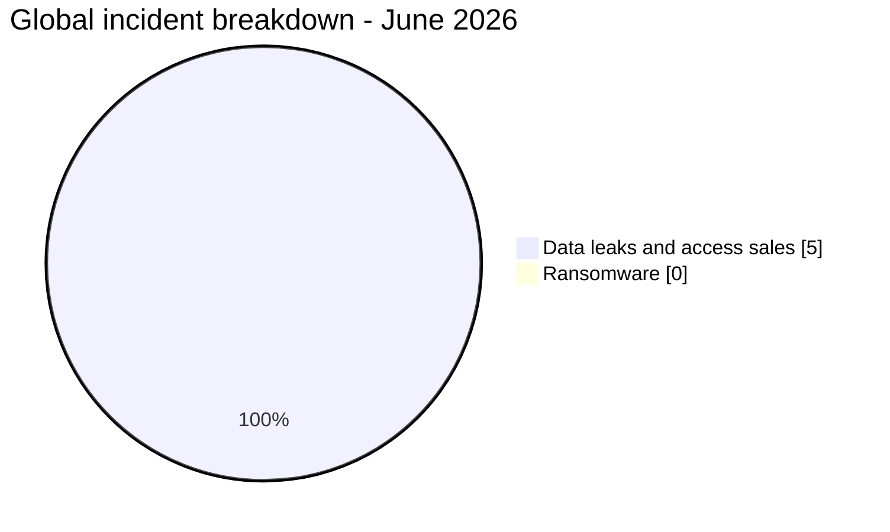
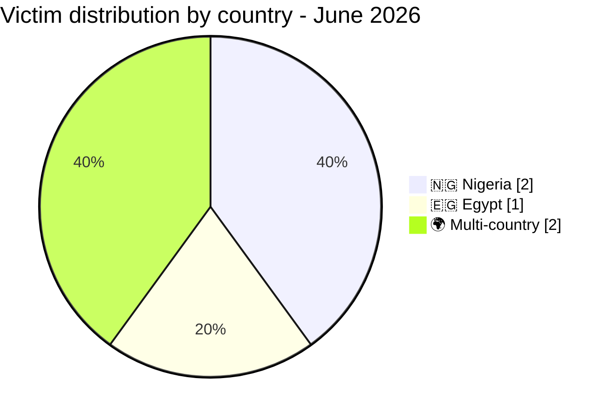
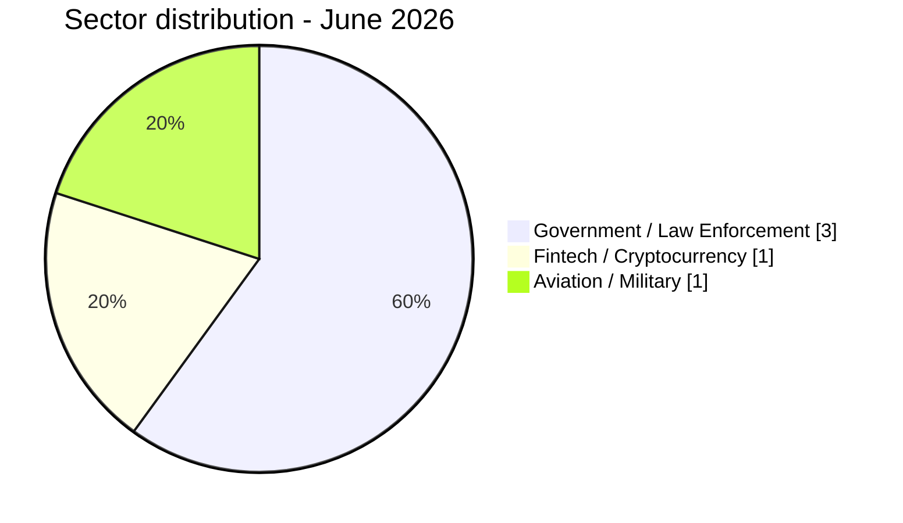
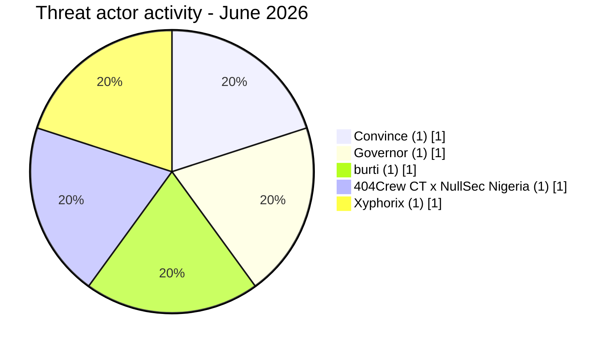

# AFRINTEL - Africa cyber statistics
## June 2026

👉🏾 [**French version available here**](./README_FR.md)

## Methodology note

These statistics are based on publicly claimed or observed incidents within the AFRINTEL monitoring scope for June 2026 (1-21 June 2026). Content originating from cybercriminal forums, leak sites, or underground channels is treated as a **claim** unless independently confirmed by the victim or supported by verifiable technical evidence.

The two multi-country incidents (Convince EDR access, Governor LEP access) are counted as **1 incident each**. For regional exposure analysis, they are mapped across their affected geographic zones.

---

## 1. Statistical summary

| Indicator | Value |
|---|---:|
| Total incidents | 5 |
| Ransomware attacks | 0 |
| Data leaks / access sales | 5 |
| Countries directly affected | 2 + multi-country |
| Distinct threat actors | 5 |
| Most affected country | Nigeria (2 incidents) |
| Main data leak country | Nigeria |

### Global breakdown

| Incident type | Count | Percentage |
|---|---:|---:|
| Ransomware | 0 | 0% |
| Data leaks / access sales | 5 | 100% |
| **Total** | **5** | **100%** |

---

## 2. Victim distribution by country

| Country | Incidents |
|---|---:|
| 🇳🇬 Nigeria | 2 |
| 🇪🇬 Egypt | 1 |
| 🌍 Multi-country | 2 |
| **Total** | **5** |

---

## 3. Incident distribution by sector

| Sector | Incidents | Percentage |
|---|---:|---:|
| Government / Law Enforcement | 3 | 60% |
| Fintech / Cryptocurrency | 1 | 20% |
| Aviation / Military | 1 | 20% |
| **Total** | **5** | **100%** |

---

## 4. Incident distribution by type

| Type | Count | Percentage |
|---|---:|---:|
| Database sale / leak | 3 | 60% |
| Access sale (credentials / accounts) | 2 | 40% |
| **Total** | **5** | **100%** |

---

## 5. Threat actor activity

| Actor | Incidents | Type |
|---|---:|:---|
| Convince | 1 | Access sale (EDR credentials) |
| Governor | 1 | Access sale (LEP accounts) |
| burti | 1 | Data broker |
| 404Crew CT x NullSec Nigeria | 1 | Data leak (coalition) |
| Xyphorix | 1 | Data broker |

---

## 6. Regional breakdown

| Region | Incidents |
|---|---:|
| North Africa | 1 (Egypt) |
| West Africa | 2 (Nigeria) |
| Multi-country / Cross-regional | 2 |
| **Total** | **5** |

---

## 7. Key facts (June 2026)

- **0 ransomware attacks**: sharp contrast with May 2026 (16 ransomware).
- **Jeroid.co**: 312,433 users, 759,900 wallets ($306M TVL), 110,282 BVN, 64,300 NIN, 70,956 biometric photos exposed. Asking price: $2,000 USD.
- **Law enforcement portal access**: 9 countries exposed via Governor (portal accounts), 8 countries via Convince (email addresses + EDR tutorial).
- **NILDS Nigeria**: government legislative institution claimed by 404Crew CT x NullSec Nigeria.
- **Egyptian pilots**: military and civil aviation personnel data exposed (5 organizations).

---

## 8. CTI interpretation

June 2026 marks a complete shift away from ransomware toward data monetization and access sales. The month's defining threat is the professionalization of law enforcement impersonation, with two independent actors selling credentials that enable fraud against Meta, Google, TikTok, and X's law enforcement portals. This represents a structural attack on Africa's digital governance infrastructure rather than isolated breaches. The Jeroid.co incident underscores the systemic risk of accumulating BVN, NIN, and biometric data in single-platform architectures without adequate storage security.

**SOC priorities for June 2026:**
1. Audit and rotate all government email credentials across Nigeria, Egypt, Tanzania, Kenya, Ethiopia, Angola, Zambia, Morocco, and Algeria.
2. Verify legitimacy of all EDR/LEP requests filed via African government accounts since January 2026.
3. Investigate Jeroid.co user exposure; monitor BVN-linked account anomalies in Nigerian financial institutions.
4. Enforce S3 bucket access controls on all fintech and identity data platforms.

---

*AFRINTEL - Open African CTI Monitoring Initiative*
