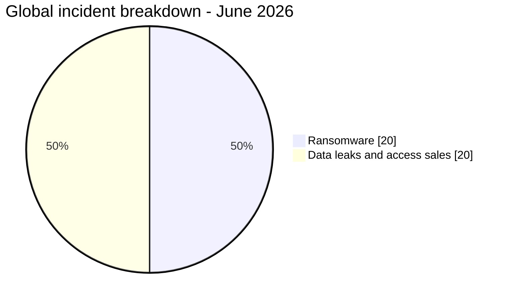
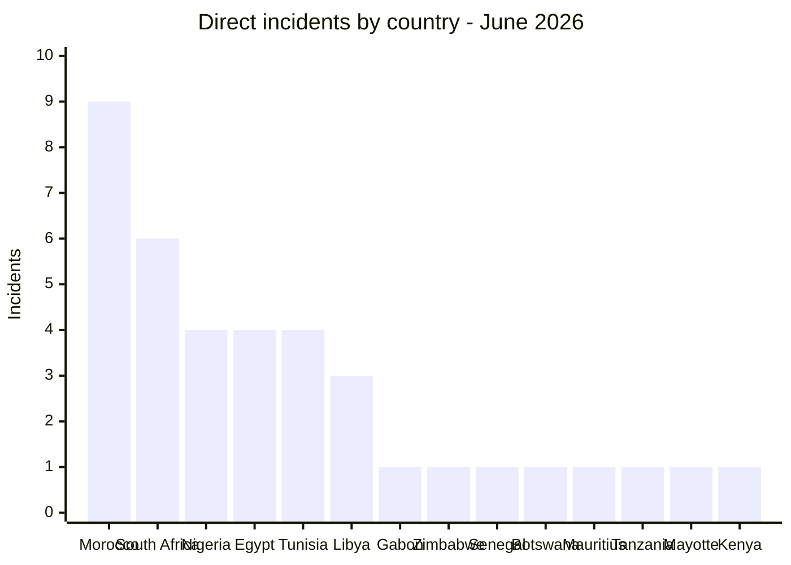
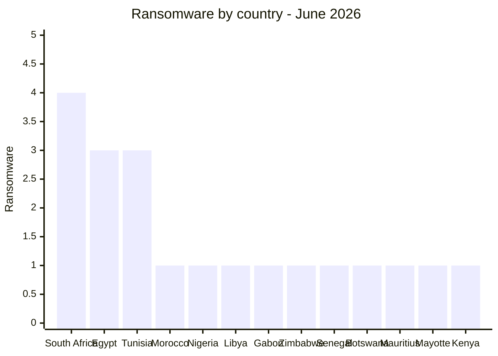
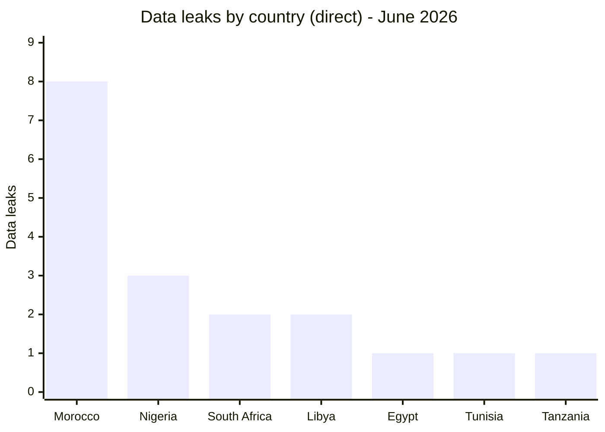
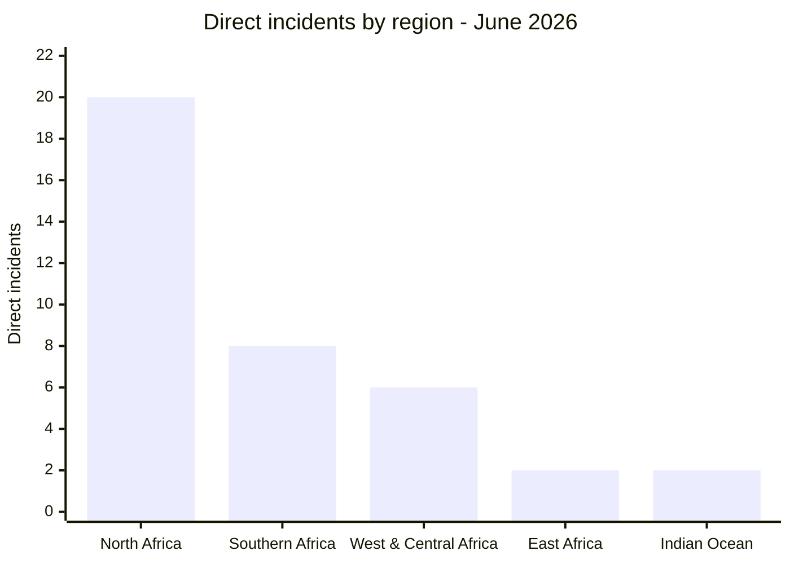
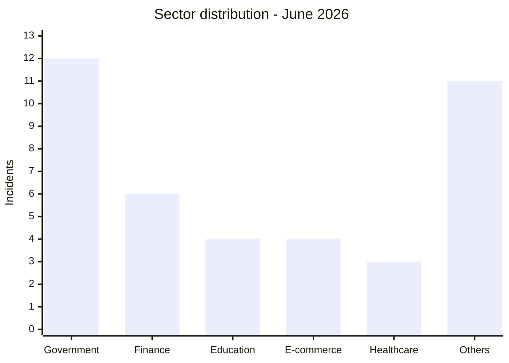
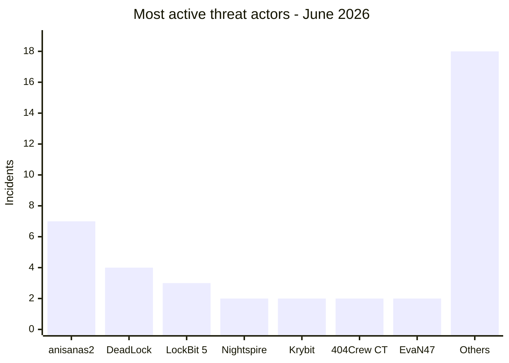

# AFRINTEL - Africa cyber statistics
## June 2026

👉🏾 [**French version available here**](./README_FR.md)

## Methodology note

These statistics are based on publicly claimed or observed incidents within the AFRINTEL monitoring scope for June 2026 (1-30 June 2026). Incidents are assigned to June when they were first identified and assessed by AFRINTEL, even when the original claim date is earlier; the original date remains documented in the victim card. Content originating from cybercriminal forums, leak sites, or underground channels is treated as a **claim** unless independently confirmed by the victim or supported by verifiable technical evidence.

The two multi-country incidents (Convince EDR email sale, Governor LEP portal access sale) are counted as **1 incident each** in the global total of 40. In the geographic exposure table (section 2.3), each country touched by these incidents is listed individually, so country-level totals exceed 40.

---

## 1. Statistical summary

| Indicator | Value |
|---|---:|
| Total incidents | 40 |
| Ransomware attacks | 20 |
| Data leaks / access sales | 20 |
| Countries affected | 20 (14 direct + 6 via multi-country incidents) |
| Distinct threat actors | 25 |
| Most affected country | Morocco (9 incidents) |
| Main ransomware country | South Africa |
| Main data leak country | Morocco |

### Global breakdown

| Incident type | Count | Percentage |
|---|---:|---:|
| Ransomware | 20 | 50.0% |
| Data leaks / access sales | 20 | 50.0% |
| **Total** | **40** | **100%** |

---

## 2. Victim distribution by country

### 2.1 Direct incidents by country

These 38 incidents have a single identified victim country. The 2 multi-country incidents are detailed in section 2.2.

| Country | Incidents |
|---|---:|
| 🇲🇦 Morocco | 9 |
| 🇿🇦 South Africa | 6 |
| 🇳🇬 Nigeria | 4 |
| 🇪🇬 Egypt | 4 |
| 🇹🇳 Tunisia | 4 |
| 🇱🇾 Libya | 3 |
| 🇬🇦 Gabon | 1 |
| 🇿🇼 Zimbabwe | 1 |
| 🇸🇳 Senegal | 1 |
| 🇧🇼 Botswana | 1 |
| 🇲🇺 Mauritius | 1 |
| 🇹🇿 Tanzania | 1 |
| 🇾🇹 Mayotte | 1 |
| 🇰🇪 Kenya | 1 |
| **Subtotal (direct)** | **38** |

### 2.2 Geographic exposure from multi-country incidents

2 incidents affected multiple countries simultaneously through credential/portal-access sales. Each is counted once in the global total of 40 but exposes several countries.

| Incident | Actor | Countries affected (African scope) |
|---|---|---|
| Government email address sale (EDR abuse) | Convince | 🇪🇹 Ethiopia, 🇹🇿 Tanzania, 🇦🇴 Angola, 🇰🇪 Kenya, 🇿🇲 Zambia, 🇳🇬 Nigeria, 🇪🇬 Egypt, 🇲🇦 Morocco |
| Law enforcement portal account sale | [Citizen] Governor | 🇪🇬 Egypt, 🇲🇼 Malawi, 🇹🇿 Tanzania, 🇩🇿 Algeria, 🇰🇪 Kenya, 🇿🇲 Zambia, 🇸🇱 Sierra Leone |

> Governor's original listing also included Palestine and Yemen; both fall outside AFRINTEL's African scope and are excluded from country counts.

### 2.3 Total geographic exposure (all 20 countries)

> The "Multi-country exposure" column counts how many times a country appears in the two credential-sale incidents. Column sums exceed 40 because multi-country incidents touch several countries simultaneously.

| Country | Direct incidents | Multi-country exposure | Total exposure |
|---|---:|---:|---:|
| 🇲🇦 Morocco | 9 | 1 (Convince) | 10 |
| 🇿🇦 South Africa | 6 | 0 | 6 |
| 🇪🇬 Egypt | 4 | 2 (Convince, Governor) | 6 |
| 🇳🇬 Nigeria | 4 | 1 (Convince) | 5 |
| 🇹🇳 Tunisia | 4 | 0 | 4 |
| 🇱🇾 Libya | 3 | 0 | 3 |
| 🇹🇿 Tanzania | 1 | 2 (Convince, Governor) | 3 |
| 🇰🇪 Kenya | 1 | 2 (Convince, Governor) | 3 |
| 🇿🇲 Zambia | 0 | 2 (Convince, Governor) | 2 |
| 🇬🇦 Gabon | 1 | 0 | 1 |
| 🇿🇼 Zimbabwe | 1 | 0 | 1 |
| 🇸🇳 Senegal | 1 | 0 | 1 |
| 🇧🇼 Botswana | 1 | 0 | 1 |
| 🇲🇺 Mauritius | 1 | 0 | 1 |
| 🇾🇹 Mayotte | 1 | 0 | 1 |
| 🇪🇹 Ethiopia | 0 | 1 (Convince) | 1 |
| 🇦🇴 Angola | 0 | 1 (Convince) | 1 |
| 🇲🇼 Malawi | 0 | 1 (Governor) | 1 |
| 🇩🇿 Algeria | 0 | 1 (Governor) | 1 |
| 🇸🇱 Sierra Leone | 0 | 1 (Governor) | 1 |
| **Total** | **38 direct incidents** | **15 country exposures** | **20 distinct countries** |

---

## 3. Ransomware vs data leaks by country

| Country | Ransomware | Data Leaks / Access Sales | Total |
|---|---:|---:|---:|
| 🇲🇦 Morocco | 1 | 8 | 9 |
| 🇿🇦 South Africa | 4 | 2 | 6 |
| 🇳🇬 Nigeria | 1 | 3 | 4 |
| 🇪🇬 Egypt | 3 | 1 | 4 |
| 🇹🇳 Tunisia | 3 | 1 | 4 |
| 🇱🇾 Libya | 1 | 2 | 3 |
| 🇬🇦 Gabon | 1 | 0 | 1 |
| 🇿🇼 Zimbabwe | 1 | 0 | 1 |
| 🇸🇳 Senegal | 1 | 0 | 1 |
| 🇧🇼 Botswana | 1 | 0 | 1 |
| 🇲🇺 Mauritius | 1 | 0 | 1 |
| 🇹🇿 Tanzania | 0 | 1 | 1 |
| 🇾🇹 Mayotte | 1 | 0 | 1 |
| 🇰🇪 Kenya | 1 | 0 | 1 |
| **Subtotal (direct)** | **20** | **18** | **38** |
| 🌍 Convince (multi-country) | 0 | 1 | 1 |
| 🌍 Governor (multi-country) | 0 | 1 | 1 |
| **Total** | **20** | **20** | **40** |

### Ransomware by country

### Data leaks by country

---

## 4. Geographic breakdown

| Region | Countries included | Direct incidents | Multi-country exposure |
|---|---|---:|---:|
| North Africa | 🇲🇦 Morocco, 🇪🇬 Egypt, 🇹🇳 Tunisia, 🇱🇾 Libya | 20 | +3 (Morocco, Egypt via Convince; Egypt via Governor) |
| Southern Africa | 🇿🇦 South Africa, 🇧🇼 Botswana, 🇿🇼 Zimbabwe | 8 | 0 |
| West & Central Africa | 🇳🇬 Nigeria, 🇬🇦 Gabon, 🇸🇳 Senegal | 6 | +1 (Nigeria via Convince) |
| East Africa | 🇰🇪 Kenya, 🇹🇿 Tanzania | 2 | +4 (Kenya, Tanzania via both Convince and Governor) |
| Indian Ocean | 🇲🇺 Mauritius, 🇾🇹 Mayotte | 2 | 0 |
| Not otherwise direct victims | 🇪🇹 Ethiopia, 🇦🇴 Angola, 🇿🇲 Zambia, 🇲🇼 Malawi, 🇩🇿 Algeria, 🇸🇱 Sierra Leone | 0 | +7 (see section 2.3) |

> Multi-country incidents are counted once in the global total of 40. The "Multi-country exposure" column shows additional country-level touches from those incidents. Total distinct countries: 20 across 5 regions plus 6 countries exposed only via credential sales.

---

## 5. Sector distribution

| Sector | Incidents | Percentage |
|---|---:|---:|
| Government / Administration | 12 | 30.0% |
| Finance / Banking | 6 | 15.0% |
| Education / University | 4 | 10.0% |
| E-commerce / Retail | 4 | 10.0% |
| Healthcare / Medical | 3 | 7.5% |
| Others | 11 | 27.5% |
| **Total** | **40** | **100%** |

---

## 6. Most active threat actors

| Threat actor / Group | Incidents | Dominant type |
|---|---:|---|
| anisanas2 | 7 | Data leaks / sales (Morocco, 3-month campaign) |
| DeadLock | 4 | Ransomware (multi-country) |
| LockBit 5 | 3 | Ransomware |
| Nightspire | 2 | Ransomware |
| Krybit | 2 | Ransomware / data published |
| 404Crew Cyber Team | 2 | Data leaks (coalition and solo) |
| EvaN47 | 2 | Data leaks (Libya) |
| Other actors | 18 | Mixed |

---

## 7. CTI trend analysis

### 7.1 Morocco under sustained single-actor pressure

Morocco recorded **9 incidents**, its highest monthly total in 2026, of which **7 are attributed to a single cluster, anisanas2**. This is the third consecutive month this actor has targeted Moroccan organizations (following RADEM Meknès and the Ministry of Justice bundle in May), spanning education, logistics, mining, e-commerce, startups and automotive. This concentration, rather than any single incident, is the defining Moroccan pattern of the quarter.

### 7.2 Ransomware regains ground

Ransomware listings reached **50% of incidents (20/40)**, up from 28.1% in the [May victim dataset](../../../CyberAttackAfrica/2026/05-may/victims.md). One month is insufficient to establish a durable change in actor behaviour, but the geographic spread of DeadLock and LockBit 5 warrants monitoring.

### 7.3 High-sensitivity fintech exposure

The analysed Jeroid.co material suggests exposure involving the volumes claimed by the actor, including 312,433 users and 70,956 biometric photos, through an unauthenticated S3 bucket. AFRINTEL does not confirm the complete claimed dataset or the initial access vector.

### 7.4 Military and defense credential hygiene

Two national-security-grade incidents were recorded in the same month: the Nigerian Army's plaintext webmail credential leak (with satellite imagery portal access) and South Africa's SANDF classified document leak. Both trace back to old material, personal accounts and documents that were never properly rotated, retired or secured.

### 7.5 Law-enforcement impersonation as a service

Two separate actors, Convince and Governor, sold government and police credentials across at least 15 African jurisdictions, explicitly marketed to file fraudulent Emergency Disclosure Requests and data subpoenas with Meta, Google, TikTok and X. This is a cross-border abuse vector that requires direct platform engagement, not just national-level response.

### 7.6 Libya's education ministries hit back-to-back

The same actor, EvaN47, targeted the Ministry of Technical and Vocational Education (June 29) and the Ministry of Education (June 30) on consecutive days, the strongest early-campaign signal of the month, worth tracking into July.

---

## 8. SOC monitoring priorities

| Priority | Monitoring focus |
|---|---|
| Critical | anisanas2 cluster tracking (Morocco, 3-month sustained campaign) |
| Critical | Public cloud storage exposure (S3/Blob) on fintech and KYC platforms |
| High | Government and military credential rotation (.gov, .mil, .ac domains) |
| High | Ransomware early indicators from DeadLock, LockBit 5, Krybit, Nightspire, Qilin leak sites |
| High | Law-enforcement portal access requests: out-of-band verification for EDR/subpoena filings |
| Medium | Libya government education sector, watch for a third ministry incident in July |
| Medium | WordPress/CMS hardening on education platforms following the Examens.tn dump |
| Medium | Infostealer log monitoring for credentials tied to government and university domains |

---

## 9. Conclusion

June 2026 recorded **40 incidents** affecting **20 distinct countries** when direct incidents and multi-country exposures are combined. Ransomware listings reached parity with data leaks and access sales. Morocco accounted for 9 direct incident records, while publications attributed to anisanas2 continued for a third month; coordination and initial access paths remain unknown. The claimed Jeroid.co exposure and Nigerian Army credential publication are among the highest-sensitivity cases in the June dataset.

**AFRINTEL** - [African Cyber Threat Intelligence](https://github.com/Hatchepsoute/AFRINTEL)
