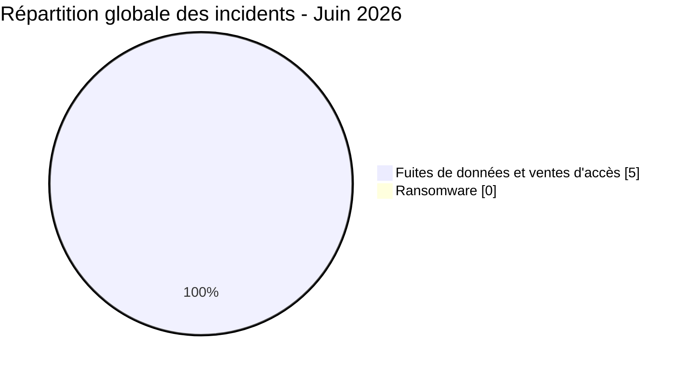
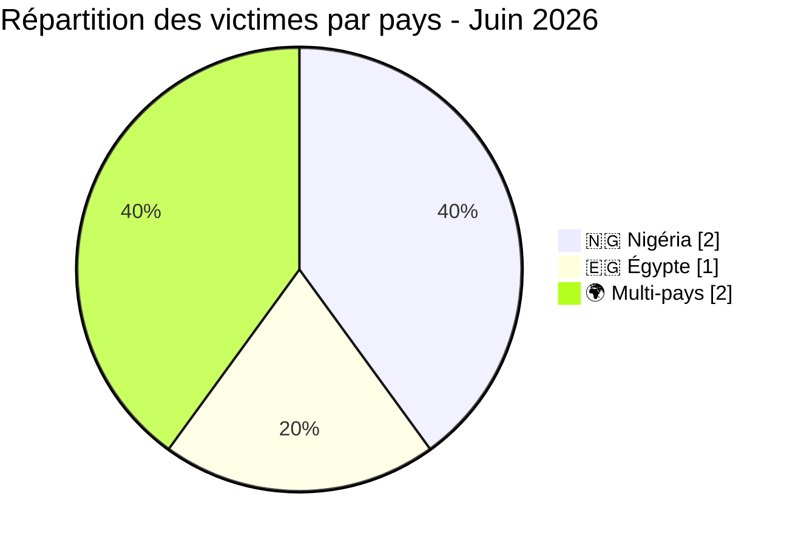
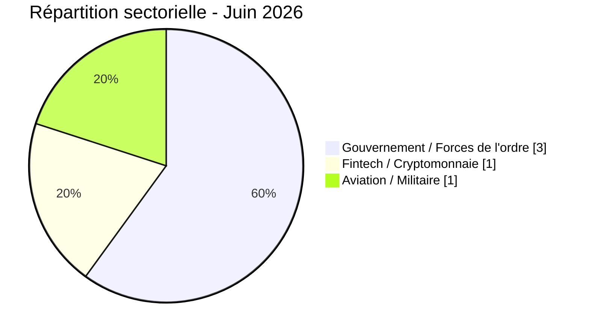
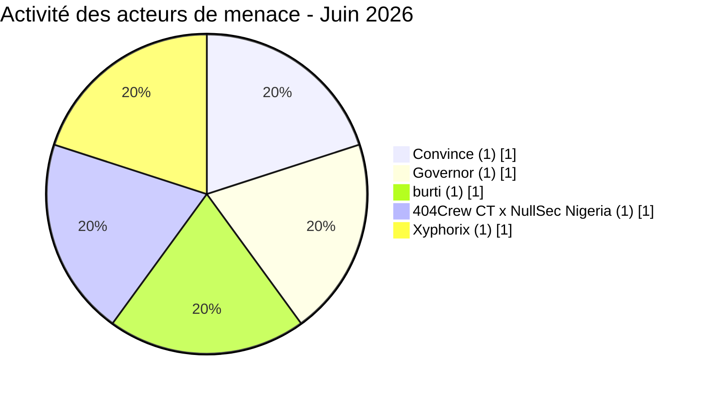

# AFRINTEL - Statistiques cyber Afrique
## Juin 2026

👉🏾 [**English version available here**](./README.md)

## Note méthodologique

Ces statistiques sont fondées sur les incidents revendiqués ou observés publiquement dans le périmètre de surveillance AFRINTEL pour juin 2026 (1-21 juin 2026). Les publications issues de forums cybercriminels, de leak sites ou de canaux clandestins sont traitées comme des **revendications** sauf confirmation indépendante de la victime ou preuve technique vérifiable.

Les deux incidents multi-pays (accès EDR Convince, accès LEP Governor) sont comptés comme **1 incident chacun**. Pour l'analyse de l'exposition régionale, ils sont cartographiés sur les zones géographiques concernées.

---

## 1. Synthèse statistique

| Indicateur | Valeur |
|---|---:|
| Total incidents | 5 |
| Incidents ransomware | 0 |
| Fuites de données / ventes d'accès | 5 |
| Pays directement touchés | 2 + multi-pays |
| Acteurs distincts | 5 |
| Pays le plus touché | Nigéria (2 incidents) |
| Principal pays fuite de données | Nigéria |

### Répartition globale

| Type d'incident | Nombre | Pourcentage |
|---|---:|---:|
| Ransomware | 0 | 0 % |
| Fuites de données / ventes d'accès | 5 | 100 % |
| **Total** | **5** | **100 %** |

---

## 2. Répartition des victimes par pays

| Pays | Incidents |
|---|---:|
| 🇳🇬 Nigéria | 2 |
| 🇪🇬 Égypte | 1 |
| 🌍 Multi-pays | 2 |
| **Total** | **5** |

---

## 3. Répartition par secteur

| Secteur | Incidents | Pourcentage |
|---|---:|---:|
| Gouvernement / Forces de l'ordre | 3 | 60 % |
| Fintech / Cryptomonnaie | 1 | 20 % |
| Aviation / Militaire | 1 | 20 % |
| **Total** | **5** | **100 %** |

---

## 4. Répartition par type d'incident

| Type | Nombre | Pourcentage |
|---|---:|---:|
| Vente / fuite de base de données | 3 | 60 % |
| Vente d'accès (identifiants / comptes) | 2 | 40 % |
| **Total** | **5** | **100 %** |

---

## 5. Activité des acteurs de menace

| Acteur | Incidents | Type |
|---|---:|:---|
| Convince | 1 | Vente d'accès (identifiants EDR) |
| Governor | 1 | Vente d'accès (comptes LEP) |
| burti | 1 | Data broker |
| 404Crew CT x NullSec Nigeria | 1 | Fuite de données (coalition) |
| Xyphorix | 1 | Data broker |

---

## 6. Répartition régionale

| Région | Incidents |
|---|---:|
| Afrique du Nord | 1 (Égypte) |
| Afrique de l'Ouest | 2 (Nigéria) |
| Multi-pays / Transrégional | 2 |
| **Total** | **5** |

---

## 7. Faits clés (Juin 2026)

- **0 incident ransomware :** contraste fort avec mai 2026 (16 ransomwares).
- **Jeroid.co :** 312 433 utilisateurs, 759 900 portefeuilles (TVL 306 M$), 110 282 BVN, 64 300 NIN, 70 956 photos biométriques exposées. Prix demandé : 2 000 dollars.
- **Accès portails forces de l'ordre :** 9 pays exposés via Governor (comptes portails), 8 pays via Convince (adresses e-mail + tutoriel EDR).
- **NILDS Nigéria :** institution gouvernementale législative revendiquée par 404Crew CT x NullSec Nigeria.
- **Pilotes égyptiens :** données personnelles de personnel militaire et civil exposées (5 organisations).

---

## 8. Interprétation CTI

Juin 2026 marque un basculement complet des opérations ransomware vers la monétisation de données et la vente d'accès. La menace structurante du mois est la professionnalisation de l'usurpation des forces de l'ordre, avec deux acteurs indépendants vendant des identifiants permettant de frauder les portails forces de l'ordre de Meta, Google, TikTok et X. Cette dynamique représente une attaque sur l'infrastructure de gouvernance numérique africaine, et non de simples fuites isolées. L'incident Jeroid.co souligne le risque systémique lié à l'accumulation de BVN, NIN et données biométriques dans des architectures mono-plateforme sans sécurité de stockage adéquate.

**Priorités SOC pour juin 2026 :**
1. Auditer et faire tourner tous les identifiants d'e-mails gouvernementaux au Nigéria, en Égypte, en Tanzanie, au Kenya, en Éthiopie, en Angola, en Zambie, au Maroc et en Algérie.
2. Vérifier la légitimité de toutes les demandes EDR/LEP soumises via des comptes gouvernementaux africains depuis janvier 2026.
3. Investiguer l'exposition des utilisateurs Jeroid.co ; surveiller les anomalies de comptes liés aux BVN dans les établissements financiers nigérians.
4. Appliquer des contrôles d'accès stricts sur les buckets S3 de toutes les plateformes fintech et d'identité numérique.

---

*AFRINTEL - Initiative ouverte de veille CTI sur l'Afrique*
