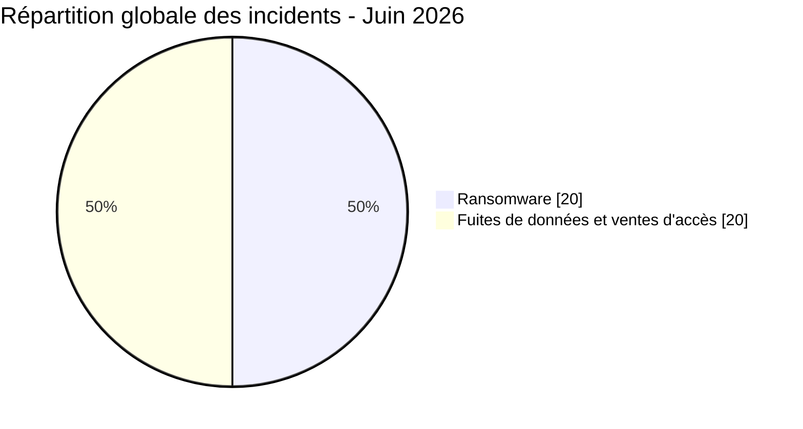
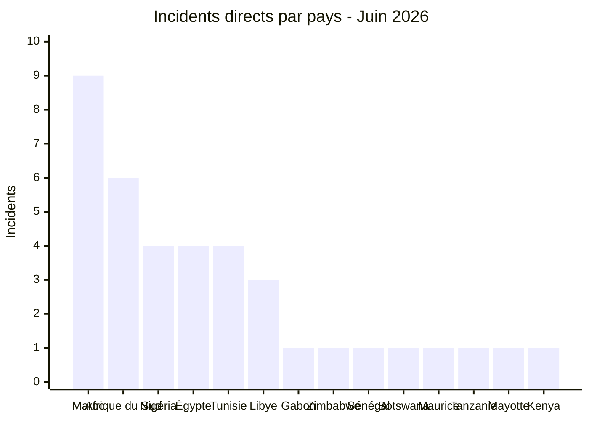
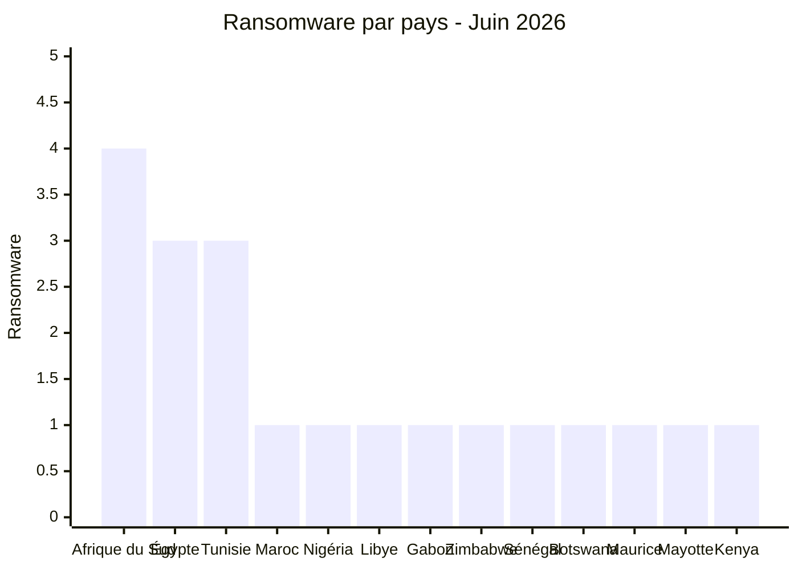
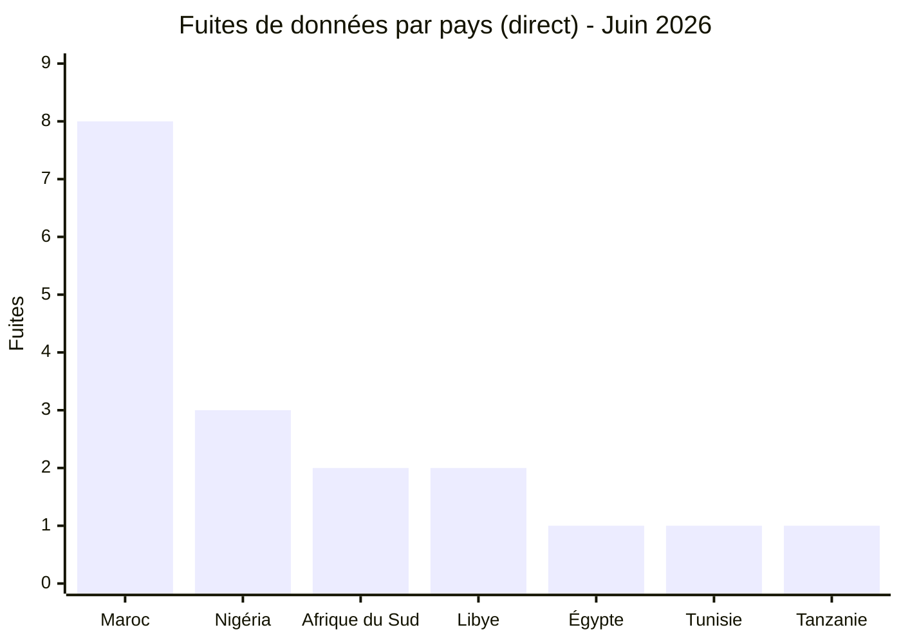
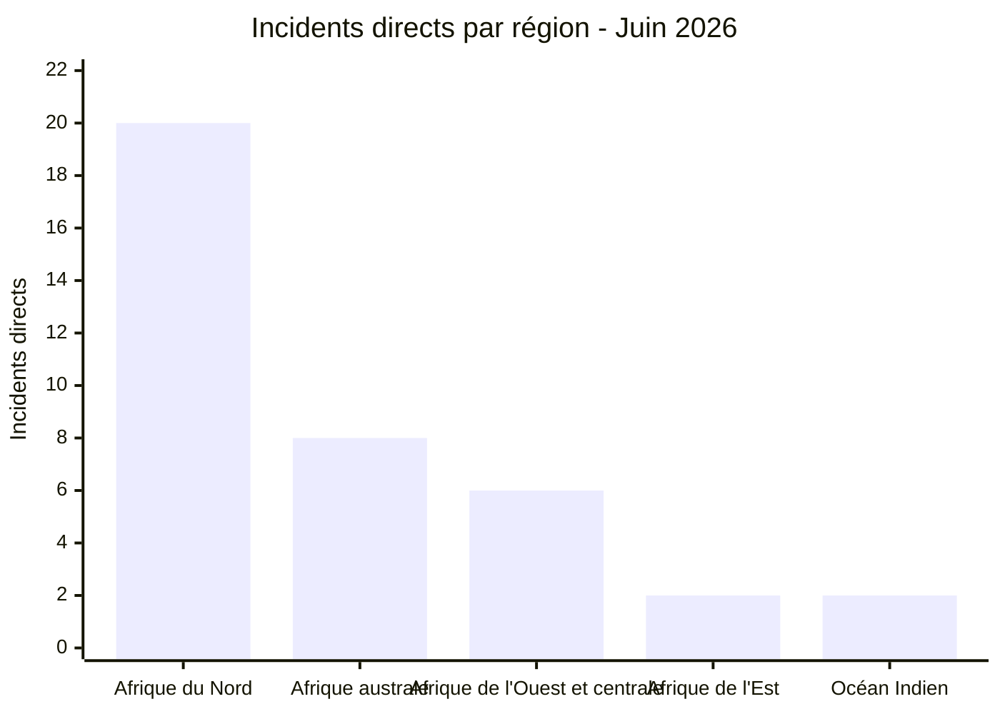
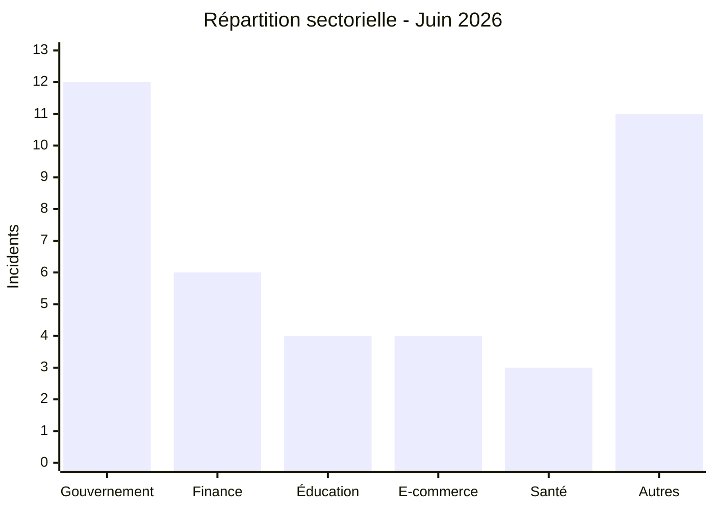
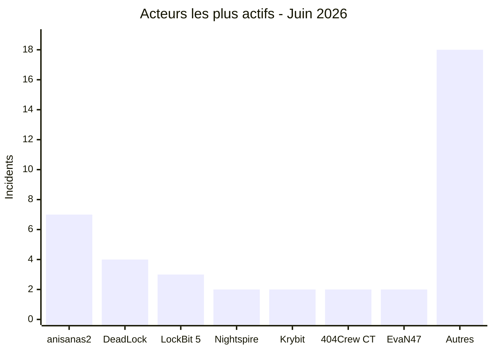

# AFRINTEL - Statistiques cyber Afrique
## Juin 2026

👉🏾 [**English version available here**](./README.md)

## Note méthodologique

Ces statistiques sont fondées sur les incidents revendiqués ou observés publiquement dans le périmètre de surveillance AFRINTEL pour juin 2026 (1-30 juin 2026). Les incidents sont rattachés à juin lorsqu'ils ont été identifiés et analysés pour la première fois par AFRINTEL, même si la revendication initiale est antérieure ; cette date initiale reste documentée dans la fiche victime. Les publications issues de forums cybercriminels, de leak sites ou de canaux clandestins sont traitées comme des **revendications** sauf confirmation indépendante de la victime ou preuve technique vérifiable.

Les deux incidents multi-pays (vente d'e-mails EDR Convince, vente d'accès portails LEP Governor) sont comptés comme **1 incident chacun** dans le total global de 40. Dans le tableau d'exposition géographique (section 2.3), chaque pays touché par ces incidents est listé individuellement, donc les totaux par pays dépassent 40.

---

## 1. Synthèse statistique

| Indicateur | Valeur |
|---|---:|
| Total incidents | 40 |
| Incidents ransomware | 20 |
| Fuites de données / ventes d'accès | 20 |
| Pays touchés | 20 (14 directs + 6 via incidents multi-pays) |
| Acteurs distincts | 25 |
| Pays le plus touché | Maroc (9 incidents) |
| Principal pays ransomware | Afrique du Sud |
| Principal pays fuite de données | Maroc |

### Répartition globale

| Type d'incident | Nombre | Pourcentage |
|---|---:|---:|
| Ransomware | 20 | 50,0 % |
| Fuites de données / ventes d'accès | 20 | 50,0 % |
| **Total** | **40** | **100 %** |

---

## 2. Répartition des victimes par pays

### 2.1 Incidents directs par pays

Ces 38 incidents ont un seul pays victime identifié. Les 2 incidents multi-pays sont détaillés en section 2.2.

| Pays | Incidents |
|---|---:|
| 🇲🇦 Maroc | 9 |
| 🇿🇦 Afrique du Sud | 6 |
| 🇳🇬 Nigéria | 4 |
| 🇪🇬 Égypte | 4 |
| 🇹🇳 Tunisie | 4 |
| 🇱🇾 Libye | 3 |
| 🇬🇦 Gabon | 1 |
| 🇿🇼 Zimbabwe | 1 |
| 🇸🇳 Sénégal | 1 |
| 🇧🇼 Botswana | 1 |
| 🇲🇺 Maurice | 1 |
| 🇹🇿 Tanzanie | 1 |
| 🇾🇹 Mayotte | 1 |
| 🇰🇪 Kenya | 1 |
| **Sous-total (direct)** | **38** |

### 2.2 Exposition géographique des incidents multi-pays

2 incidents ont touché plusieurs pays simultanément via des ventes d'identifiants/accès portails. Chacun est compté une fois dans le total global de 40 mais expose plusieurs pays.

| Incident | Acteur | Pays touchés (périmètre africain) |
|---|---|---|
| Vente d'adresses e-mail gouvernementales (abus EDR) | Convince | 🇪🇹 Éthiopie, 🇹🇿 Tanzanie, 🇦🇴 Angola, 🇰🇪 Kenya, 🇿🇲 Zambie, 🇳🇬 Nigéria, 🇪🇬 Égypte, 🇲🇦 Maroc |
| Vente de comptes portails forces de l'ordre | [Citizen] Governor | 🇪🇬 Égypte, 🇲🇼 Malawi, 🇹🇿 Tanzanie, 🇩🇿 Algérie, 🇰🇪 Kenya, 🇿🇲 Zambie, 🇸🇱 Sierra Leone |

> Le listing original de Governor incluait aussi la Palestine et le Yémen ; les deux sont hors périmètre africain d'AFRINTEL et exclus du décompte des pays.

### 2.3 Exposition géographique totale (20 pays)

> La colonne "Exposition multi-pays" compte le nombre d'apparitions d'un pays dans les deux incidents de vente d'identifiants. Les sommes de colonnes dépassent 40 car les incidents multi-pays touchent plusieurs pays simultanément.

| Pays | Incidents directs | Exposition multi-pays | Exposition totale |
|---|---:|---:|---:|
| 🇲🇦 Maroc | 9 | 1 (Convince) | 10 |
| 🇿🇦 Afrique du Sud | 6 | 0 | 6 |
| 🇪🇬 Égypte | 4 | 2 (Convince, Governor) | 6 |
| 🇳🇬 Nigéria | 4 | 1 (Convince) | 5 |
| 🇹🇳 Tunisie | 4 | 0 | 4 |
| 🇱🇾 Libye | 3 | 0 | 3 |
| 🇹🇿 Tanzanie | 1 | 2 (Convince, Governor) | 3 |
| 🇰🇪 Kenya | 1 | 2 (Convince, Governor) | 3 |
| 🇿🇲 Zambie | 0 | 2 (Convince, Governor) | 2 |
| 🇬🇦 Gabon | 1 | 0 | 1 |
| 🇿🇼 Zimbabwe | 1 | 0 | 1 |
| 🇸🇳 Sénégal | 1 | 0 | 1 |
| 🇧🇼 Botswana | 1 | 0 | 1 |
| 🇲🇺 Maurice | 1 | 0 | 1 |
| 🇾🇹 Mayotte | 1 | 0 | 1 |
| 🇪🇹 Éthiopie | 0 | 1 (Convince) | 1 |
| 🇦🇴 Angola | 0 | 1 (Convince) | 1 |
| 🇲🇼 Malawi | 0 | 1 (Governor) | 1 |
| 🇩🇿 Algérie | 0 | 1 (Governor) | 1 |
| 🇸🇱 Sierra Leone | 0 | 1 (Governor) | 1 |
| **Total** | **38 incidents directs** | **15 expositions pays** | **20 pays distincts** |

---

## 3. Ransomware vs fuites de données par pays

| Pays | Ransomware | Fuites de données / Ventes d'accès | Total |
|---|---:|---:|---:|
| 🇲🇦 Maroc | 1 | 8 | 9 |
| 🇿🇦 Afrique du Sud | 4 | 2 | 6 |
| 🇳🇬 Nigéria | 1 | 3 | 4 |
| 🇪🇬 Égypte | 3 | 1 | 4 |
| 🇹🇳 Tunisie | 3 | 1 | 4 |
| 🇱🇾 Libye | 1 | 2 | 3 |
| 🇬🇦 Gabon | 1 | 0 | 1 |
| 🇿🇼 Zimbabwe | 1 | 0 | 1 |
| 🇸🇳 Sénégal | 1 | 0 | 1 |
| 🇧🇼 Botswana | 1 | 0 | 1 |
| 🇲🇺 Maurice | 1 | 0 | 1 |
| 🇹🇿 Tanzanie | 0 | 1 | 1 |
| 🇾🇹 Mayotte | 1 | 0 | 1 |
| 🇰🇪 Kenya | 1 | 0 | 1 |
| **Sous-total (direct)** | **20** | **18** | **38** |
| 🌍 Convince (multi-pays) | 0 | 1 | 1 |
| 🌍 Governor (multi-pays) | 0 | 1 | 1 |
| **Total** | **20** | **20** | **40** |

### Ransomware par pays

### Fuites de données par pays

---

## 4. Répartition géographique

| Région | Pays inclus | Incidents directs | Exposition multi-pays |
|---|---|---:|---:|
| Afrique du Nord | 🇲🇦 Maroc, 🇪🇬 Égypte, 🇹🇳 Tunisie, 🇱🇾 Libye | 20 | +3 (Maroc, Égypte via Convince ; Égypte via Governor) |
| Afrique australe | 🇿🇦 Afrique du Sud, 🇧🇼 Botswana, 🇿🇼 Zimbabwe | 8 | 0 |
| Afrique de l'Ouest et centrale | 🇳🇬 Nigéria, 🇬🇦 Gabon, 🇸🇳 Sénégal | 6 | +1 (Nigéria via Convince) |
| Afrique de l'Est | 🇰🇪 Kenya, 🇹🇿 Tanzanie | 2 | +4 (Kenya, Tanzanie via Convince et Governor) |
| Océan Indien | 🇲🇺 Maurice, 🇾🇹 Mayotte | 2 | 0 |
| Sans incident direct | 🇪🇹 Éthiopie, 🇦🇴 Angola, 🇿🇲 Zambie, 🇲🇼 Malawi, 🇩🇿 Algérie, 🇸🇱 Sierra Leone | 0 | +7 (voir section 2.3) |

> Les incidents multi-pays sont comptés une fois dans le total global de 40. La colonne "Exposition multi-pays" montre les contacts pays supplémentaires issus de ces incidents. Total de pays distincts : 20 répartis sur 5 régions, plus 6 pays exposés uniquement via les ventes d'identifiants.

---

## 5. Répartition sectorielle

| Secteur | Incidents | Pourcentage |
|---|---:|---:|
| Government / Administration | 12 | 30,0 % |
| Finance / Banking | 6 | 15,0 % |
| Education / University | 4 | 10,0 % |
| E-commerce / Retail | 4 | 10,0 % |
| Healthcare / Medical | 3 | 7,5 % |
| Autres | 11 | 27,5 % |
| **Total** | **40** | **100 %** |

---

## 6. Acteurs de menace les plus actifs

| Acteur / Groupe | Incidents | Type dominant |
|---|---:|---|
| anisanas2 | 7 | Fuites / ventes de données (Maroc, campagne sur 3 mois) |
| DeadLock | 4 | Ransomware (multi-pays) |
| LockBit 5 | 3 | Ransomware |
| Nightspire | 2 | Ransomware |
| Krybit | 2 | Ransomware / données publiées |
| 404Crew Cyber Team | 2 | Fuite de données (coalition et solo) |
| EvaN47 | 2 | Fuite de données (Libye) |
| Autres acteurs | 18 | Mixte |

---

## 7. Analyse des tendances CTI

### 7.1 Le Maroc sous pression soutenue d'un seul acteur

Le Maroc enregistre **9 incidents**, son total mensuel le plus élevé de 2026, dont **7 attribués à un seul cluster, anisanas2**. C'est le troisième mois consécutif où cet acteur cible des organisations marocaines (après RADEM Meknès et le lot Ministère de la Justice en mai), couvrant l'éducation, la logistique, les mines, le e-commerce, les startups et l'automobile. Cette concentration, plus qu'un incident isolé, constitue le schéma marocain déterminant du trimestre.

### 7.2 Le ransomware regagne du terrain

Les publications ransomware atteignent **50 % des incidents (20/40)**, contre 28,1 % dans le [jeu de données de mai](../../../CyberAttackAfrica/2026/05-may/victims_FR.md). Un seul mois ne permet pas d’établir un changement durable du comportement des acteurs, mais la dispersion de DeadLock et LockBit 5 justifie une surveillance.

### 7.3 Exposition fintech à forte sensibilité

Les éléments analysés concernant Jeroid.co suggèrent une exposition portant sur les volumes revendiqués par l’acteur, dont 312 433 utilisateurs et 70 956 photos biométriques, via un bucket S3 sans authentification. AFRINTEL ne confirme ni le jeu de données complet revendiqué ni le vecteur d’accès initial.

### 7.4 Hygiène des identifiants militaires et de défense

Deux incidents de niveau sécurité nationale ont été enregistrés le même mois : la fuite d'identifiants de messagerie en clair de l'armée nigériane (avec accès au portail d'imagerie satellite) et la fuite de document classifié SANDF en Afrique du Sud. Les deux remontent à d'anciens éléments, comptes personnels et documents jamais correctement renouvelés, retirés ou sécurisés.

### 7.5 L'usurpation des forces de l'ordre en tant que service

Deux acteurs distincts, Convince et Governor, ont vendu des identifiants gouvernementaux et policiers sur au moins 15 juridictions africaines, explicitement commercialisés pour soumettre de fausses demandes de divulgation d'urgence et citations à comparaître auprès de Meta, Google, TikTok et X. C'est un vecteur d'abus transfrontalier qui nécessite un engagement direct des plateformes, pas seulement une réponse nationale.

### 7.6 Les ministères libyens touchés coup sur coup

Le même acteur, EvaN47, a ciblé le Ministère de l'Enseignement technique et professionnel (29 juin) et le Ministère de l'Éducation (30 juin) deux jours consécutifs, le signal de campagne naissante le plus fort du mois, à surveiller en juillet.

---

## 8. Priorités de surveillance SOC

| Priorité | Axe de surveillance |
|---|---|
| Critique | Suivi du cluster anisanas2 (Maroc, campagne soutenue sur 3 mois) |
| Critique | Exposition de stockage cloud public (S3/Blob) sur les plateformes fintech et KYC |
| Élevée | Rotation des identifiants gouvernementaux et militaires (domaines .gov, .mil, .ac) |
| Élevée | Indicateurs précoces de ransomware sur les leak sites de DeadLock, LockBit 5, Krybit, Nightspire, Qilin |
| Élevée | Demandes d'accès portails forces de l'ordre : vérification hors bande pour les dépôts EDR/citation à comparaître |
| Moyenne | Secteur éducatif gouvernemental libyen, surveiller un troisième incident ministériel en juillet |
| Moyenne | Durcissement WordPress/CMS sur les plateformes éducatives suite au dump Examens.tn |
| Moyenne | Surveillance des logs infostealers pour les identifiants liés aux domaines gouvernementaux et universitaires |

---

## 9. Conclusion

Juin 2026 recense **40 incidents** concernant **20 pays distincts** lorsque les incidents directs et les expositions multi-pays sont combinés. Les publications ransomware atteignent la parité avec les fuites de données et ventes d’accès. Le Maroc compte 9 incidents directs, tandis que les publications attribuées à anisanas2 se poursuivent pour un troisième mois ; leur coordination et les vecteurs d’accès restent inconnus. La revendication Jeroid.co et la publication d’identifiants de l’armée nigériane figurent parmi les cas les plus sensibles du jeu de données de juin.

**AFRINTEL** - [African Cyber Threat Intelligence](https://github.com/Hatchepsoute/AFRINTEL)
