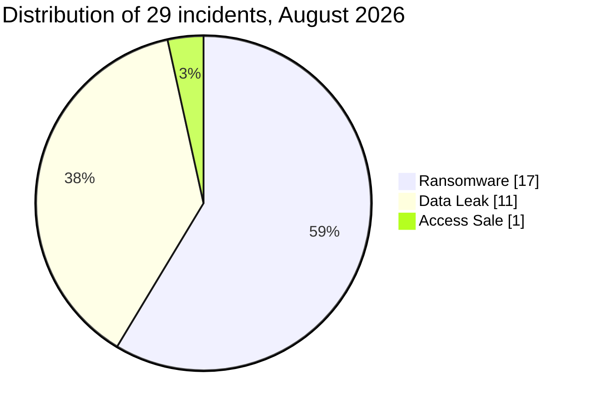

# AFRINTEL: cyber statistics in Africa

## August 2026

👉🏾 [French version](./README_FR.md)

## 1. Scope and counting

These statistics derive from the bilingual [victims_FR.md](../../../CyberAttackAfrica/2026/08-august/victims_FR.md) / [victims.md](../../../CyberAttackAfrica/2026/08-august/victims.md) pair following parity checks. Structured data is determined once from the French version and reused in both languages. The corpus contains 29 records collected in August with follow-up information recorded through 13 September 2026. The 17 ransomware cases are assigned to August. Five data leaks published in January, June or July were discovered and added in August because closed monthly reports are not modified retroactively; their initial dates remain preserved.

Each record contributes to one country: 29 incidents and 29 geographic occurrences. PAYGO is limited to the documented Kenyan scope. Hungry Lion remains assigned to South Africa with reservations about the targeted entity and country. DGSN/DGST counts as one event. The origin of the Afribaba sample remains uncertain. No record carries Under Investigation - Alleged.

## 2. Statistical overview

| Indicator | Value |
|---|---|
| Documented incidents | 29 |
| Country assignments | 10 |
| Normalised sectors | 16 |
| Actor / publication labels | 19 |
| Ransomware | 17 (58.6%) |
| Data Leak | 11 (37.9%) |
| Access Sale | 1 (3.4%) |

DDoS, Defacement, Account Takeover, System Intrusion, Malware and Operational Fraud: 0 each. Percentages are rounded to one decimal place.

## 3. Country and incident-type distribution

| Country | ISO code | Ransomware | Data Leak | Access Sale | Total | Share | Bar |
|---|---|---|---|---|---|---|---|
| 🇿🇦 South Africa | ZA | 9 | 2 | 0 | 11 | 37.9% | ███████████ |
| 🇪🇬 Egypt | EG | 2 | 2 | 0 | 4 | 13.8% | ████ |
| 🇩🇿 Algeria | DZ | 0 | 2 | 1 | 3 | 10.3% | ███ |
| 🇲🇦 Morocco | MA | 1 | 2 | 0 | 3 | 10.3% | ███ |
| 🇰🇪 Kenya | KE | 0 | 2 | 0 | 2 | 6.9% | ██ |
| 🇳🇬 Nigeria | NG | 2 | 0 | 0 | 2 | 6.9% | ██ |
| 🇨🇲 Cameroon | CM | 1 | 0 | 0 | 1 | 3.4% | █ |
| 🇬🇦 Gabon | GA | 1 | 0 | 0 | 1 | 3.4% | █ |
| 🇱🇾 Libya | LY | 0 | 1 | 0 | 1 | 3.4% | █ |
| 🇲🇺 Mauritius | MU | 1 | 0 | 0 | 1 | 3.4% | █ |
| **Total** |  | 17 | 11 | 1 | **29** | 100% |  |

Scale: █ = 1 incident. Each ISO code is paired with the country name in the same row.

## 4. Regional distribution

| Region | Ransomware | Data Leak | Access Sale | Total | Share |
|---|---|---|---|---|---|
| North Africa | 3 | 7 | 1 | 11 | 37.9% |
| Southern Africa | 9 | 2 | 0 | 11 | 37.9% |
| West Africa | 2 | 0 | 0 | 2 | 6.9% |
| Central Africa | 2 | 0 | 0 | 2 | 6.9% |
| East Africa | 0 | 2 | 0 | 2 | 6.9% |
| Indian Ocean | 1 | 0 | 0 | 1 | 3.4% |
| **Total** | 17 | 11 | 1 | **29** | 100% |

Mauritius is assigned to the Indian Ocean separately from East Africa. West Africa and Central Africa remain distinct.

## 5. Sector distribution

| Normalised sector | Records | Share | Organisations / contexts |
|---|---|---|---|
| Government / Administration | 6 | 20.7% | Egyptian Local Services Portal; DGRSDT; Ministry of Commerce; RAMED; DGSN / DGST; Conseil Gabonais des Chargeurs (CGC) |
| Finance / Banking | 6 | 20.7% | SARB; ASHA Microfinance Bank; DC Partner; Unidentified PAYGO platform; SpearFin Ltd; CCA Bank |
| Human Resources / Recruitment | 3 | 10.3% | AVANTA Maroc; SnapStar Talent; mpowa.mobi |
| Restaurants / Quick-service restaurants | 2 | 6.9% | Hungry Lion; Rohloff Group |
| E-commerce / Retail | 1 | 3.4% | Afribaba |
| Engineering / Construction | 1 | 3.4% | Babcock Africa |
| Food manufacturing | 1 | 3.4% | Mima Foods |
| Healthcare / Medical | 1 | 3.4% | ADG Healthcare |
| Labour relations / Sector governance | 1 | 3.4% | Furniture Bargaining Council |
| Media / Publishing | 1 | 3.4% | Daily Trust |
| Plastics manufacturing / Housewares | 1 | 3.4% | Buzz Trading 104 |
| Real Estate | 1 | 3.4% | Serengeti Golf and Wildlife Estate |
| Sports / Federations | 1 | 3.4% | EFA |
| Telecommunications | 1 | 3.4% | Albarq Media Service |
| Transport / Logistics | 1 | 3.4% | The Courier Guy |
| Travel / Events | 1 | 3.4% | Sure Travel |
| **Total** | **29** | 100% |  |

Normalisation follows the monthly report: SARB in finance, DGRSDT and CGC in administration, ADG Healthcare in healthcare, FBC in labour relations and sector governance.

## 6. Actors and publication authors

| Actor / author | Type | Records | Targets |
|---|---|---|---|
| KRYBIT | Ransomware | 6 | Buzz Trading 104 (ZA); ASHA Microfinance Bank (NG); DC Partner (ZA); Serengeti Golf and Wildlife Estate (ZA); Mima Foods (EG); Conseil Gabonais des Chargeurs (CGC) (GA) |
| Orova | Ransomware | 2 | Sure Travel (ZA); ADG Healthcare (EG) |
| exfilar | Data Leak | 2 | mpowa.mobi (ZA); SnapStar Talent (KE) |
| incransom | Ransomware | 2 | SpearFin Ltd (MU); Rohloff Group (ZA) |
| medusalocker | Ransomware | 2 | The Courier Guy (ZA); Hungry Lion (ZA) |
| thegentlemen | Ransomware | 2 | AVANTA Maroc (MA); Babcock Africa (ZA) |
| Deadlock | Ransomware | 1 | Furniture Bargaining Council (ZA) |
| Everest | Ransomware | 1 | CCA Bank (CM) |
| Florence | Access Sale | 1 | Ministry of Commerce (DZ) |
| JBT2026 | Data Leak | 1 | RAMED (MA) |
| JabaR00t | Data Leak | 1 | DGSN / DGST (MA) |
| NullSec Nigeria | Data Leak | 1 | SARB (ZA) |
| OriginalCrazyOldFart | Data Leak | 1 | Unidentified PAYGO platform (KE) |
| Panzer | Ransomware | 1 | Daily Trust (NG) |
| R3D3MPTION | Data Leak | 1 | Egyptian Local Services Portal (EG) |
| Revesky | Data Leak | 1 | EFA (EG) |
| Richard2002 | Data Leak | 1 | Albarq Media Service (LY) |
| TelephoneHooliganism | Data Leak | 1 | Afribaba (DZ) |
| anisanas2 | Data Leak | 1 | DGRSDT (DZ) |
| **Total** |  | **29** |  |

Country codes: see the ISO legend in the country table.

KRYBIT combines the krybit/KRYBIT case variants. The 19 labels do not establish 19 independent teams. OriginalCrazyOldFart is a republisher; JBT2026 remains distinct from JabaR00t. Confirmation of the FBC incident does not technically attribute the attack to Deadlock.

## 7. Status, confidence and impact

| Dimension | Value | Records | Share |
|---|---|---|---|
| Status | Claim - Data Sample Published | 13 | 44.8% |
| Status | Claim - Unverified | 12 | 41.4% |
| Status | Data Fully Published | 3 | 10.3% |
| Status | Victim Confirmed | 1 | 3.4% |
| **Total status** |  | 29 | 100% |
| Confidence | Low | 8 | 27.6% |
| Confidence | Medium | 7 | 24.1% |
| Confidence | High | 12 | 41.4% |
| Confidence | Very High | 2 | 6.9% |
| Confidence | Not specified | 0 | 0.0% |
| **Total confidence** |  | 29 | 100% |
| Impact | Level 1 | 0 | 0.0% |
| Impact | Level 2 | 3 | 10.3% |
| Impact | Level 3 | 7 | 24.1% |
| Impact | Level 4 | 18 | 62.1% |
| Impact | Not specified (RAMED) | 1 | 3.4% |
| **Total impact** |  | 29 | 100% |

RAMED confidence is `High`; impact remains unspecified. CGC retains the structured value High. Data Fully Published does not validate completeness; high confidence is not equivalent to official confirmation.

## 8. Comparison with July

| Indicator | July 2026 | August 2026 | Observed change |
|---|---|---|---|
| Total incidents | 42 | 29 | -13 (-31.0%) |
| Ransomware | 18 | 17 | -1 (-5.6%) |
| Data Leak | 18 | 11 | -7 (-38.9%) |
| Access Sale | 6 | 1 | -5 (-83.3%) |
| DDoS | 0 | 0 | 0 (stable) |
| Defacement | 0 | 0 | 0 (stable) |
| Account Takeover | 0 | 0 | 0 (stable) |
| System Intrusion | 0 | 0 | 0 (stable) |
| Malware | 0 | 0 | 0 (stable) |
| Operational Fraud | 0 | 0 | 0 (stable) |

July’s 42 records and their types were checked in both languages. The comparison concerns collection corpora. For August, only some data leaks are earlier publications discovered later. It does not measure the actual change in compromises.

## 9. CTI interpretation and checks

Government and finance account for 12 records; North Africa and Southern Africa account for 22. Priority risks concern identity, payment and personnel data and internal documents.

Country sum = region sum = sector sum = type sum = actor-occurrence sum = **29**. Status, confidence and impact each total **29**, retaining unspecified values. No total of people or exfiltrated volumes is produced from heterogeneous samples.

[Full CTI report](../../../CyberAttackAfrica/2026/08-august/README.md) · [Victim records](../../../CyberAttackAfrica/2026/08-august/victims.md)

**AFRINTEL** · [GitHub](https://github.com/Hatchepsoute/AFRINTEL)
