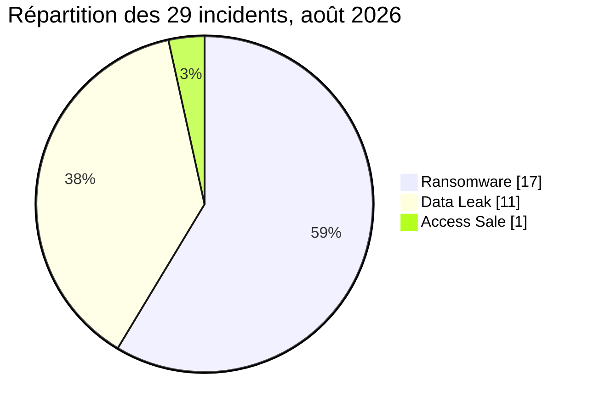

# AFRINTEL : statistiques cyber en Afrique

## Août 2026

👉🏾 [Version anglaise](./README.md)

## 1. Périmètre et comptage

Ces statistiques dérivent du couple bilingue [victims_FR.md](../../../CyberAttackAfrica/2026/08-august/victims_FR.md) / [victims.md](../../../CyberAttackAfrica/2026/08-august/victims.md), après contrôle de parité. Les données structurées sont déterminées une seule fois depuis la version française, puis réutilisées dans les deux langues. Le corpus contient 29 fiches collectées en août, avec les suivis consignés jusqu’au 13 septembre 2026. Le rapport est daté du 14 septembre 2026. Les 17 cas ransomware sont rattachés à août. Cinq fuites de données publiées en janvier, juin ou juillet ont été découvertes et intégrées en août, car les rapports mensuels clôturés ne sont pas modifiés rétroactivement ; leurs dates initiales restent conservées.

Chaque fiche contribue à un seul pays : 29 incidents et 29 occurrences géographiques. PAYGO reste limité à la partie kényane documentée. Hungry Lion reste rattaché à l’Afrique du Sud sous réserve de l’entité et du pays visés. DGSN/DGST compte pour un seul événement. L’origine de l’échantillon Afribaba reste incertaine. Aucun cas n’est classé Under Investigation - Alleged.

## 2. Résumé statistique

| Indicateur | Valeur |
|---|---|
| Incidents documentés | 29 |
| Pays de rattachement | 10 |
| Secteurs normalisés | 16 |
| Libellés d’acteur / de publication | 19 |
| Ransomware | 17 (58,6 %) |
| Data Leak | 11 (37,9 %) |
| Access Sale | 1 (3,4 %) |

DDoS, Defacement, Account Takeover, System Intrusion, Malware et Operational Fraud : 0 chacun. Les pourcentages sont arrondis à une décimale.

## 3. Répartition par pays et par type

| Pays | Code ISO | Ransomware | Data Leak | Access Sale | Total | Part | Barre |
|---|---|---|---|---|---|---|---|
| 🇿🇦 Afrique du Sud | ZA | 9 | 2 | 0 | 11 | 37,9 % | ███████████ |
| 🇪🇬 Égypte | EG | 2 | 2 | 0 | 4 | 13,8 % | ████ |
| 🇩🇿 Algérie | DZ | 0 | 2 | 1 | 3 | 10,3 % | ███ |
| 🇲🇦 Maroc | MA | 1 | 2 | 0 | 3 | 10,3 % | ███ |
| 🇰🇪 Kenya | KE | 0 | 2 | 0 | 2 | 6,9 % | ██ |
| 🇳🇬 Nigeria | NG | 2 | 0 | 0 | 2 | 6,9 % | ██ |
| 🇨🇲 Cameroun | CM | 1 | 0 | 0 | 1 | 3,4 % | █ |
| 🇬🇦 Gabon | GA | 1 | 0 | 0 | 1 | 3,4 % | █ |
| 🇱🇾 Libye | LY | 0 | 1 | 0 | 1 | 3,4 % | █ |
| 🇲🇺 Maurice | MU | 1 | 0 | 0 | 1 | 3,4 % | █ |
| **Total** |  | 17 | 11 | 1 | **29** | 100 % |  |

Échelle : █ = 1 incident. Chaque code ISO est associé au nom du pays sur la même ligne.

## 4. Répartition régionale

| Région | Ransomware | Data Leak | Access Sale | Total | Part |
|---|---|---|---|---|---|
| Afrique du Nord | 3 | 7 | 1 | 11 | 37,9 % |
| Afrique australe | 9 | 2 | 0 | 11 | 37,9 % |
| Afrique de l’Ouest | 2 | 0 | 0 | 2 | 6,9 % |
| Afrique centrale | 2 | 0 | 0 | 2 | 6,9 % |
| Afrique de l’Est | 0 | 2 | 0 | 2 | 6,9 % |
| Océan Indien | 1 | 0 | 0 | 1 | 3,4 % |
| **Total** | 17 | 11 | 1 | **29** | 100 % |

Maurice est classée dans l’océan Indien, séparément de l’Afrique de l’Est. L’Afrique de l’Ouest et l’Afrique centrale restent distinctes.

## 5. Répartition sectorielle

| Secteur normalisé | Fiches | Part | Organisations / contextes |
|---|---|---|---|
| Gouvernement / Administration | 7 | 24,1 % | Portail des services locaux égyptiens; DGRSDT; Ministère du Commerce; mpowa.mobi; RAMED; DGSN / DGST; Conseil Gabonais des Chargeurs (CGC) |
| Finance / Banque | 6 | 20,7 % | SARB; ASHA Microfinance Bank; DC Partner; Plateforme PAYGO non identifiée; SpearFin Ltd; CCA Bank |
| Ressources humaines / Recrutement | 2 | 6,9 % | AVANTA Maroc; SnapStar Talent |
| Restauration / Restauration rapide | 2 | 6,9 % | Hungry Lion; Rohloff Group |
| E-commerce / Retail | 1 | 3,4 % | Afribaba |
| Ingénierie / Construction | 1 | 3,4 % | Babcock Africa |
| Industrie agroalimentaire | 1 | 3,4 % | Mima Foods |
| Santé / Médical | 1 | 3,4 % | ADG Healthcare |
| Relations sociales / Gouvernance sectorielle | 1 | 3,4 % | Furniture Bargaining Council |
| Médias / Édition | 1 | 3,4 % | Daily Trust |
| Fabrication de plastiques / Articles ménagers | 1 | 3,4 % | Buzz Trading 104 |
| Immobilier | 1 | 3,4 % | Serengeti Golf and Wildlife Estate |
| Sports / Fédérations | 1 | 3,4 % | EFA |
| Télécommunications | 1 | 3,4 % | Albarq Media Service |
| Transport / Logistique | 1 | 3,4 % | The Courier Guy |
| Voyage / Événementiel | 1 | 3,4 % | Sure Travel |
| **Total** | **29** | 100 % |  |

La normalisation suit le rapport mensuel : SARB en finance, DGRSDT et CGC en administration, ADG Healthcare en santé, FBC en relations sociales et gouvernance sectorielle.

## 6. Acteurs et auteurs de publication

| Acteur / auteur | Type | Fiches | Cibles |
|---|---|---|---|
| KRYBIT | Ransomware | 6 | Buzz Trading 104 (ZA); ASHA Microfinance Bank (NG); DC Partner (ZA); Serengeti Golf and Wildlife Estate (ZA); Mima Foods (EG); Conseil Gabonais des Chargeurs (CGC) (GA) |
| Orova | Ransomware | 2 | Sure Travel (ZA); ADG Healthcare (EG) |
| exfilar | Data Leak | 2 | mpowa.mobi (ZA); SnapStar Talent (KE) |
| incransom | Ransomware | 2 | SpearFin Ltd (MU); Rohloff Group (ZA) |
| medusalocker | Ransomware | 2 | The Courier Guy (ZA); Hungry Lion (ZA) |
| thegentlemen | Ransomware | 2 | AVANTA Maroc (MA); Babcock Africa (ZA) |
| Deadlock | Ransomware | 1 | Furniture Bargaining Council (ZA) |
| Everest | Ransomware | 1 | CCA Bank (CM) |
| Florence | Access Sale | 1 | Ministère du Commerce (DZ) |
| JBT2026 | Data Leak | 1 | RAMED (MA) |
| JabaR00t | Data Leak | 1 | DGSN / DGST (MA) |
| NullSec Nigeria | Data Leak | 1 | SARB (ZA) |
| OriginalCrazyOldFart | Data Leak | 1 | Plateforme PAYGO non identifiée (KE) |
| Panzer | Ransomware | 1 | Daily Trust (NG) |
| R3D3MPTION | Data Leak | 1 | Portail des services locaux égyptiens (EG) |
| Revesky | Data Leak | 1 | EFA (EG) |
| Richard2002 | Data Leak | 1 | Albarq Media Service (LY) |
| TelephoneHooliganism | Data Leak | 1 | Afribaba (DZ) |
| anisanas2 | Data Leak | 1 | DGRSDT (DZ) |
| **Total** |  | **29** |  |

Codes pays : voir la légende ISO dans le tableau des pays.

KRYBIT regroupe les variations de casse krybit/KRYBIT. Les 19 libellés ne démontrent pas 19 équipes indépendantes. OriginalCrazyOldFart est un republicateur ; JBT2026 reste distinct de JabaR00t. La confirmation de l’incident FBC n’attribue pas techniquement l’attaque à Deadlock.

## 7. Statut, confiance et impact

| Dimension | Valeur | Fiches | Part |
|---|---|---|---|
| Statut | Claim - Data Sample Published | 13 | 44,8 % |
| Statut | Claim - Unverified | 12 | 41,4 % |
| Statut | Data Fully Published | 3 | 10,3 % |
| Statut | Victim Confirmed | 1 | 3,4 % |
| **Total statut** |  | 29 | 100 % |
| Confiance | Low | 8 | 27,6 % |
| Confiance | Medium | 7 | 24,1 % |
| Confiance | High | 12 | 41,4 % |
| Confiance | Very High | 2 | 6,9 % |
| Confiance | Non précisé | 0 | 0,0 % |
| **Total confiance** |  | 29 | 100 % |
| Impact | Level 1 | 0 | 0,0 % |
| Impact | Level 2 | 3 | 10,3 % |
| Impact | Level 3 | 7 | 24,1 % |
| Impact | Level 4 | 18 | 62,1 % |
| Impact | Non précisé (RAMED) | 1 | 3,4 % |
| **Total impact** |  | 29 | 100 % |

La confiance de RAMED est `High` ; son impact reste non précisé. Le champ structuré du CGC reste High. Data Fully Published ne valide pas l’exhaustivité ; une confiance élevée n’équivaut pas à une confirmation officielle.

## 8. Comparaison avec juillet

| Indicateur | Juillet 2026 | Août 2026 | Évolution observée |
|---|---|---|---|
| Total incidents | 42 | 29 | -13 (-31,0 %) |
| Ransomware | 18 | 17 | -1 (-5,6 %) |
| Data Leak | 18 | 11 | -7 (-38,9 %) |
| Access Sale | 6 | 1 | -5 (-83,3 %) |
| DDoS | 0 | 0 | 0 (stable) |
| Defacement | 0 | 0 | 0 (stable) |
| Account Takeover | 0 | 0 | 0 (stable) |
| System Intrusion | 0 | 0 | 0 (stable) |
| Malware | 0 | 0 | 0 (stable) |
| Operational Fraud | 0 | 0 | 0 (stable) |

Les 42 fiches de juillet et leurs types ont été contrôlés dans les deux langues. La comparaison concerne les corpus de collecte. Pour août, seules certaines fuites de données sont des publications antérieures découvertes tardivement. Elle ne mesure pas la variation réelle des compromissions.

## 9. Lecture CTI et contrôles

Le gouvernement et la finance représentent 13 fiches ; l’Afrique du Nord et l’Afrique australe en représentent 22. Les risques prioritaires concernent les données d’identité, de paiement, de personnel et les documents internes.

Somme par pays = somme par région = somme par secteur = somme par type = somme des occurrences par acteur = **29**. Statut, confiance et impact totalisent chacun **29**, avec les valeurs non précisées conservées. Aucun cumul de personnes ou de volumes exfiltrés n’est produit à partir d’échantillons hétérogènes.

[Rapport CTI complet](../../../CyberAttackAfrica/2026/08-august/README_FR.md) · [Fiches victimes](../../../CyberAttackAfrica/2026/08-august/victims_FR.md)

**AFRINTEL** · [GitHub](https://github.com/Hatchepsoute/AFRINTEL)
