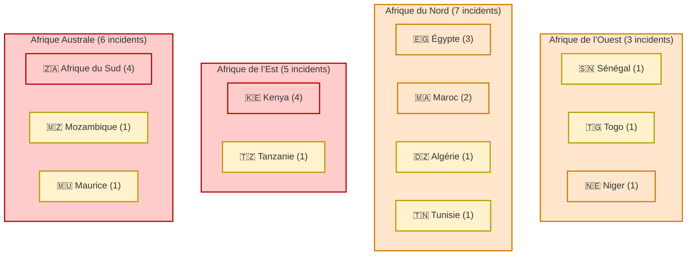
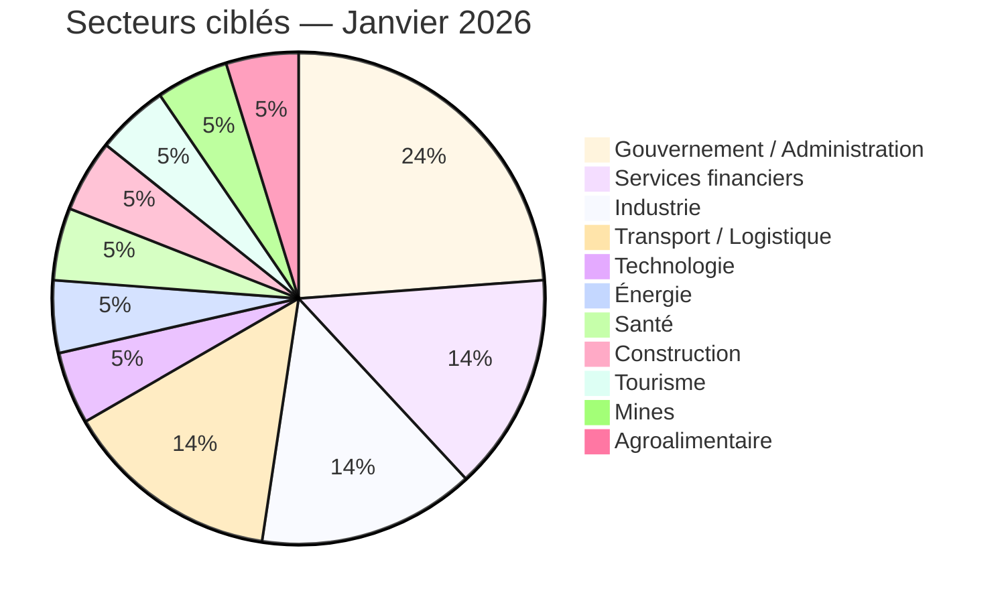

# AFRINTEL - Statistiques des cyberttaques en Afrique par acteur et par pays (Janvier 2026)
👉🏾 [**English version available here**](README_EN.md)

Le mois de janvier 2026 marque une phase de pression cyber soutenue sur le continent africain, caractérisée par une activité accrue des groupes ransomware structurés, l’émergence d’acteurs opportunistes et une persistance d’attaques non revendiquées ciblant des entités gouvernementales et des secteurs stratégiques. Cette analyse statistique met en lumière les dynamiques d’acteurs, les zones géographiques à risque, les secteurs prioritaires et les tendances opérationnelles observées, afin d’éclairer la prise de décision et l’anticipation des menaces.

---

## 📊 Vue d’ensemble

| Métrique | Valeur |
|---|---:|
| **Incidents documentés** | **21** |
| **Pays touchés** | **12** |
| **Acteurs identifiés** | **11** |
| **Incidents non attribués** | **1** *(Niger — `Unknown`)* |
| **Ransomware** | **18** |
| **Fuites de données** | **2** |
| **Défacement** | **1** |

> **Note de fiabilité** : les inscriptions sur leak sites et publications underground sont traitées comme des **revendications** sauf corroboration externe.

---

## 🗺️ Répartition par pays

| Pays | Incidents | Acteurs dominants (Jan 2026) |
|---|---:|---|
| 🇿🇦 Afrique du Sud | 4 | `thegentlemen`, `vect` |
| 🇰🇪 Kenya | 4 | `thegentlemen`, `tengu`, `blackshrantac`, `devman` |
| 🇪🇬 Égypte | 3 | `thegentlemen`, `tengu`, `direwolf` |
| 🇲🇦 Maroc | 2 | `tengu`, `skra1a` |
| 🇩🇿 Algérie | 1 | `tengu` |
| 🇲🇺 Maurice | 1 | `thegentlemen` |
| 🇲🇿 Mozambique | 1 | `qilin` |
| 🇸🇳 Sénégal | 1 | `breach3d` |
| 🇹🇿 Tanzanie | 1 | `benzona` |
| 🇹🇬 Togo | 1 | `Bigbrother` |
| 🇹🇳 Tunisie | 1 | `tengu` |
| 🇳🇪 Niger | 1 | `Unknown` *(défacement non revendiqué)* |

---

## 🎯 Répartition par acteur (Top)

| Acteur | Incidents | Pays ciblés |
|---|---:|---|
| `thegentlemen` | **6** | Égypte, Kenya, Maurice, Afrique du Sud |
| `tengu` | **5** | Algérie, Égypte, Kenya, Maroc, Tunisie |
| `Bigbrother` | 1 | Togo |
| `breach3d` | 1 | Sénégal |
| `skra1a` | 1 | Maroc |
| `qilin` | 1 | Mozambique |
| `vect` | 1 | Afrique du Sud |
| `direwolf` | 1 | Égypte |
| `benzona` | 1 | Tanzanie |
| `blackshrantac` | 1 | Kenya |
| `devman` | 1 | Kenya |
| `Unknown` | 1 | Niger |

---

## 🧭 Répartition par secteur

| Secteur | Incidents |
|---|---:|
| Gouvernement / Administration | 5 |
| Services financiers | 3 |
| Industrie | 3 |
| Transport / Logistique | 3 |
| Technologie | 1 |
| Énergie | 1 |
| Santé | 1 |
| Construction | 1 |
| Tourisme | 1 |
| Mines | 1 |
| Agroalimentaire | 1 |

---

## 🔍 Top 5 pays les plus ciblés

- 🇿🇦 Afrique du Sud ████████████░░ 4  
- 🇰🇪 Kenya ████████████░░ 4  
- 🇪🇬 Égypte ██████████░░░ 3  
- 🇲🇦 Maroc ███████░░░░░░ 2  
- (x7) Pays à 1 incident ███░░░░░░░░░ 1  

---

# 📊 Visual Intelligence Layer

## 🧩 Distribution des acteurs

```mermaid
flowchart TB
classDef high fill:#ff4d4d,color:#ffffff,stroke:#990000,stroke-width:2px;
classDef medium fill:#ffa64d,color:#000000,stroke:#cc6600,stroke-width:2px;
classDef low fill:#ffe6b3,color:#000000,stroke:#cc9900,stroke-width:1px;

TG["thegentlemen (6)"]:::high
TENGU["tengu (5)"]:::high

BIG["Bigbrother (1)"]:::medium
UNK["Unknown (1)"]:::medium

VECT["vect (1)"]:::low
QILIN["qilin (1)"]:::low
SKRA["skra1a (1)"]:::low
BREACH["breach3d (1)"]:::low
DIRE["direwolf (1)"]:::low
BENZ["benzona (1)"]:::low
BLACK["blackshrantac (1)"]:::low
DEVMAN["devman (1)"]:::low
```

---

## 🗺️ Heatmap - Intensité par région

---

## 🥧 Répartition par secteur (pie chart)

---

## 🧩 Cartographie Acteurs → Victimes (OSINT-safe)

> Certains incidents “one-off” n’ont pas de victime explicitée dans le rapport source : ils sont conservés comme **victime non précisée** afin d’éviter toute invention.

```mermaid
flowchart LR

  %% ===== STYLE =====
  classDef actor fill:#ffe6cc,stroke:#cc7a00,stroke-width:2px;
  classDef victim fill:#e6f2ff,stroke:#0066cc,stroke-width:2px;

  %% ===== ACTEURS =====
  A1["thegentlemen"]:::actor
  A2["tengu"]:::actor
  A3["Bigbrother"]:::actor
  A4["breach3d"]:::actor
  A5["skra1a"]:::actor
  A6["qilin"]:::actor
  A7["vect"]:::actor
  A8["direwolf"]:::actor
  A9["benzona"]:::actor
  A10["blackshrantac"]:::actor
  A11["devman"]:::actor
  A12["Unknown"]:::actor

  %% ===== VICTIMES =====
  V1["Real Tech\n(Unknown domain)\n🇪🇬 Égypte"]:::victim
  V2["CPF Financial Services\n(Unknown domain)\n🇰🇪 Kenya"]:::victim
  V3["Rogers Capital\n(Unknown domain)\n🇲🇺 Maurice"]:::victim
  V4["Paltrack\n(Unknown domain)\n🇿🇦 Afrique du Sud"]:::victim
  V5["Rola Motor Group\n(Unknown domain)\n🇿🇦 Afrique du Sud"]:::victim
  V6["Witzenberg Municipality\n(Unknown domain)\n🇿🇦 Afrique du Sud"]:::victim

  V7["Tahkout Group\n(Unknown domain)\n🇩🇿 Algérie"]:::victim
  V8["skyegtours.com\n(skyegtours.com)\n🇪🇬 Égypte"]:::victim
  V9["namico.go.ke\n(namico.go.ke)\n🇰🇪 Kenya"]:::victim
  V10["Nafae Sanitaire\n(Unknown domain)\n🇲🇦 Maroc"]:::victim
  V11["FRUIT-BONTÉ\n(Unknown domain)\n🇹🇳 Tunisie"]:::victim

  V12["PixPay\n(pay.pixpay.sn)\n🇸🇳 Sénégal"]:::victim
  V13["AOM Aviation\n(Unknown domain)\n🇲🇦 Maroc"]:::victim
  V14["CFM Mozambique\n(Unknown domain)\n🇲🇿 Mozambique"]:::victim
  V15["Togo access claim\n(Unknown domain)\n🇹🇬 Togo"]:::victim

  V16["Victime non précisée\n(Unknown)\n🇿🇦 Afrique du Sud"]:::victim
  V17["Victime non précisée\n(Unknown)\n🇪🇬 Égypte"]:::victim
  V18["Victime non précisée\n(Unknown)\n🇹🇿 Tanzanie"]:::victim
  V19["Victime non précisée\n(Unknown)\n🇰🇪 Kenya"]:::victim
  V20["Victime non précisée\n(Unknown)\n🇰🇪 Kenya"]:::victim

  V21["Défacement gouvernemental\n(Multi-sites)\n🇳🇪 Niger"]:::victim

  %% ===== RELATIONS =====
  A1 --> V1
  A1 --> V2
  A1 --> V3
  A1 --> V4
  A1 --> V5
  A1 --> V6

  A2 --> V7
  A2 --> V8
  A2 --> V9
  A2 --> V10
  A2 --> V11

  A4 --> V12
  A5 --> V13
  A6 --> V14
  A3 --> V15

  A7 --> V16
  A8 --> V17
  A9 --> V18
  A10 --> V19
  A11 --> V20

  A12 --> V21
```

---

## 📌 Incidents critiques (Janvier 2026)

### 🇳🇪 Niger - Défacement massif (**Unknown**)
- **Nature** : défacement coordonné multi-sites (non revendiqué)
- **Risque** : exposition systémique (surface web publique / gouvernance patch)
- **Impact** : confiance institutionnelle / disponibilité / visibilité médiatique

### 🇸🇳 PixPay - Fuite de données (`breach3d`)
- **Nature** : exposition/vente de données (FinTech)
- **Impact** : fraude, usurpation, risques réglementaires, atteinte à la confiance

### 🇲🇦 AOM Aviation - Fuite de données (`skra1a`)
- **Nature** : base de données exposée
- **Impact** : chaîne d’approvisionnement, passagers/partenaires, opérations

---

## 🛡️ Recommandations SOC / CTI

1) **Surveiller en priorité les acteurs dominants** : `thegentlemen` & `tengu` (corrélations pays/secteur).  
2) **Durcir les portails publics** : WAF, patching, revue CMS, inventaire DNS, réduction surface d’attaque.  
3) **Détecter l’exfiltration** : seuils volumétriques, egress filtering, anomalies DNS/HTTP, comptes privilégiés.  
4) **Préparation de crise** : playbooks ransomware + data leak, sauvegardes immuables, exercices tabletop.  

---

## 🔗 Liens utiles

- [Rapport mensuel (FR)](/reports/january/README.md)
- [Monthly report (EN)](/reports/january/README_EN.md)

---

**AFRINTEL — African Threat Intelligence Initiative**  
*TLP:CLEAR — Public sharing permitted*
