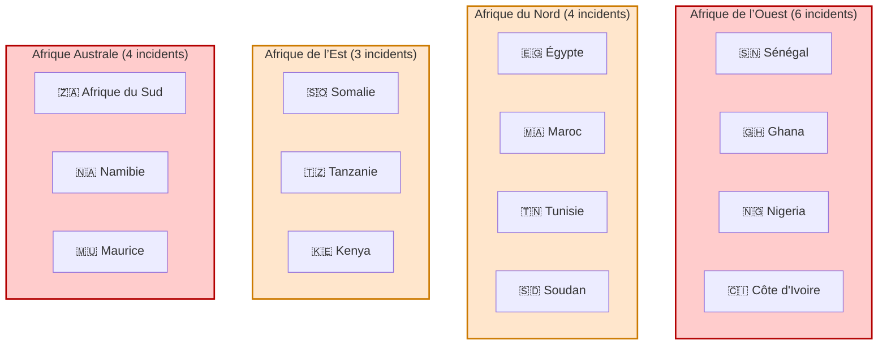
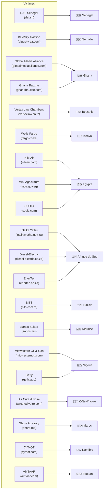
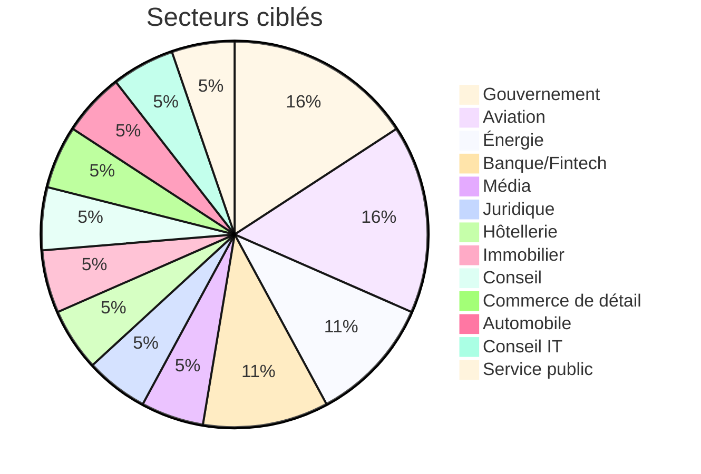

# AFRINTEL - Statistiques par acteur et par pays (Février 2026)
👉🏾 [**English version available here**](README_EN.md)

En février 2026, l’écosystème cybercriminel opérant contre le continent africain démontre une maturité opérationnelle croissante, combinant campagnes structurées de groupes ransomware et exploitation opportuniste d’infrastructures exposées.

Les indicateurs consolidés présentés ci-dessous offrent une lecture stratégique des risques émergents, des concentrations géographiques des incidents et des secteurs les plus ciblés, afin d’orienter la posture de défense, les priorités de détection et les investissements en cybersécurité.
---

## 📊 Vue d'ensemble

| Métrique | Valeur |
|----------|--------|
| **Total des incidents** | 20 |
| **Pays touchés** | 13 |
| **Acteurs de menace actifs** | 10 |
| **Volume total de données exfiltrées** | ~147 To |

---

## 🗺️ Répartition par pays

| Pays | Nombre d'incidents | Principaux acteurs |
|------|-------------------|---------------------|
| 🇿🇦 **Afrique du Sud** | 3 | `thegentlemen` (2), `Lockbit5` (1), `vect` (1) |
| 🇪🇬 **Égypte** | 3 | `thegentlemen` (1), `lockbit5` (1), `payload` (1) |
| 🇳🇬 **Nigeria** | 2 | `killsec` (1), `incransom` (1) |
| 🇬🇭 **Ghana** | 2 | `0APT` (1), `thegentlemen` (1) |
| 🇸🇳 **Sénégal** | 1 | `The Green Blood Group` (1) ⚠️ **139 To** |
| 🇸🇴 **Somalie** | 1 | `0APT` (1) |
| 🇹🇿 **Tanzanie** | 1 | `0APT` (1) |
| 🇰🇪 **Kenya** | 1 | `thegentlemen` (1) |
| 🇲🇺 **Maurice** | 1 | `lockbit5` (1) |
| 🇹🇳 **Tunisie** | 1 | `thegentlemen` (1) |
| 🇸🇩 **Soudan** | 1 | `apt73/bashe` (1) |
| 🇨🇮 **Côte d'Ivoire** | 1 | `incransom` (1) |
| 🇲🇦 **Maroc** | 1 | `tengu` (1) |
| 🇳🇦 **Namibie** | 1 | `qilin` (1) |

---

## 🎯 Répartition par acteur de menace

| Acteur | Incidents | Pays ciblés | Volume total |
|--------|-----------|-------------|--------------|
| `thegentlemen` | **5** | Kenya, Ghana, Égypte, Afrique du Sud (×2), Tunisie | ~? |
| `0APT` | **3** | Somalie, Ghana, Tanzanie | **~7 To** |
| `lockbit5` | **2** | Maurice, Égypte | ~? |
| `incransom` | **2** | Nigeria, Côte d'Ivoire | **~210 Go** |
| `The Green Blood Group` | **1** | Sénégal | **139 To** ⚠️ |
| `killsec` | **1** | Nigeria | ~? |
| `vect` | **1** | Afrique du Sud | 151 Go |
| `qilin` | **1** | Namibie | ~? |
| `payload` | **1** | Égypte | ~? |
| `tengu` | **1** | Maroc | ~? |
| `apt73/bashe` | **1** | Soudan | ~? |

---

## 📈 Analyse par secteur

| Secteur | Incidents | Acteurs principaux |
|---------|-----------|---------------------|
| **Gouvernement** | 3 | `The Green Blood Group`, `lockbit5`, `thegentlemen` |
| **Aviation** | 3 | `0APT` (2), `thegentlemen`, `incransom` |
| **Énergie** | 2 | `incransom`, `vect` |
| **Banque/Fintech** | 2 | `thegentlemen`, `killsec` |
| **Média** | 1 | `0APT` |
| **Juridique** | 1 | `0APT` |
| **Hôtellerie** | 1 | `lockbit5` |
| **Immobilier** | 1 | `payload` |
| **Conseil** | 1 | `apt73/bashe` |
| **Commerce** | 1 | `qilin` |
| **Automobile** | 1 | `Lockbit5` |
| **IT Consulting** | 1 | `thegentlemen` |
| **Service public** | 1 | `thegentlemen` |

---
## 🔍 Top 5 des pays les plus ciblés en février 2026

- Afrique du Sud ████████████░░░░ 3
- Égypte ████████████░░░░ 3
- Nigeria ████████░░░░░░░░ 2
- Ghana ████████░░░░░░░░ 2
- Sénégal ████░░░░░░░░░░░░ 1 (139 To)

---

# 📊 Visual intelligence layer

## 🗺️ Heatmap – État des lieux de l'intensité de la menace régionale

---
## 📊 Diagramme de victimes par pays

---

## 🧩 Cartographie Acteurs → Victimes 

```mermaid
flowchart LR

  %% ===== STYLE =====
  classDef actor fill:#ffe6cc,stroke:#cc7a00,stroke-width:2px;
  classDef victim fill:#e6f2ff,stroke:#0066cc,stroke-width:2px;

  %% ===== ACTEURS =====
  A1["The Green Blood Group"]:::actor
  A2["0APT"]:::actor
  A3["thegentlemen"]:::actor
  A4["lockbit5"]:::actor
  A5["incransom"]:::actor
  A6["payload"]:::actor
  A7["tengu"]:::actor
  A8["qilin"]:::actor
  A9["vect"]:::actor
  A10["apt73 / bashe"]:::actor
  A11["killsec"]:::actor

  %% ===== VICTIMES =====
  V1["DAF Sénégal\n(daf.sn)\n🇸🇳 Sénégal"]:::victim
  V2["BlueSky Aviation\n(bluesky-air.com)\n🇸🇴 Somalie"]:::victim
  V3["Global Media Alliance\n(globalmediaalliance.com)\n🇬🇭 Ghana"]:::victim
  V4["Vertex Law Chambers\n(vertexlaw.co.tz)\n🇹🇿 Tanzanie"]:::victim
  V5["Wells Fargo Kenya\n(fargo.co.ke)\n🇰🇪 Kenya"]:::victim
  V6["Ghana Bauxite\n(ghanabauxite.com)\n🇬🇭 Ghana"]:::victim
  V7["Nile Air\n(nileair.com)\n🇪🇬 Égypte"]:::victim
  V8["Intsika Yethu Municipality\n(intsikayethu.gov.za)\n🇿🇦 Afrique du Sud"]:::victim
  V9["BITS\n(bits.com.tn)\n🇹🇳 Tunisie"]:::victim
  V10["Sands Suites Resort\n(sands.mu)\n🇲🇺 Île Maurice"]:::victim
  V11["Ministry of Agriculture\n(moa.gov.eg)\n🇪🇬 Égypte"]:::victim
  V12["Diesel-Electric\n(diesel-electric.co.za)\n🇿🇦 Afrique du Sud"]:::victim
  V13["Midwestern Oil & Gas\n(midwesternog.com)\n🇳🇬 Nigeria"]:::victim
  V14["Air Côte d’Ivoire\n(aircotedivoire.com)\n🇨🇮 Côte d’Ivoire"]:::victim
  V15["SODIC\n(sodic.com)\n🇪🇬 Égypte"]:::victim
  V16["Shora Advisory\n(shora.ma)\n🇲🇦 Maroc"]:::victim
  V17["CYMOT\n(cymot.com)\n🇳🇦 Namibie"]:::victim
  V18["EnerTec\n(enertec.co.za)\n🇿🇦 Afrique du Sud"]:::victim
  V19["AMTAAR\n(amtaar.com)\n🇸🇩 Soudan"]:::victim
  V20["Getly\n(getly.app)\n🇳🇬 Nigeria"]:::victim

  %% ===== RELATIONS =====
  A1 --> V1
  A2 --> V2
  A2 --> V3
  A2 --> V4
  A3 --> V5
  A3 --> V6
  A3 --> V7
  A3 --> V8
  A3 --> V9
  A4 --> V10
  A4 --> V11
  A4 --> V12
  A5 --> V13
  A5 --> V14
  A6 --> V15
  A7 --> V16
  A8 --> V17
  A9 --> V18
  A10 --> V19
  A11 --> V20
```

---
## Répartition par secteur

---

## 🔴 Incident critique : DAF SÉNÉGAL

- **Acteur** : `The Green Blood Group`
- **Volume** : 139 To
- **Pays** : Sénégal
- **Secteur** : Gouvernement
- **Données** : Base citoyens, biométrie, immigration

**⚠️ Plus grande fuite de données jamais recensée en Afrique.**

---

## 🔗 Liens utiles

- [Rapport complet (FR)](/reports/february/README.md)
- [Full report (EN)](/reports/february/README_EN.md)
---
## ✍🏿 Auteur

**Adama ASSIONGBON**  
Consultant SOC & Cyber Threat Intelligence [LinkedIn Profile](https://www.linkedin.com/in/adama-assiongbon-9029893a/)
---

*AFRINTEL -- Initiative de Veille Open CTI*
*TLP:CLEAR - Partage public autorisé*

