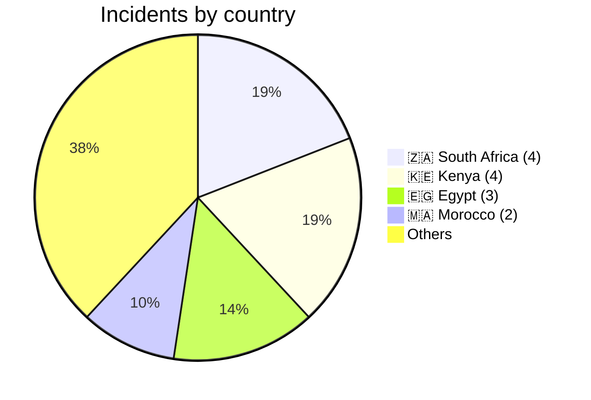
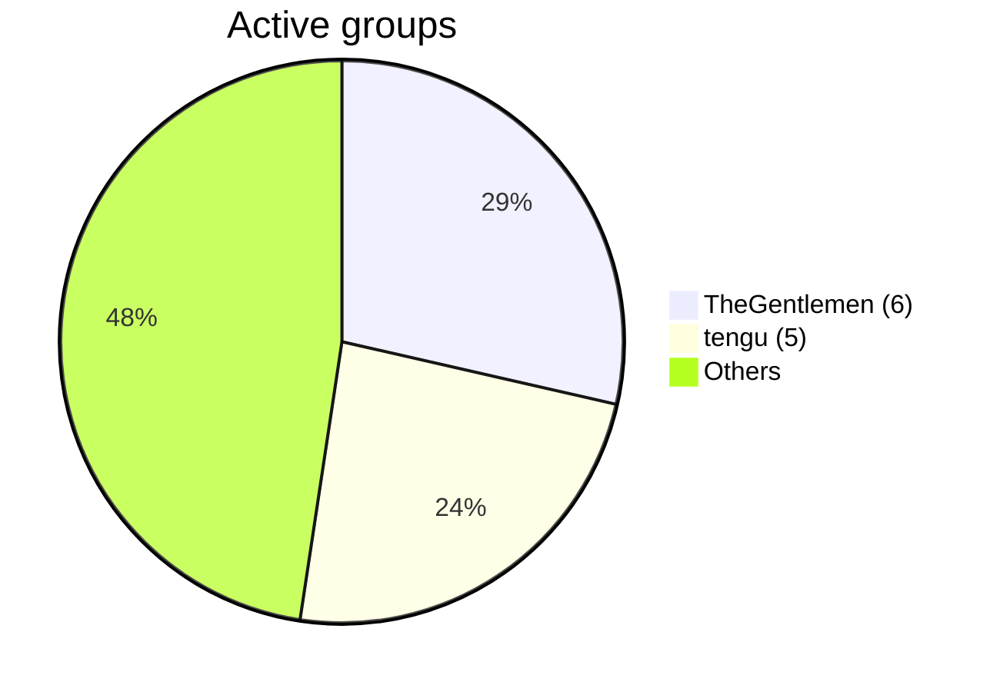
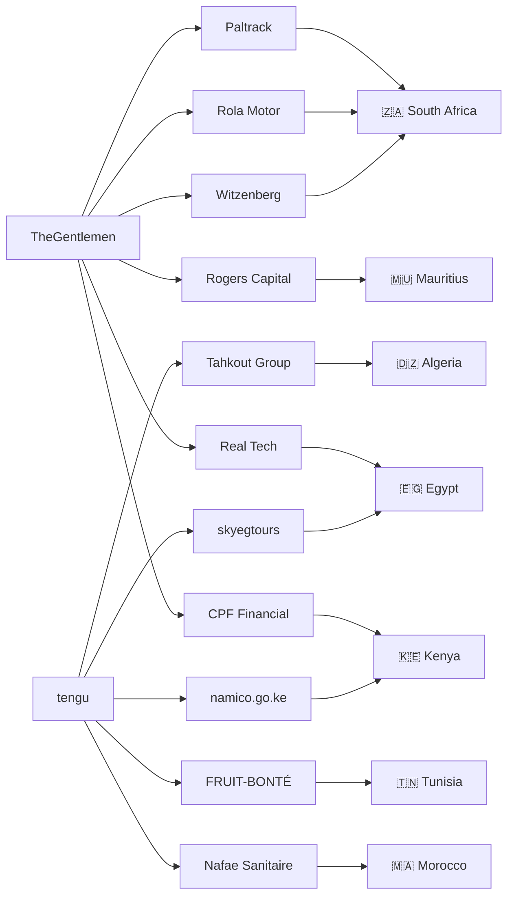
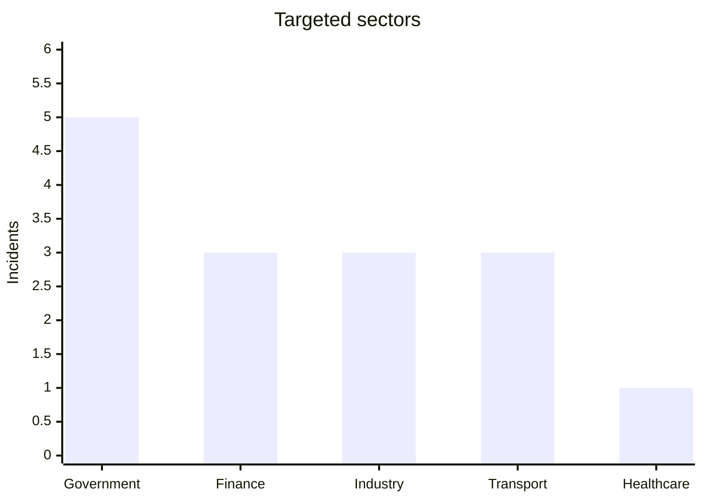

# AFRINTEL Visual Intelligence - January 2026

## Geographic Distribution

## Most active actors

## CTI Ecosystem Map

## Targeted sectors

## CTI Reading

- January 2026 showed strong cross-border ransomware activity.
- TheGentlemen and tengu dominated African operations.
- Government infrastructures became priority targets.
- Data leaks started emerging as a major trend.
