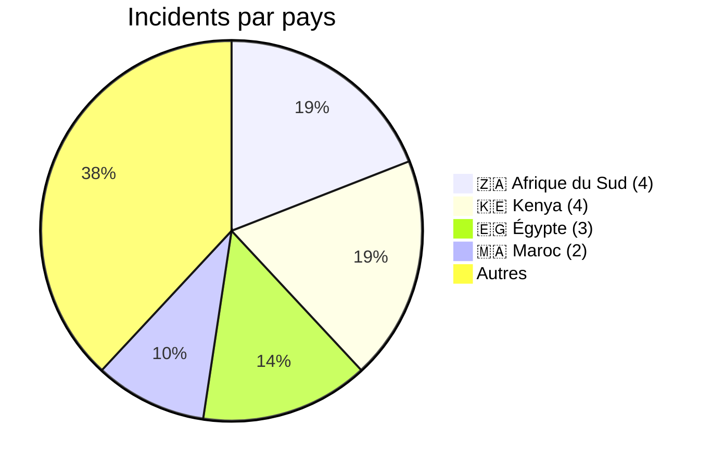
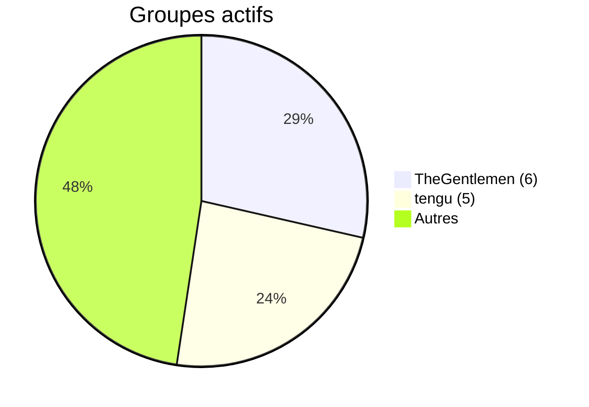
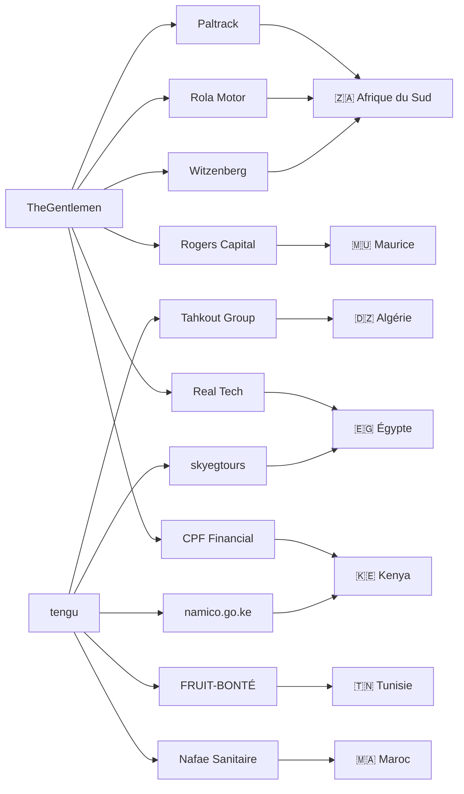
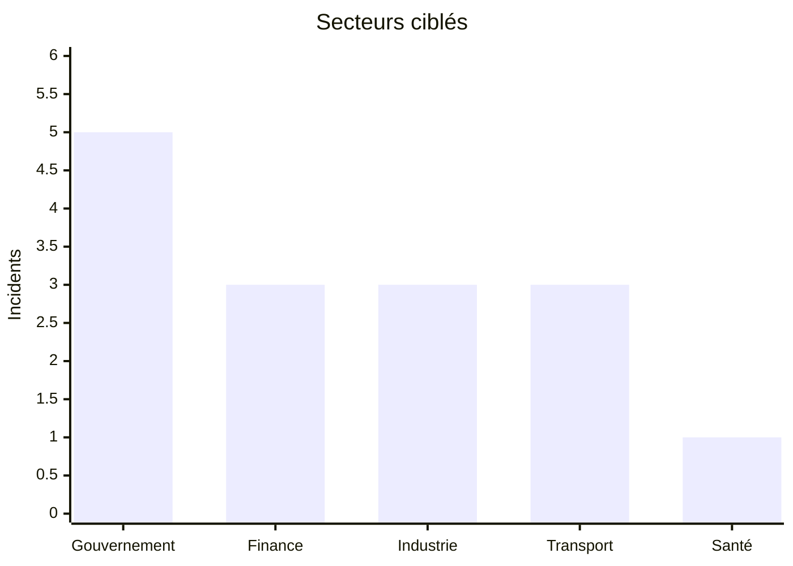

# AFRINTEL Visual Intelligence  -  Janvier 2026

## Répartition géographique

## Acteurs les plus actifs

## CTI Ecosystem Map

## Secteurs ciblés

## Lecture CTI

- Janvier 2026 marque une forte activité ransomware transfrontalière.
- TheGentlemen et tengu dominent les opérations africaines.
- Les infrastructures gouvernementales deviennent des cibles prioritaires.
- Les fuites de données commencent à émerger comme tendance majeure.
