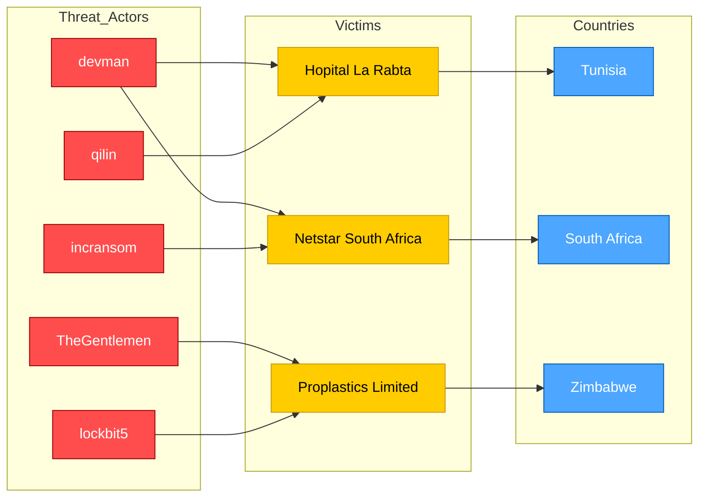

# AFRINTEL 2025 - double claims map

This graph focuses on the **double-claim phenomenon**, where the same victim appears under two distinct threat actors / ransomware groups during 2025.

## Interpretation

- **Hopital La Rabta** was claimed by **devman** and later by **qilin**.
- **Netstar South Africa** was claimed by **devman** and later by **incransom**.
- **Proplastics Limited** was claimed by **TheGentlemen** and later by **lockbit5**.

This pattern may indicate:
- access resale
- shared broker infrastructure
- re-exploitation of already compromised organizations
- opportunistic reuse of exposed data
