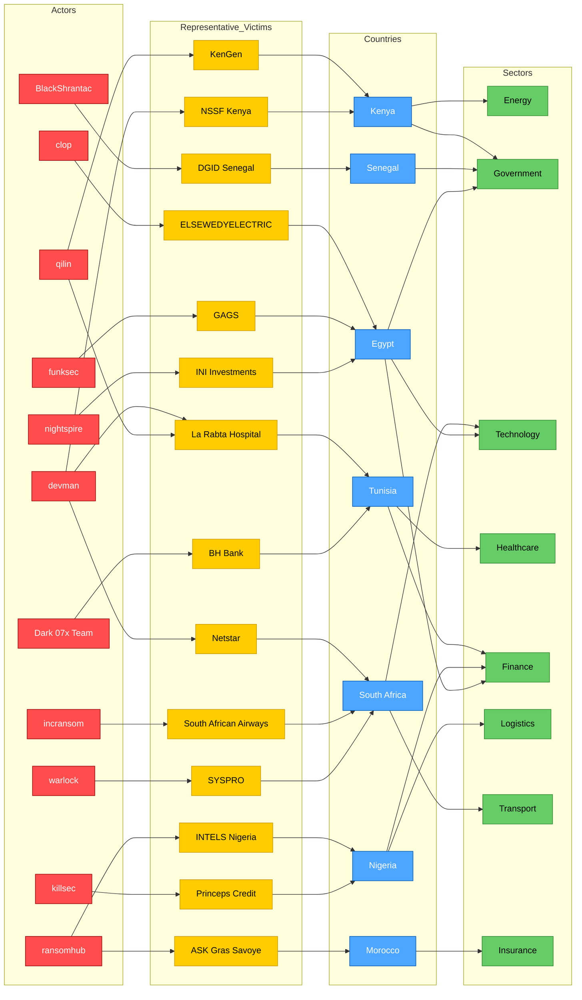

# AFRINTEL 2025 – CTI Ecosystem strategic map
👉🏾 [**French version available here**](./ecosystem-map_2025_fr.md)

This map provides a **readable and synthetic view** of the cyberattack landscape in Africa for the year 2025, focusing on:
- the **most active ransomware groups**
- the **most targeted countries**
- the **most exposed sectors**
- a sample of **representative victims**

For the full 2025 dataset, this map should be read together with the yearly statistics and the dedicated double-claims graph.

## 1. Strategic ecosystem map

## 2. Reading guide

- 🔴 **Actors**: ransomware groups or cybercriminals
- 🟡 **Victims**: representative affected organizations
- 🔵 **Countries**: geographical location of victims
- 🟢 **Sectors**: impacted industries

## 3. Analytical notes

- The year 2025 is marked by the predominance of **Egypt, South Africa, and Morocco** as primary targets.
- The groups **qilin, devman**, and incransom are the most prolific.
- The **technology, government, finance, logistics, and healthcare** sectors are under high pressure.
- This map is a **visual synthesis**; it does not claim to be exhaustive. Double claims (e.g., La Rabta Hospital) are symbolized by multiple links.

For detailed analysis, please consult the monthly reports and annual statistics.
