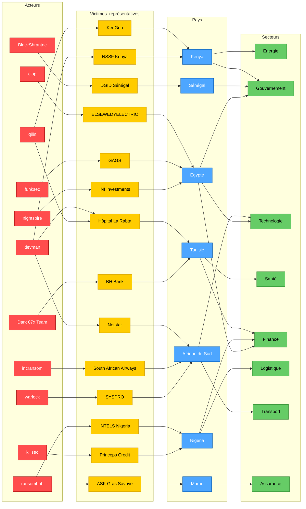

# AFRINTEL 2025 - Carte de l’écosystème CTI
👉🏾 [**English version available here**](./ecosystem-map_2025.md)

Cette carte présente une vue lisible et synthétique du paysage des cyberattaques en Afrique pour l'année 2025, en mettant l'accent sur :
- les **groupes ransomware les plus actifs**
- les **pays les plus ciblés**
- les **secteurs les plus exposés**
- un échantillon de **victimes représentatives**

Pour le détail complet des 149 incidents, veuillez vous référer aux rapports mensuels et aux statistiques annuelles.

## 1. Carte stratégique de l'écosystème

## 2. Guide de lecture

- 🔴 **Acteurs** : groupes ransomware ou cybercriminels
- 🟡 **Victimes** : organisations représentatives touchées
- 🔵 **Pays** : localisation géographique des victimes
- 🟢 **Secteurs** : domaines d'activité impactés

## 3. Remarques analytiques

- L'année 2025 est marquée par la prédominance de l'**Égypte**, de l'**Afrique du Sud** et du **Maroc** comme cibles principales.
- Les groupes **Qilin, Devman et Incransom** sont les plus prolifiques.
- Les secteurs **technologique, gouvernemental, financier, logistique et sanitaire** sont sous forte pression.
- Cette carte est une **synthèse visuelle** ; elle ne prétend pas à l'exhaustivité. Les doubles revendications (ex. Hôpital La Rabta) sont symbolisées par des liens multiples.

Pour une analyse détaillée, consulter les rapports mensuels et les statistiques annuelles.
