## 🔗 Cartographie des acteurs de menace - Janvier & Février 2026
👉🏾 [English version](./ecosystem-map.md)

Ce graphique illustre les connexions entre les groupes ransomware et leurs cibles à travers l'Afrique, basé sur 41 incidents documentés dans 18 pays.

### Acteurs → victimes → pays (Janvier + Février 2026)

```mermaid
flowchart LR

classDef actor fill:#ffe6cc,stroke:#cc7a00,stroke-width:2px;
classDef victim fill:#e6f2ff,stroke:#0066cc,stroke-width:2px;
classDef country fill:#e8ffe6,stroke:#2b8a3e,stroke-width:2px;
classDef unknown fill:#f2f2f2,stroke:#666,stroke-width:2px,stroke-dasharray: 5 5;

%% ===== ACTORS =====
A1["Bigbrother"]:::actor
A2["vect"]:::actor
A3["blackshrantac"]:::actor
A4["TheGentlemen"]:::actor
A5["direwolf"]:::actor
A6["breach3d"]:::actor
A7["qilin"]:::actor
A8["benzona"]:::actor
A9["tengu"]:::actor
A10["devman"]:::actor
A11["skra1a"]:::actor
A12["The Green Blood Group"]:::actor
A13["0APT"]:::actor
A14["killsec"]:::actor
A15["incransom"]:::actor
A16["lockbit5"]:::actor
A17["payload"]:::actor
A18["apt73 / bashe"]:::actor
A19["Lockbit5"]:::actor
A20["Unknown"]:::unknown

%% ===== VICTIMS JANUARY =====
V1["Gouvernement du Togo"]:::victim
V2["Sites gouvernementaux Niger"]:::victim
V3["Hytec South Africa"]:::victim
V4["National Water Authority"]:::victim
V5["Real Tech"]:::victim
V6["Tepco-Group"]:::victim
V7["Rogers Capital"]:::victim
V8["PixPay"]:::victim
V9["CFM Mozambique"]:::victim
V10["CCBRT"]:::victim
V11["Nafae Sanitaire"]:::victim
V12["CPF Financial Services"]:::victim
V13["NSSF"]:::victim
V14["Paltrack"]:::victim
V15["Rola Motor Group"]:::victim
V16["Witzenberg Municipality"]:::victim
V17["namico.go.ke"]:::victim
V18["FRUIT-BONTÉ Agroalimentaire"]:::victim
V19["skyegtours.com"]:::victim
V20["Tahkout Group"]:::victim
V21["AOM Aviation Group"]:::victim

%% ===== VICTIMS FEBRUARY =====
V22["DAF SÉNÉGAL"]:::victim
V23["BlueSky Aviation"]:::victim
V24["Global Media Alliance"]:::victim
V25["Vertex Law Chambers"]:::victim
V26["Wells Fargo"]:::victim
V27["Getly"]:::victim
V28["Ghana Bauxite"]:::victim
V29["Midwestern Oil & Gas"]:::victim
V30["Nile Air"]:::victim
V31["Sands Suites"]:::victim
V32["Municipalité d'Intsika Yethu"]:::victim
V33["BITS"]:::victim
V34["sodic.com"]:::victim
V35["amtaar.com"]:::victim
V36["aircotedivoire.com"]:::victim
V37["Shora Advisory"]:::victim
V38["moa.gov.eg"]:::victim
V39["CYMOT"]:::victim
V40["EnerTec"]:::victim
V41["Diesel-Electric"]:::victim

%% ===== COUNTRIES =====
C1["🇹🇬 Togo"]:::country
C2["🇳🇪 Niger"]:::country
C3["🇿🇦 South Africa"]:::country
C4["🇰🇪 Kenya"]:::country
C5["🇪🇬 Egypt"]:::country
C6["🇲🇺 Mauritius"]:::country
C7["🇸🇳 Senegal"]:::country
C8["🇲🇿 Mozambique"]:::country
C9["🇹🇿 Tanzania"]:::country
C10["🇲🇦 Morocco"]:::country
C11["🇩🇿 Algeria"]:::country
C12["🇸🇴 Somalia"]:::country
C13["🇬🇭 Ghana"]:::country
C14["🇳🇬 Nigeria"]:::country
C15["🇹🇳 Tunisia"]:::country
C16["🇸🇩 Sudan"]:::country
C17["🇨🇮 Côte d'Ivoire"]:::country
C18["🇳🇦 Namibia"]:::country

%% ===== JANUARY RELATIONS =====
A1 --> V1
A20 --> V2
A2 --> V3
A3 --> V4
A4 --> V5
A5 --> V6
A4 --> V7
A6 --> V8
A7 --> V9
A8 --> V10
A9 --> V11
A4 --> V12
A10 --> V13
A4 --> V14
A4 --> V15
A4 --> V16
A9 --> V17
A9 --> V18
A9 --> V19
A9 --> V20
A11 --> V21

%% ===== FEBRUARY RELATIONS =====
A12 --> V22
A13 --> V23
A13 --> V24
A13 --> V25
A4 --> V26
A14 --> V27
A4 --> V28
A15 --> V29
A4 --> V30
A16 --> V31
A4 --> V32
A4 --> V33
A17 --> V34
A18 --> V35
A15 --> V36
A9 --> V37
A16 --> V38
A7 --> V39
A2 --> V40
A19 --> V41

%% ===== COUNTRY LINKS =====
V1 --> C1
V2 --> C2
V3 --> C3
V4 --> C4
V5 --> C5
V6 --> C5
V7 --> C6
V8 --> C7
V9 --> C8
V10 --> C9
V11 --> C10
V12 --> C4
V13 --> C4
V14 --> C3
V15 --> C3
V16 --> C3
V17 --> C4
V18 --> C15
V19 --> C5
V20 --> C11
V21 --> C10

V22 --> C7
V23 --> C12
V24 --> C13
V25 --> C9
V26 --> C4
V27 --> C14
V28 --> C13
V29 --> C14
V30 --> C5
V31 --> C6
V32 --> C3
V33 --> C15
V34 --> C5
V35 --> C16
V36 --> C17
V37 --> C10
V38 --> C5
V39 --> C18
V40 --> C3
V41 --> C3
```

