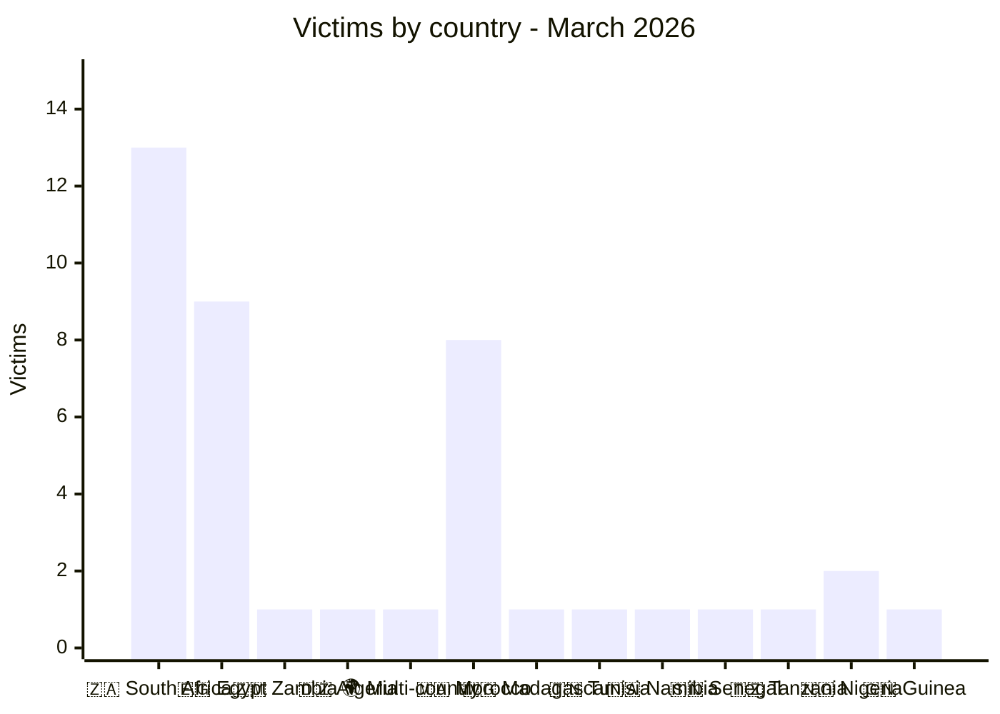
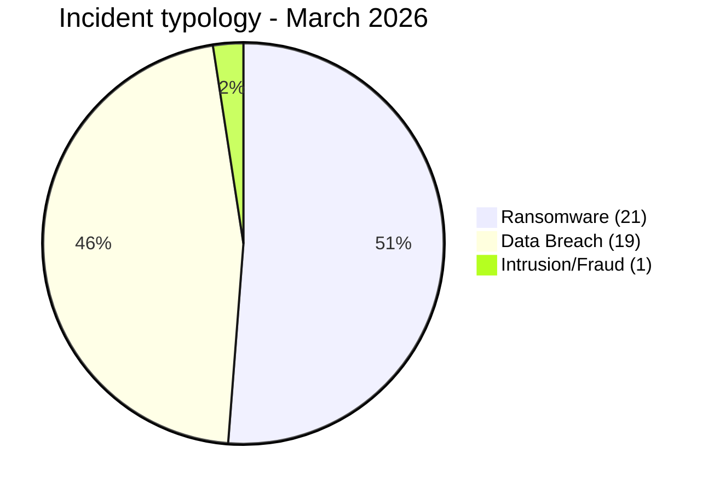
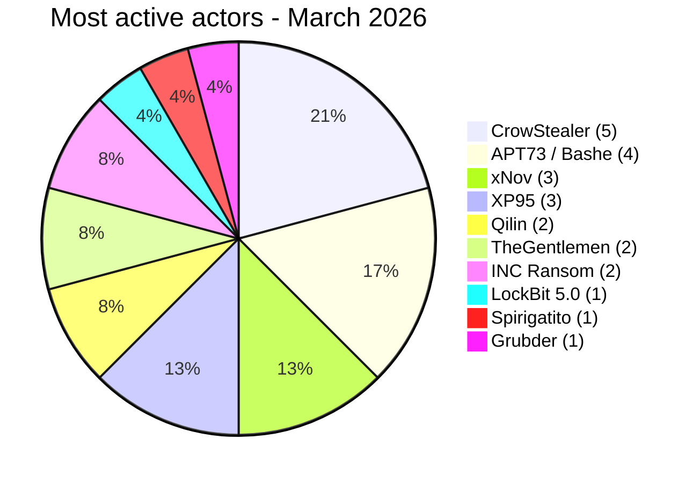
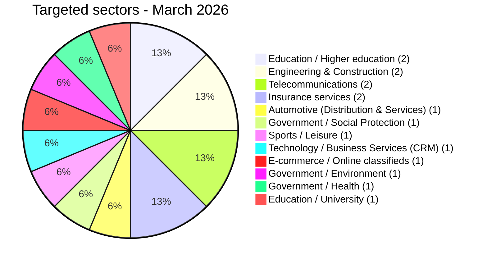

# AFRINTEL Visual Intelligence - March 2026

## Reliability note

Leak-site, forum and underground-channel posts are treated as **unverified claims**, unless explicitly corroborated.

**Source:** [https://github.com/Hatchepsoute/AFRINTEL/tree/main/CyberAttackAfrica/2026/03-march](https://github.com/Hatchepsoute/AFRINTEL/tree/main/CyberAttackAfrica/2026/03-march)

## Summary

| Indicator | Value |
|---|---:|
| Victims | 41 |
| Affected countries | 12 (plus 1 multi-country incident) |
| Attributed actors | 26 |
| Affected sectors | 38 |

## Victims by country

## Incident typology

## Most active actors

## Targeted sectors

## Full map - Actor → Victim → Country → Sector

```mermaid
flowchart LR
    classDef actor fill:#3b0764,color:#fff,stroke:#a855f7,stroke-width:1px;
    classDef victim fill:#7f1d1d,color:#fff,stroke:#ef4444,stroke-width:1px;
    classDef country fill:#064e3b,color:#fff,stroke:#10b981,stroke-width:1px;
    classDef sector fill:#1e3a8a,color:#fff,stroke:#60a5fa,stroke-width:1px;
    A_LockBit_5_0["LockBit 5.0"] --> V_Diesel_Electric_Group["Diesel-Electric Group"] --> C_South_Africa["🇿🇦 South Africa"] --> S_Automotive__Distribution___Services["Automotive (Distribution & Services)"]
    class A_LockBit_5_0 actor;
    class V_Diesel_Electric_Group victim;
    class C_South_Africa country;
    class S_Automotive__Distribution___Services sector;
    A_CrowStealer["CrowStealer"] --> V_Canadian_International_College__CIC["Canadian International College (CIC)"] --> C_Egypt["🇪🇬 Egypt"] --> S_Education___Higher_education["Education / Higher education"]
    class A_CrowStealer actor;
    class V_Canadian_International_College__CIC victim;
    class C_Egypt country;
    class S_Education___Higher_education sector;
    A_Spirigatito["Spirigatito"] --> V_ZISPIS__Zambia_Integrated_Social_Protection_Information["ZISPIS (Zambia Integrated Social Protection Information System)"] --> C_Zambia["🇿🇲 Zambia"] --> S_Government___Social_Protection["Government / Social Protection"]
    class A_Spirigatito actor;
    class V_ZISPIS__Zambia_Integrated_Social_Protection_Information victim;
    class C_Zambia country;
    class S_Government___Social_Protection sector;
    A_xNov["xNov"] --> V_Eventing_South_Africa["Eventing South Africa"] --> C_South_Africa["🇿🇦 South Africa"] --> S_Sports___Leisure["Sports / Leisure"]
    class A_xNov actor;
    class V_Eventing_South_Africa victim;
    class C_South_Africa country;
    class S_Sports___Leisure sector;
    A_Grubder["Grubder"] --> V_Bridges__tebridges_dz["Bridges (tebridges.dz)"] --> C_Algeria["🇩🇿 Algeria"] --> S_Technology___Business_Services__CRM["Technology / Business Services (CRM)"]
    class A_Grubder actor;
    class V_Bridges__tebridges_dz victim;
    class C_Algeria country;
    class S_Technology___Business_Services__CRM sector;
    A_zimablue["zimablue"] --> V_Loozap__loozap_com["Loozap (loozap.com)"] --> C_MultiCountry["🌍 Multi-country"] --> S_E_commerce___Online_classifieds["E-commerce / Online classifieds"]
    class A_zimablue actor;
    class V_Loozap__loozap_com victim;
    class C_MultiCountry country;
    class S_E_commerce___Online_classifieds sector;
    A_CrowStealer["CrowStealer"] --> V_Waste_Management_Regulatory_Authority__WMRA["Waste Management Regulatory Authority (WMRA)"] --> C_Egypt["🇪🇬 Egypt"] --> S_Government___Environment["Government / Environment"]
    class A_CrowStealer actor;
    class V_Waste_Management_Regulatory_Authority__WMRA victim;
    class C_Egypt country;
    class S_Government___Environment sector;
    A_CrowStealer["CrowStealer"] --> V_Orascom_Construction["Orascom Construction"] --> C_Egypt["🇪🇬 Egypt"] --> S_Engineering___Construction["Engineering & Construction"]
    class A_CrowStealer actor;
    class V_Orascom_Construction victim;
    class C_Egypt country;
    class S_Engineering___Construction sector;
    A_CrowStealer["CrowStealer"] --> V_Ministry_of_Health_and_Population__E_Portal["Ministry of Health and Population (E-Portal)"] --> C_Egypt["🇪🇬 Egypt"] --> S_Government___Health["Government / Health"]
    class A_CrowStealer actor;
    class V_Ministry_of_Health_and_Population__E_Portal victim;
    class C_Egypt country;
    class S_Government___Health sector;
    A_TelephoneHooliganism["TelephoneHooliganism"] --> V_Walter_Sisulu_University__WSU["Walter Sisulu University (WSU)"] --> C_South_Africa["🇿🇦 South Africa"] --> S_Education___University["Education / University"]
    class A_TelephoneHooliganism actor;
    class V_Walter_Sisulu_University__WSU victim;
    class C_South_Africa country;
    class S_Education___University sector;
    A_CrowStealer["CrowStealer"] --> V_Ministry_of_Education_and_Technical_Education["Ministry of Education and Technical Education"] --> C_Egypt["🇪🇬 Egypt"] --> S_Government___Education["Government / Education"]
    class A_CrowStealer actor;
    class V_Ministry_of_Education_and_Technical_Education victim;
    class C_Egypt country;
    class S_Government___Education sector;
    A_xNov["xNov"] --> V_National_Office_of_University__Social_and_Cultural_Work["National Office of University, Social and Cultural Works (ONOUSC)"] --> C_Morocco["🇲🇦 Morocco"] --> S_Education___Government["Education / Government"]
    class A_xNov actor;
    class V_National_Office_of_University__Social_and_Cultural_Work victim;
    class C_Morocco country;
    class S_Education___Government sector;
    A_Qilin["Qilin"] --> V_Outsourcia["Outsourcia"] --> C_Morocco["🇲🇦 Morocco"] --> S_Business_Process_Outsourcing__BPO["Business Process Outsourcing (BPO)"]
    class A_Qilin actor;
    class V_Outsourcia victim;
    class C_Morocco country;
    class S_Business_Process_Outsourcing__BPO sector;
    A_Crypto24["Crypto24"] --> V_Rowad_Modern_Engineering["Rowad Modern Engineering"] --> C_Egypt["🇪🇬 Egypt"] --> S_Engineering___Construction["Engineering & Construction"]
    class A_Crypto24 actor;
    class V_Rowad_Modern_Engineering victim;
    class C_Egypt country;
    class S_Engineering___Construction sector;
    A_PEAR["PEAR"] --> V_INTERACT_TECHNOLOGY_SOLUTIONS["INTERACT TECHNOLOGY SOLUTIONS"] --> C_Egypt["🇪🇬 Egypt"] --> S_IT_Consulting["IT Consulting"]
    class A_PEAR actor;
    class V_INTERACT_TECHNOLOGY_SOLUTIONS victim;
    class C_Egypt country;
    class S_IT_Consulting sector;
    A_Qilin["Qilin"] --> V_Orange_Madagascar["Orange Madagascar"] --> C_Madagascar["🇲🇬 Madagascar"] --> S_Telecommunications["Telecommunications"]
    class A_Qilin actor;
    class V_Orange_Madagascar victim;
    class C_Madagascar country;
    class S_Telecommunications sector;
    A_The_Gentlemen["TheGentlemen"] --> V_K_PROPHA__Karray_Produits_Pharmaceutiques["K.PROPHA (Karray Produits Pharmaceutiques)"] --> C_Tunisia["🇹🇳 Tunisia"] --> S_Health___Pharmaceutical["Health / Pharmaceutical"]
    class A_The_Gentlemen actor;
    class V_K_PROPHA__Karray_Produits_Pharmaceutiques victim;
    class C_Tunisia country;
    class S_Health___Pharmaceutical sector;
    A_APT73___Bashe["APT73 / Bashe"] --> V_HACA__High_Authority_for_Audiovisual_Communication["HACA (High Authority for Audiovisual Communication)"] --> C_Morocco["🇲🇦 Morocco"] --> S_Government___Media["Government / Media"]
    class A_APT73___Bashe actor;
    class V_HACA__High_Authority_for_Audiovisual_Communication victim;
    class C_Morocco country;
    class S_Government___Media sector;
    A_Lynx["Lynx"] --> V_Lion_of_Africa_Insurance["Lion of Africa Insurance"] --> C_South_Africa["🇿🇦 South Africa"] --> S_Insurance_services["Insurance services"]
    class A_Lynx actor;
    class V_Lion_of_Africa_Insurance victim;
    class C_South_Africa country;
    class S_Insurance_services sector;
    A_XP95["XP95"] --> V_Gauteng_Provincial_Government["Gauteng Provincial Government"] --> C_South_Africa["🇿🇦 South Africa"] --> S_Government___Public_administration["Government / Public administration"]
    class A_XP95 actor;
    class V_Gauteng_Provincial_Government victim;
    class C_South_Africa country;
    class S_Government___Public_administration sector;
    A_Payload["Payload"] --> V_Grid_Fine_Finishes["Grid Fine Finishes"] --> C_Egypt["🇪🇬 Egypt"] --> S_Fit_out___Construction["Fit-out / Construction"]
    class A_Payload actor;
    class V_Grid_Fine_Finishes victim;
    class C_Egypt country;
    class S_Fit_out___Construction sector;
    A_Blackwinter99["Blackwinter99"] --> V_University_of_South_Africa__UNISA["University of South Africa (UNISA)"] --> C_South_Africa["🇿🇦 South Africa"] --> S_Education___Higher_Education["Education / Higher Education"]
    class A_Blackwinter99 actor;
    class V_University_of_South_Africa__UNISA victim;
    class C_South_Africa country;
    class S_Education___Higher_Education sector;
    A_INC_Ransom["INC Ransom"] --> V_Namibia_Airports_Company["Namibia Airports Company"] --> C_Namibia["🇳🇦 Namibia"] --> S_Air_transport["Air transport"]
    class A_INC_Ransom actor;
    class V_Namibia_Airports_Company victim;
    class C_Namibia country;
    class S_Air_transport sector;
    A_DragonForce["DragonForce"] --> V_The_Unlimited["The Unlimited"] --> C_South_Africa["🇿🇦 South Africa"] --> S_Insurance_services["Insurance services"]
    class A_DragonForce actor;
    class V_The_Unlimited victim;
    class C_South_Africa country;
    class S_Insurance_services sector;
    A_anisanas2["anisanas2"] --> V_Ministry_of_Justice["Ministry of Justice"] --> C_Morocco["🇲🇦 Morocco"] --> S_Government___Justice["Government / Justice"]
    class A_anisanas2 actor;
    class V_Ministry_of_Justice victim;
    class C_Morocco country;
    class S_Government___Justice sector;
    A_The_Gentlemen["TheGentlemen"] --> V_Elundini_Local_Municipality["Elundini Local Municipality"] --> C_South_Africa["🇿🇦 South Africa"] --> S_Local_government["Local government"]
    class A_The_Gentlemen actor;
    class V_Elundini_Local_Municipality victim;
    class C_South_Africa country;
    class S_Local_government sector;
    A_NightSpire["NightSpire"] --> V_Semenya_Furumele_Consulting_Engineers["Semenya Furumele Consulting Engineers"] --> C_South_Africa["🇿🇦 South Africa"] --> S_Engineering_consulting["Engineering consulting"]
    class A_NightSpire actor;
    class V_Semenya_Furumele_Consulting_Engineers victim;
    class C_South_Africa country;
    class S_Engineering_consulting sector;
    V_United_Bank_for_Africa__UBA_Senegal["United Bank for Africa (UBA Senegal) — unattributed"] --> C_Senegal["🇸🇳 Senegal"] --> S_Finance___Banking["Finance / Banking"]
    class V_United_Bank_for_Africa__UBA_Senegal victim;
    class C_Senegal country;
    class S_Finance___Banking sector;
    A_INC_Ransom["INC Ransom"] --> V_ETFSA["ETFSA"] --> C_South_Africa["🇿🇦 South Africa"] --> S_Wealth_Management["Wealth Management"]
    class A_INC_Ransom actor;
    class V_ETFSA victim;
    class C_South_Africa country;
    class S_Wealth_Management sector;
    A_APT73___Bashe["APT73 / Bashe"] --> V_Maroc_Telecom["Maroc Telecom"] --> C_Morocco["🇲🇦 Morocco"] --> S_Telecommunications["Telecommunications"]
    class A_APT73___Bashe actor;
    class V_Maroc_Telecom victim;
    class C_Morocco country;
    class S_Telecommunications sector;
    A_APT73___Bashe["APT73 / Bashe"] --> V_2M_TV["2M TV"] --> C_Morocco["🇲🇦 Morocco"] --> S_Media___Audiovisual["Media & Audiovisual"]
    class A_APT73___Bashe actor;
    class V_2M_TV victim;
    class C_Morocco country;
    class S_Media___Audiovisual sector;
    A_APT73___Bashe["APT73 / Bashe"] --> V_Royal_Institute_for_Strategic_Studies__IRES["Royal Institute for Strategic Studies (IRES)"] --> C_Morocco["🇲🇦 Morocco"] --> S_Research___Think_tank["Research / Think tank"]
    class A_APT73___Bashe actor;
    class V_Royal_Institute_for_Strategic_Studies__IRES victim;
    class C_Morocco country;
    class S_Research___Think_tank sector;
    A_XP95["XP95"] --> V_Statistics_South_Africa__Stats_SA["Statistics South Africa (Stats SA)"] --> C_South_Africa["🇿🇦 South Africa"] --> S_Government___National_Statistics["Government / National Statistics"]
    class A_XP95 actor;
    class V_Statistics_South_Africa__Stats_SA victim;
    class C_South_Africa country;
    class S_Government___National_Statistics sector;
    A_XP95["XP95"] --> V_Gauteng_City_Region_Academy__GCRA["Gauteng City Region Academy (GCRA)"] --> C_South_Africa["🇿🇦 South Africa"] --> S_Education___Training__Provincial_Government["Education / Training (Provincial Government)"]
    class A_XP95 actor;
    class V_Gauteng_City_Region_Academy__GCRA victim;
    class C_South_Africa country;
    class S_Education___Training__Provincial_Government sector;
    A_Morpheus["Morpheus"] --> V_SBC_Tanzania_Limited["SBC Tanzania Limited"] --> C_Tanzania["🇹🇿 Tanzania"] --> S_Food___Beverage["Food & Beverage"]
    class A_Morpheus actor;
    class V_SBC_Tanzania_Limited victim;
    class C_Tanzania country;
    class S_Food___Beverage sector;
    A_Coinbase_Cartel["Coinbase Cartel"] --> V_Nashua["Nashua"] --> C_South_Africa["🇿🇦 South Africa"] --> S_IT___Managed_Services["IT & Managed Services"]
    class A_Coinbase_Cartel actor;
    class V_Nashua victim;
    class C_South_Africa country;
    class S_IT___Managed_Services sector;
    A_AshleyWood2022["AshleyWood2022"] --> V_Ahmadu_Bello_University__ABU_Zaria["Ahmadu Bello University (ABU Zaria)"] --> C_Nigeria["🇳🇬 Nigeria"] --> S_Education___Higher_education["Education / Higher education"]
    class A_AshleyWood2022 actor;
    class V_Ahmadu_Bello_University__ABU_Zaria victim;
    class C_Nigeria country;
    class S_Education___Higher_education sector;
    A_Bytetobreach["Bytetobreach"] --> V_Remita__SystemSpecs["Remita (SystemSpecs)"] --> C_Nigeria["🇳🇬 Nigeria"] --> S_Fintech___Payment_services["Fintech / Payment services"]
    class A_Bytetobreach actor;
    class V_Remita__SystemSpecs victim;
    class C_Nigeria country;
    class S_Fintech___Payment_services sector;
    A_xNov["xNov"] --> V_Smarteez__L_Or_al_Morocco_Supply_Chain_Provider["Smarteez (L'Oréal Morocco Supply Chain Provider)"] --> C_Morocco["🇲🇦 Morocco"] --> S_Digital_Marketing___Cosmetics__L_Or_al_Supply_Chain["Digital Marketing / Cosmetics (L'Oréal Supply Chain)"]
    class A_xNov actor;
    class V_Smarteez__L_Or_al_Morocco_Supply_Chain_Provider victim;
    class C_Morocco country;
    class S_Digital_Marketing___Cosmetics__L_Or_al_Supply_Chain sector;
    A_Al_Sheikh["Al-Sheikh"] --> V_Semsar_Masr__semsarmasr_com["Semsar Masr (semsarmasr.com)"] --> C_Egypt["🇪🇬 Egypt"] --> S_Real_Estate___Online_classifieds["Real Estate / Online classifieds"]
    class A_Al_Sheikh actor;
    class V_Semsar_Masr__semsarmasr_com victim;
    class C_Egypt country;
    class S_Real_Estate___Online_classifieds sector;
    A_Keymous["Keymous"] --> V_Ministry_of_Health__sante_gov_gn["Ministry of Health (sante.gov.gn)"] --> C_Guinea["🇬🇳 Guinea"] --> S_Government___Public_Health["Government / Public Health"]
    class A_Keymous actor;
    class V_Ministry_of_Health__sante_gov_gn victim;
    class C_Guinea country;
    class S_Government___Public_Health sector;
```

## Simplified map - Actor → Victim

```mermaid
flowchart LR
    classDef actor fill:#3b0764,color:#fff,stroke:#a855f7;
    classDef victim fill:#7f1d1d,color:#fff,stroke:#ef4444;
    A_LockBit_5_0["LockBit 5.0"] --> V_Diesel_Electric_Group["Diesel-Electric Group"]
    class A_LockBit_5_0 actor;
    class V_Diesel_Electric_Group victim;
    A_CrowStealer["CrowStealer"] --> V_Canadian_International_College__CIC["Canadian International College (CIC)"]
    class A_CrowStealer actor;
    class V_Canadian_International_College__CIC victim;
    A_Spirigatito["Spirigatito"] --> V_ZISPIS__Zambia_Integrated_Social_Protection_Information["ZISPIS (Zambia Integrated Social Protection Information System)"]
    class A_Spirigatito actor;
    class V_ZISPIS__Zambia_Integrated_Social_Protection_Information victim;
    A_xNov["xNov"] --> V_Eventing_South_Africa["Eventing South Africa"]
    class A_xNov actor;
    class V_Eventing_South_Africa victim;
    A_Grubder["Grubder"] --> V_Bridges__tebridges_dz["Bridges (tebridges.dz)"]
    class A_Grubder actor;
    class V_Bridges__tebridges_dz victim;
    A_zimablue["zimablue"] --> V_Loozap__loozap_com["Loozap (loozap.com)"]
    class A_zimablue actor;
    class V_Loozap__loozap_com victim;
    A_CrowStealer["CrowStealer"] --> V_Waste_Management_Regulatory_Authority__WMRA["Waste Management Regulatory Authority (WMRA)"]
    class A_CrowStealer actor;
    class V_Waste_Management_Regulatory_Authority__WMRA victim;
    A_CrowStealer["CrowStealer"] --> V_Orascom_Construction["Orascom Construction"]
    class A_CrowStealer actor;
    class V_Orascom_Construction victim;
    A_CrowStealer["CrowStealer"] --> V_Ministry_of_Health_and_Population__E_Portal["Ministry of Health and Population (E-Portal)"]
    class A_CrowStealer actor;
    class V_Ministry_of_Health_and_Population__E_Portal victim;
    A_TelephoneHooliganism["TelephoneHooliganism"] --> V_Walter_Sisulu_University__WSU["Walter Sisulu University (WSU)"]
    class A_TelephoneHooliganism actor;
    class V_Walter_Sisulu_University__WSU victim;
    A_CrowStealer["CrowStealer"] --> V_Ministry_of_Education_and_Technical_Education["Ministry of Education and Technical Education"]
    class A_CrowStealer actor;
    class V_Ministry_of_Education_and_Technical_Education victim;
    A_xNov["xNov"] --> V_National_Office_of_University__Social_and_Cultural_Work["National Office of University, Social and Cultural Works (ONOUSC)"]
    class A_xNov actor;
    class V_National_Office_of_University__Social_and_Cultural_Work victim;
    A_Qilin["Qilin"] --> V_Outsourcia["Outsourcia"]
    class A_Qilin actor;
    class V_Outsourcia victim;
    A_Qilin["Qilin"] --> V_Orange_Madagascar["Orange Madagascar"]
    class A_Qilin actor;
    class V_Orange_Madagascar victim;
    A_The_Gentlemen["TheGentlemen"] --> V_K_PROPHA__Karray_Produits_Pharmaceutiques["K.PROPHA (Karray Produits Pharmaceutiques)"]
    class A_The_Gentlemen actor;
    class V_K_PROPHA__Karray_Produits_Pharmaceutiques victim;
    A_APT73___Bashe["APT73 / Bashe"] --> V_HACA__High_Authority_for_Audiovisual_Communication["HACA (High Authority for Audiovisual Communication)"]
    class A_APT73___Bashe actor;
    class V_HACA__High_Authority_for_Audiovisual_Communication victim;
    A_XP95["XP95"] --> V_Gauteng_Provincial_Government["Gauteng Provincial Government"]
    class A_XP95 actor;
    class V_Gauteng_Provincial_Government victim;
    A_INC_Ransom["INC Ransom"] --> V_Namibia_Airports_Company["Namibia Airports Company"]
    class A_INC_Ransom actor;
    class V_Namibia_Airports_Company victim;
    A_The_Gentlemen["TheGentlemen"] --> V_Elundini_Local_Municipality["Elundini Local Municipality"]
    class A_The_Gentlemen actor;
    class V_Elundini_Local_Municipality victim;
    A_INC_Ransom["INC Ransom"] --> V_ETFSA["ETFSA"]
    class A_INC_Ransom actor;
    class V_ETFSA victim;
    A_APT73___Bashe["APT73 / Bashe"] --> V_Maroc_Telecom["Maroc Telecom"]
    class A_APT73___Bashe actor;
    class V_Maroc_Telecom victim;
    A_APT73___Bashe["APT73 / Bashe"] --> V_2M_TV["2M TV"]
    class A_APT73___Bashe actor;
    class V_2M_TV victim;
    A_APT73___Bashe["APT73 / Bashe"] --> V_Royal_Institute_for_Strategic_Studies__IRES["Royal Institute for Strategic Studies (IRES)"]
    class A_APT73___Bashe actor;
    class V_Royal_Institute_for_Strategic_Studies__IRES victim;
    A_XP95["XP95"] --> V_Statistics_South_Africa__Stats_SA["Statistics South Africa (Stats SA)"]
    class A_XP95 actor;
    class V_Statistics_South_Africa__Stats_SA victim;
    A_XP95["XP95"] --> V_Gauteng_City_Region_Academy__GCRA["Gauteng City Region Academy (GCRA)"]
    class A_XP95 actor;
    class V_Gauteng_City_Region_Academy__GCRA victim;
    A_xNov["xNov"] --> V_Smarteez__L_Or_al_Morocco_Supply_Chain_Provider["Smarteez (L'Oréal Morocco Supply Chain Provider)"]
    class A_xNov actor;
    class V_Smarteez__L_Or_al_Morocco_Supply_Chain_Provider victim;
```

## CTI reading

- South Africa remains the main observed hotspot in March 2026.
- Morocco and Egypt face strong pressure against public institutions, telecoms, education and health.
- Data leaks, database sales and financial intrusions are as important as ransomware activity.
- Government, education and health sectors should remain top priorities for hardening, SOC monitoring and incident response.
