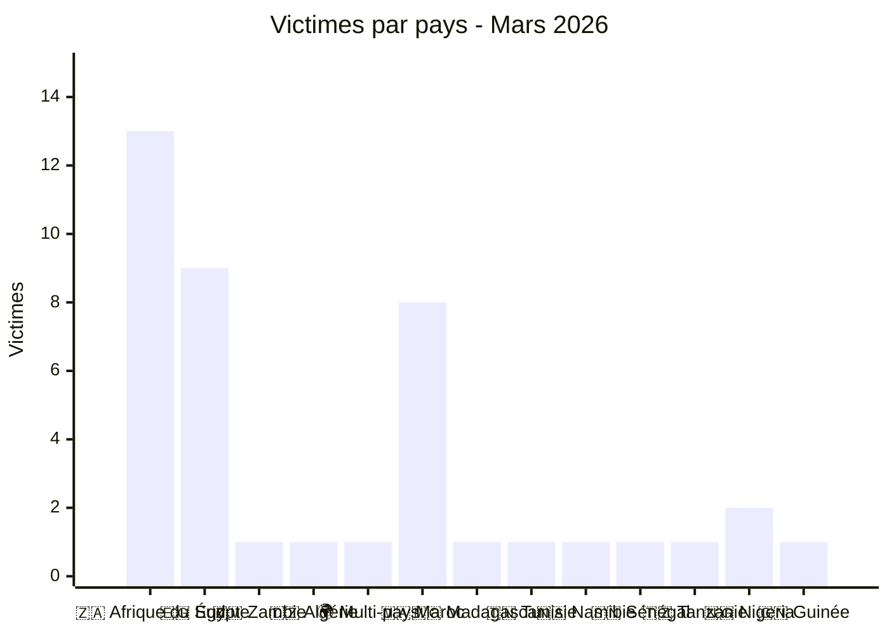
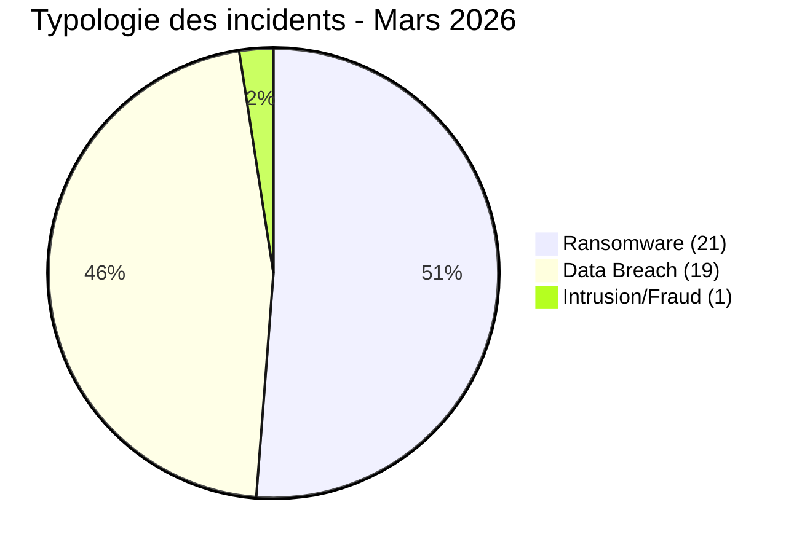
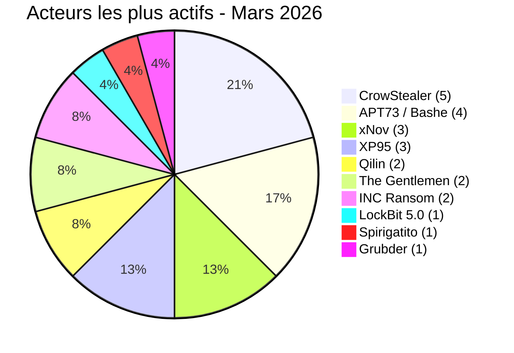
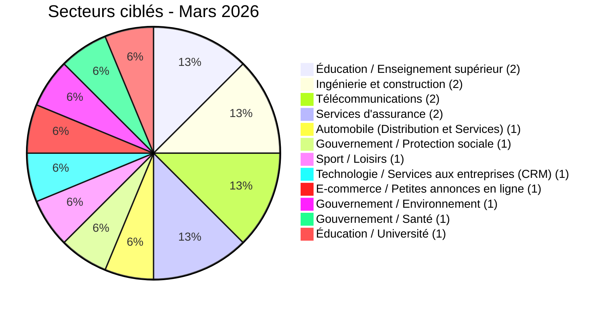

# AFRINTEL Visual Intelligence - Mars 2026

## Note de fiabilité

Les publications issues des leak sites, forums et canaux underground sont traitées comme des **revendications non confirmées**, sauf corroboration explicite.

**Source :** [https://github.com/Hatchepsoute/AFRINTEL/tree/main/CyberAttackAfrica/2026/03-march](https://github.com/Hatchepsoute/AFRINTEL/tree/main/CyberAttackAfrica/2026/03-march)

## Synthèse

| Indicateur | Valeur |
|---|---:|
| Victimes | 41 |
| Pays touchés | 12 (plus 1 incident multi-pays) |
| Acteurs attribués | 26 |
| Secteurs touchés | 38 |

## Victimes par pays

## Typologie des incidents

## Acteurs les plus actifs

## Secteurs ciblés

## Carte complète - Actor → Victim → Country → Sector

```mermaid
flowchart LR
    classDef actor fill:#3b0764,color:#fff,stroke:#a855f7,stroke-width:1px;
    classDef victim fill:#7f1d1d,color:#fff,stroke:#ef4444,stroke-width:1px;
    classDef country fill:#064e3b,color:#fff,stroke:#10b981,stroke-width:1px;
    classDef sector fill:#1e3a8a,color:#fff,stroke:#60a5fa,stroke-width:1px;
    A_LockBit_5_0["LockBit 5.0"] --> V_Diesel_Electric_Group["Diesel-Electric Group"] --> C_Afrique_du_Sud["🇿🇦 Afrique du Sud"] --> S_Automobile__Distribution_et_Services["Automobile (Distribution et Services)"]
    class A_LockBit_5_0 actor;
    class V_Diesel_Electric_Group victim;
    class C_Afrique_du_Sud country;
    class S_Automobile__Distribution_et_Services sector;
    A_CrowStealer["CrowStealer"] --> V_Canadian_International_College__CIC["Canadian International College (CIC)"] --> C_gypte["🇪🇬 Égypte"] --> S_ducation___Enseignement_sup_rieur["Éducation / Enseignement supérieur"]
    class A_CrowStealer actor;
    class V_Canadian_International_College__CIC victim;
    class C_gypte country;
    class S_ducation___Enseignement_sup_rieur sector;
    A_Spirigatito["Spirigatito"] --> V_ZISPIS__Zambia_Integrated_Social_Protection_Information["ZISPIS (Zambia Integrated Social Protection Information System)"] --> C_Zambie["🇿🇲 Zambie"] --> S_Gouvernement___Protection_sociale["Gouvernement / Protection sociale"]
    class A_Spirigatito actor;
    class V_ZISPIS__Zambia_Integrated_Social_Protection_Information victim;
    class C_Zambie country;
    class S_Gouvernement___Protection_sociale sector;
    A_xNov["xNov"] --> V_Eventing_South_Africa["Eventing South Africa"] --> C_Afrique_du_Sud["🇿🇦 Afrique du Sud"] --> S_Sport___Loisirs["Sport / Loisirs"]
    class A_xNov actor;
    class V_Eventing_South_Africa victim;
    class C_Afrique_du_Sud country;
    class S_Sport___Loisirs sector;
    A_Grubder["Grubder"] --> V_Bridges__tebridges_dz["Bridges (tebridges.dz)"] --> C_Alg_rie["🇩🇿 Algérie"] --> S_Technologie___Services_aux_entreprises__CRM["Technologie / Services aux entreprises (CRM)"]
    class A_Grubder actor;
    class V_Bridges__tebridges_dz victim;
    class C_Alg_rie country;
    class S_Technologie___Services_aux_entreprises__CRM sector;
    A_zimablue["zimablue"] --> V_Loozap__loozap_com["Loozap (loozap.com)"] --> C_MultiPays["🌍 Multi-pays"] --> S_E_commerce___Petites_annonces_en_ligne["E-commerce / Petites annonces en ligne"]
    class A_zimablue actor;
    class V_Loozap__loozap_com victim;
    class C_MultiPays country;
    class S_E_commerce___Petites_annonces_en_ligne sector;
    A_CrowStealer["CrowStealer"] --> V_Autorit__de_R_gulation_de_la_Gestion_des_D_chets__WMRA["Autorité de Régulation de la Gestion des Déchets (WMRA)"] --> C_gypte["🇪🇬 Égypte"] --> S_Gouvernement___Environnement["Gouvernement / Environnement"]
    class A_CrowStealer actor;
    class V_Autorit__de_R_gulation_de_la_Gestion_des_D_chets__WMRA victim;
    class C_gypte country;
    class S_Gouvernement___Environnement sector;
    A_CrowStealer["CrowStealer"] --> V_Orascom_Construction["Orascom Construction"] --> C_gypte["🇪🇬 Égypte"] --> S_Ing_nierie_et_construction["Ingénierie et construction"]
    class A_CrowStealer actor;
    class V_Orascom_Construction victim;
    class C_gypte country;
    class S_Ing_nierie_et_construction sector;
    A_CrowStealer["CrowStealer"] --> V_Minist_re_de_la_Sant__et_de_la_Population__E_Portal["Ministère de la Santé et de la Population (E-Portal)"] --> C_gypte["🇪🇬 Égypte"] --> S_Gouvernement___Sant["Gouvernement / Santé"]
    class A_CrowStealer actor;
    class V_Minist_re_de_la_Sant__et_de_la_Population__E_Portal victim;
    class C_gypte country;
    class S_Gouvernement___Sant sector;
    A_TelephoneHooliganism["TelephoneHooliganism"] --> V_Walter_Sisulu_University__WSU["Walter Sisulu University (WSU)"] --> C_Afrique_du_Sud["🇿🇦 Afrique du Sud"] --> S_ducation___Universit["Éducation / Université"]
    class A_TelephoneHooliganism actor;
    class V_Walter_Sisulu_University__WSU victim;
    class C_Afrique_du_Sud country;
    class S_ducation___Universit sector;
    A_CrowStealer["CrowStealer"] --> V_Minist_re_de_l__ducation_et_de_l_Enseignement_Technique["Ministère de l'Éducation et de l'Enseignement Technique"] --> C_gypte["🇪🇬 Égypte"] --> S_Gouvernement____ducation["Gouvernement / Éducation"]
    class A_CrowStealer actor;
    class V_Minist_re_de_l__ducation_et_de_l_Enseignement_Technique victim;
    class C_gypte country;
    class S_Gouvernement____ducation sector;
    A_xNov["xNov"] --> V_Office_National_des__uvres_Universitaires_Sociales_et_C["Office National des Œuvres Universitaires Sociales et Culturelles (ONOUSC)"] --> C_Maroc["🇲🇦 Maroc"] --> S_ducation___Gouvernement["Éducation / Gouvernement"]
    class A_xNov actor;
    class V_Office_National_des__uvres_Universitaires_Sociales_et_C victim;
    class C_Maroc country;
    class S_ducation___Gouvernement sector;
    A_Qilin["Qilin"] --> V_Outsourcia["Outsourcia"] --> C_Maroc["🇲🇦 Maroc"] --> S_Business_Process_Outsourcing__BPO["Business Process Outsourcing (BPO)"]
    class A_Qilin actor;
    class V_Outsourcia victim;
    class C_Maroc country;
    class S_Business_Process_Outsourcing__BPO sector;
    A_Crypto24["Crypto24"] --> V_Rowad_Modern_Engineering["Rowad Modern Engineering"] --> C_gypte["🇪🇬 Égypte"] --> S_Ing_nierie_et_construction["Ingénierie et construction"]
    class A_Crypto24 actor;
    class V_Rowad_Modern_Engineering victim;
    class C_gypte country;
    class S_Ing_nierie_et_construction sector;
    A_PEAR["PEAR"] --> V_INTERACT_TECHNOLOGY_SOLUTIONS["INTERACT TECHNOLOGY SOLUTIONS"] --> C_gypte["🇪🇬 Égypte"] --> S_IT_Consulting["IT Consulting"]
    class A_PEAR actor;
    class V_INTERACT_TECHNOLOGY_SOLUTIONS victim;
    class C_gypte country;
    class S_IT_Consulting sector;
    A_Qilin["Qilin"] --> V_Orange_Madagascar["Orange Madagascar"] --> C_Madagascar["🇲🇬 Madagascar"] --> S_T_l_communications["Télécommunications"]
    class A_Qilin actor;
    class V_Orange_Madagascar victim;
    class C_Madagascar country;
    class S_T_l_communications sector;
    A_The_Gentlemen["The Gentlemen"] --> V_K_PROPHA__Karray_Produits_Pharmaceutiques["K.PROPHA (Karray Produits Pharmaceutiques)"] --> C_Tunisie["🇹🇳 Tunisie"] --> S_Sant____Pharmaceutique["Santé / Pharmaceutique"]
    class A_The_Gentlemen actor;
    class V_K_PROPHA__Karray_Produits_Pharmaceutiques victim;
    class C_Tunisie country;
    class S_Sant____Pharmaceutique sector;
    A_APT73___Bashe["APT73 / Bashe"] --> V_HACA__Haute_Autorit__de_la_Communication_Audiovisuelle["HACA (Haute Autorité de la Communication Audiovisuelle)"] --> C_Maroc["🇲🇦 Maroc"] --> S_Gouvernement___M_dias["Gouvernement / Médias"]
    class A_APT73___Bashe actor;
    class V_HACA__Haute_Autorit__de_la_Communication_Audiovisuelle victim;
    class C_Maroc country;
    class S_Gouvernement___M_dias sector;
    A_Lynx["Lynx"] --> V_Lion_of_Africa_Insurance["Lion of Africa Insurance"] --> C_Afrique_du_Sud["🇿🇦 Afrique du Sud"] --> S_Services_d_assurance["Services d'assurance"]
    class A_Lynx actor;
    class V_Lion_of_Africa_Insurance victim;
    class C_Afrique_du_Sud country;
    class S_Services_d_assurance sector;
    A_XP95["XP95"] --> V_Gouvernement_Provincial_de_Gauteng["Gouvernement Provincial de Gauteng"] --> C_Afrique_du_Sud["🇿🇦 Afrique du Sud"] --> S_Gouvernement___Administration_publique["Gouvernement / Administration publique"]
    class A_XP95 actor;
    class V_Gouvernement_Provincial_de_Gauteng victim;
    class C_Afrique_du_Sud country;
    class S_Gouvernement___Administration_publique sector;
    A_Payload["Payload"] --> V_Grid_Fine_Finishes["Grid Fine Finishes"] --> C_gypte["🇪🇬 Égypte"] --> S_Am_nagement___Construction["Aménagement / Construction"]
    class A_Payload actor;
    class V_Grid_Fine_Finishes victim;
    class C_gypte country;
    class S_Am_nagement___Construction sector;
    A_Blackwinter99["Blackwinter99"] --> V_University_of_South_Africa__UNISA["University of South Africa (UNISA)"] --> C_Afrique_du_Sud["🇿🇦 Afrique du Sud"] --> S_ducation___Enseignement_Sup_rieur["Éducation / Enseignement Supérieur"]
    class A_Blackwinter99 actor;
    class V_University_of_South_Africa__UNISA victim;
    class C_Afrique_du_Sud country;
    class S_ducation___Enseignement_Sup_rieur sector;
    A_INC_Ransom["INC Ransom"] --> V_Namibia_Airports_Company["Namibia Airports Company"] --> C_Namibie["🇳🇦 Namibie"] --> S_Transport_a_rien["Transport aérien"]
    class A_INC_Ransom actor;
    class V_Namibia_Airports_Company victim;
    class C_Namibie country;
    class S_Transport_a_rien sector;
    A_DragonForce["DragonForce"] --> V_The_Unlimited["The Unlimited"] --> C_Afrique_du_Sud["🇿🇦 Afrique du Sud"] --> S_Services_d_assurance["Services d'assurance"]
    class A_DragonForce actor;
    class V_The_Unlimited victim;
    class C_Afrique_du_Sud country;
    class S_Services_d_assurance sector;
    A_anisanas2["anisanas2"] --> V_Minist_re_de_la_Justice["Ministère de la Justice"] --> C_Maroc["🇲🇦 Maroc"] --> S_Gouvernement___Justice["Gouvernement / Justice"]
    class A_anisanas2 actor;
    class V_Minist_re_de_la_Justice victim;
    class C_Maroc country;
    class S_Gouvernement___Justice sector;
    A_The_Gentlemen["The Gentlemen"] --> V_Elundini_Local_Municipality["Elundini Local Municipality"] --> C_Afrique_du_Sud["🇿🇦 Afrique du Sud"] --> S_Administration_locale["Administration locale"]
    class A_The_Gentlemen actor;
    class V_Elundini_Local_Municipality victim;
    class C_Afrique_du_Sud country;
    class S_Administration_locale sector;
    A_NightSpire["NightSpire"] --> V_Semenya_Furumele_Consulting_Engineers["Semenya Furumele Consulting Engineers"] --> C_Afrique_du_Sud["🇿🇦 Afrique du Sud"] --> S_Ing_nierie_conseil["Ingénierie conseil"]
    class A_NightSpire actor;
    class V_Semenya_Furumele_Consulting_Engineers victim;
    class C_Afrique_du_Sud country;
    class S_Ing_nierie_conseil sector;
    V_United_Bank_for_Africa__UBA_S_n_gal["United Bank for Africa (UBA Sénégal) — non attribué"] --> C_S_n_gal["🇸🇳 Sénégal"] --> S_Finance___Banque["Finance / Banque"]
    class V_United_Bank_for_Africa__UBA_S_n_gal victim;
    class C_S_n_gal country;
    class S_Finance___Banque sector;
    A_INC_Ransom["INC Ransom"] --> V_ETFSA["ETFSA"] --> C_Afrique_du_Sud["🇿🇦 Afrique du Sud"] --> S_Wealth_Management["Wealth Management"]
    class A_INC_Ransom actor;
    class V_ETFSA victim;
    class C_Afrique_du_Sud country;
    class S_Wealth_Management sector;
    A_APT73___Bashe["APT73 / Bashe"] --> V_Maroc_Telecom["Maroc Telecom"] --> C_Maroc["🇲🇦 Maroc"] --> S_T_l_communications["Télécommunications"]
    class A_APT73___Bashe actor;
    class V_Maroc_Telecom victim;
    class C_Maroc country;
    class S_T_l_communications sector;
    A_APT73___Bashe["APT73 / Bashe"] --> V_2M_TV["2M TV"] --> C_Maroc["🇲🇦 Maroc"] --> S_M_dias_et_audiovisuel["Médias et audiovisuel"]
    class A_APT73___Bashe actor;
    class V_2M_TV victim;
    class C_Maroc country;
    class S_M_dias_et_audiovisuel sector;
    A_APT73___Bashe["APT73 / Bashe"] --> V_Institut_Royal_des__tudes_Strat_giques__IRES["Institut Royal des Études Stratégiques (IRES)"] --> C_Maroc["🇲🇦 Maroc"] --> S_Recherche___Think_tank["Recherche / Think tank"]
    class A_APT73___Bashe actor;
    class V_Institut_Royal_des__tudes_Strat_giques__IRES victim;
    class C_Maroc country;
    class S_Recherche___Think_tank sector;
    A_XP95["XP95"] --> V_Statistics_South_Africa__Stats_SA["Statistics South Africa (Stats SA)"] --> C_Afrique_du_Sud["🇿🇦 Afrique du Sud"] --> S_Gouvernement___Statistiques_Nationales["Gouvernement / Statistiques Nationales"]
    class A_XP95 actor;
    class V_Statistics_South_Africa__Stats_SA victim;
    class C_Afrique_du_Sud country;
    class S_Gouvernement___Statistiques_Nationales sector;
    A_XP95["XP95"] --> V_Gauteng_City_Region_Academy__GCRA["Gauteng City Region Academy (GCRA)"] --> C_Afrique_du_Sud["🇿🇦 Afrique du Sud"] --> S_ducation___Formation__Gouvernement_provincial["Éducation / Formation (Gouvernement provincial)"]
    class A_XP95 actor;
    class V_Gauteng_City_Region_Academy__GCRA victim;
    class C_Afrique_du_Sud country;
    class S_ducation___Formation__Gouvernement_provincial sector;
    A_Morpheus["Morpheus"] --> V_SBC_Tanzania_Limited["SBC Tanzania Limited"] --> C_Tanzanie["🇹🇿 Tanzanie"] --> S_Agroalimentaire["Agroalimentaire"]
    class A_Morpheus actor;
    class V_SBC_Tanzania_Limited victim;
    class C_Tanzanie country;
    class S_Agroalimentaire sector;
    A_Coinbase_Cartel["Coinbase Cartel"] --> V_Nashua["Nashua"] --> C_Afrique_du_Sud["🇿🇦 Afrique du Sud"] --> S_IT___Managed_Services["IT & Managed Services"]
    class A_Coinbase_Cartel actor;
    class V_Nashua victim;
    class C_Afrique_du_Sud country;
    class S_IT___Managed_Services sector;
    A_AshleyWood2022["AshleyWood2022"] --> V_Universit__Ahmadu_Bello__ABU_Zaria["Université Ahmadu Bello (ABU Zaria)"] --> C_Nigeria["🇳🇬 Nigeria"] --> S_ducation___Enseignement_sup_rieur["Éducation / Enseignement supérieur"]
    class A_AshleyWood2022 actor;
    class V_Universit__Ahmadu_Bello__ABU_Zaria victim;
    class C_Nigeria country;
    class S_ducation___Enseignement_sup_rieur sector;
    A_Bytetobreach["Bytetobreach"] --> V_Remita__SystemSpecs["Remita (SystemSpecs)"] --> C_Nigeria["🇳🇬 Nigeria"] --> S_Fintech___Services_de_paiement["Fintech / Services de paiement"]
    class A_Bytetobreach actor;
    class V_Remita__SystemSpecs victim;
    class C_Nigeria country;
    class S_Fintech___Services_de_paiement sector;
    A_xNov["xNov"] --> V_Smarteez__Prestataire_L_Or_al_Maroc___Supply_Chain["Smarteez (Prestataire L’Oréal Maroc - Supply Chain)"] --> C_Maroc["🇲🇦 Maroc"] --> S_Marketing_Digital___Cosm_tique__Supply_Chain_L_Or_al["Marketing Digital / Cosmétique (Supply Chain L'Oréal)"]
    class A_xNov actor;
    class V_Smarteez__Prestataire_L_Or_al_Maroc___Supply_Chain victim;
    class C_Maroc country;
    class S_Marketing_Digital___Cosm_tique__Supply_Chain_L_Or_al sector;
    A_Al_Sheikh["Al-Sheikh"] --> V_Semsar_Masr__semsarmasr_com["Semsar Masr (semsarmasr.com)"] --> C_gypte["🇪🇬 Égypte"] --> S_Immobilier___Petites_annonces_en_ligne["Immobilier / Petites annonces en ligne"]
    class A_Al_Sheikh actor;
    class V_Semsar_Masr__semsarmasr_com victim;
    class C_gypte country;
    class S_Immobilier___Petites_annonces_en_ligne sector;
    A_Keymous["Keymous"] --> V_Minist_re_de_la_Sant___sante_gov_gn["Ministère de la Santé (sante.gov.gn)"] --> C_Guin_e["🇬🇳 Guinée"] --> S_Gouvernement___Sant__publique["Gouvernement / Santé publique"]
    class A_Keymous actor;
    class V_Minist_re_de_la_Sant___sante_gov_gn victim;
    class C_Guin_e country;
    class S_Gouvernement___Sant__publique sector;
```

## Carte simplifiée - Actor → Victim

```mermaid
flowchart LR
    classDef actor fill:#3b0764,color:#fff,stroke:#a855f7;
    classDef victim fill:#7f1d1d,color:#fff,stroke:#ef4444;
    A_LockBit_5_0["LockBit 5.0"] --> V_Diesel_Electric_Group["Diesel-Electric Group"]
    class A_LockBit_5_0 actor;
    class V_Diesel_Electric_Group victim;
    A_CrowStealer["CrowStealer"] --> V_Canadian_International_College__CIC["Canadian International College (CIC)"]
    class A_CrowStealer actor;
    class V_Canadian_International_College__CIC victim;
    A_Spirigatito["Spirigatito"] --> V_ZISPIS__Zambia_Integrated_Social_Protection_Information["ZISPIS (Zambia Integrated Social Protection Information System)"]
    class A_Spirigatito actor;
    class V_ZISPIS__Zambia_Integrated_Social_Protection_Information victim;
    A_xNov["xNov"] --> V_Eventing_South_Africa["Eventing South Africa"]
    class A_xNov actor;
    class V_Eventing_South_Africa victim;
    A_Grubder["Grubder"] --> V_Bridges__tebridges_dz["Bridges (tebridges.dz)"]
    class A_Grubder actor;
    class V_Bridges__tebridges_dz victim;
    A_zimablue["zimablue"] --> V_Loozap__loozap_com["Loozap (loozap.com)"]
    class A_zimablue actor;
    class V_Loozap__loozap_com victim;
    A_CrowStealer["CrowStealer"] --> V_Autorit__de_R_gulation_de_la_Gestion_des_D_chets__WMRA["Autorité de Régulation de la Gestion des Déchets (WMRA)"]
    class A_CrowStealer actor;
    class V_Autorit__de_R_gulation_de_la_Gestion_des_D_chets__WMRA victim;
    A_CrowStealer["CrowStealer"] --> V_Orascom_Construction["Orascom Construction"]
    class A_CrowStealer actor;
    class V_Orascom_Construction victim;
    A_CrowStealer["CrowStealer"] --> V_Minist_re_de_la_Sant__et_de_la_Population__E_Portal["Ministère de la Santé et de la Population (E-Portal)"]
    class A_CrowStealer actor;
    class V_Minist_re_de_la_Sant__et_de_la_Population__E_Portal victim;
    A_TelephoneHooliganism["TelephoneHooliganism"] --> V_Walter_Sisulu_University__WSU["Walter Sisulu University (WSU)"]
    class A_TelephoneHooliganism actor;
    class V_Walter_Sisulu_University__WSU victim;
    A_CrowStealer["CrowStealer"] --> V_Minist_re_de_l__ducation_et_de_l_Enseignement_Technique["Ministère de l'Éducation et de l'Enseignement Technique"]
    class A_CrowStealer actor;
    class V_Minist_re_de_l__ducation_et_de_l_Enseignement_Technique victim;
    A_xNov["xNov"] --> V_Office_National_des__uvres_Universitaires_Sociales_et_C["Office National des Œuvres Universitaires Sociales et Culturelles (ONOUSC)"]
    class A_xNov actor;
    class V_Office_National_des__uvres_Universitaires_Sociales_et_C victim;
    A_Qilin["Qilin"] --> V_Outsourcia["Outsourcia"]
    class A_Qilin actor;
    class V_Outsourcia victim;
    A_Qilin["Qilin"] --> V_Orange_Madagascar["Orange Madagascar"]
    class A_Qilin actor;
    class V_Orange_Madagascar victim;
    A_The_Gentlemen["The Gentlemen"] --> V_K_PROPHA__Karray_Produits_Pharmaceutiques["K.PROPHA (Karray Produits Pharmaceutiques)"]
    class A_The_Gentlemen actor;
    class V_K_PROPHA__Karray_Produits_Pharmaceutiques victim;
    A_APT73___Bashe["APT73 / Bashe"] --> V_HACA__Haute_Autorit__de_la_Communication_Audiovisuelle["HACA (Haute Autorité de la Communication Audiovisuelle)"]
    class A_APT73___Bashe actor;
    class V_HACA__Haute_Autorit__de_la_Communication_Audiovisuelle victim;
    A_XP95["XP95"] --> V_Gouvernement_Provincial_de_Gauteng["Gouvernement Provincial de Gauteng"]
    class A_XP95 actor;
    class V_Gouvernement_Provincial_de_Gauteng victim;
    A_INC_Ransom["INC Ransom"] --> V_Namibia_Airports_Company["Namibia Airports Company"]
    class A_INC_Ransom actor;
    class V_Namibia_Airports_Company victim;
    A_The_Gentlemen["The Gentlemen"] --> V_Elundini_Local_Municipality["Elundini Local Municipality"]
    class A_The_Gentlemen actor;
    class V_Elundini_Local_Municipality victim;
    A_INC_Ransom["INC Ransom"] --> V_ETFSA["ETFSA"]
    class A_INC_Ransom actor;
    class V_ETFSA victim;
    A_APT73___Bashe["APT73 / Bashe"] --> V_Maroc_Telecom["Maroc Telecom"]
    class A_APT73___Bashe actor;
    class V_Maroc_Telecom victim;
    A_APT73___Bashe["APT73 / Bashe"] --> V_2M_TV["2M TV"]
    class A_APT73___Bashe actor;
    class V_2M_TV victim;
    A_APT73___Bashe["APT73 / Bashe"] --> V_Institut_Royal_des__tudes_Strat_giques__IRES["Institut Royal des Études Stratégiques (IRES)"]
    class A_APT73___Bashe actor;
    class V_Institut_Royal_des__tudes_Strat_giques__IRES victim;
    A_XP95["XP95"] --> V_Statistics_South_Africa__Stats_SA["Statistics South Africa (Stats SA)"]
    class A_XP95 actor;
    class V_Statistics_South_Africa__Stats_SA victim;
    A_XP95["XP95"] --> V_Gauteng_City_Region_Academy__GCRA["Gauteng City Region Academy (GCRA)"]
    class A_XP95 actor;
    class V_Gauteng_City_Region_Academy__GCRA victim;
    A_xNov["xNov"] --> V_Smarteez__Prestataire_L_Or_al_Maroc___Supply_Chain["Smarteez (Prestataire L’Oréal Maroc - Supply Chain)"]
    class A_xNov actor;
    class V_Smarteez__Prestataire_L_Or_al_Maroc___Supply_Chain victim;
```

## Lecture CTI

- L’Afrique du Sud reste le principal foyer observé en mars 2026.
- Le Maroc et l’Égypte concentrent une forte pression contre les institutions publiques, télécoms, éducation et santé.
- Les fuites de données, ventes de bases et intrusions financières sont aussi importantes que le ransomware.
- Les secteurs gouvernement, éducation et santé doivent rester prioritaires pour le durcissement, la supervision SOC et la réponse à incident.
