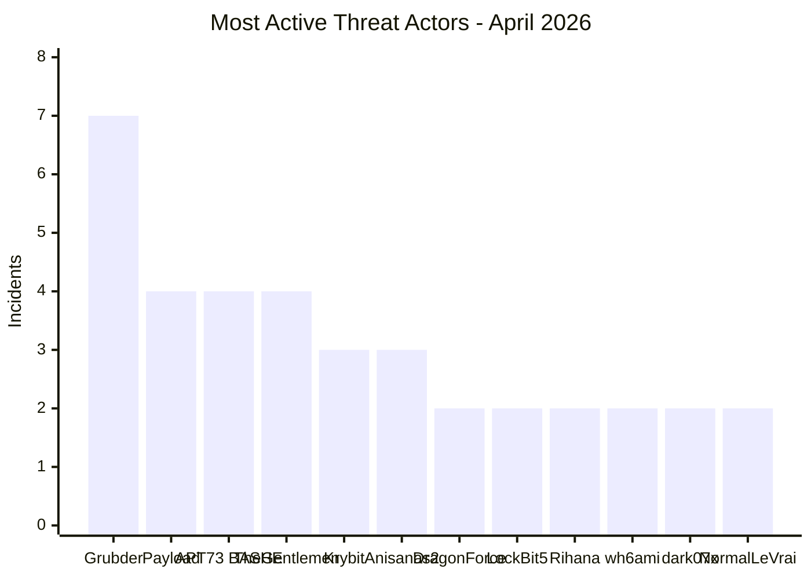

# AFRINTEL - Most Active Threat Actors
## April 2026

| Threat Actor / Group | Incidents | Dominant Type |
|---|---:|---|
| Grubder | 7 | Data leaks |
| Payload | 4 | Ransomware |
| APT73 / BASHE | 4 | Ransomware |
| TheGentlemen | 4 | Ransomware |
| Krybit | 3 | Ransomware |
| Anisanas2 | 3 | Data leaks |
| DragonForce | 2 | Ransomware |
| LockBit5 | 2 | Ransomware |
| Rihana | 2 | Data leaks |
| wh6ami | 2 | Data leaks |
| dark07x | 2 | Data leaks |
| NormalLeVrai | 2 | Data leaks |
| Others | 23 | Mixed |

