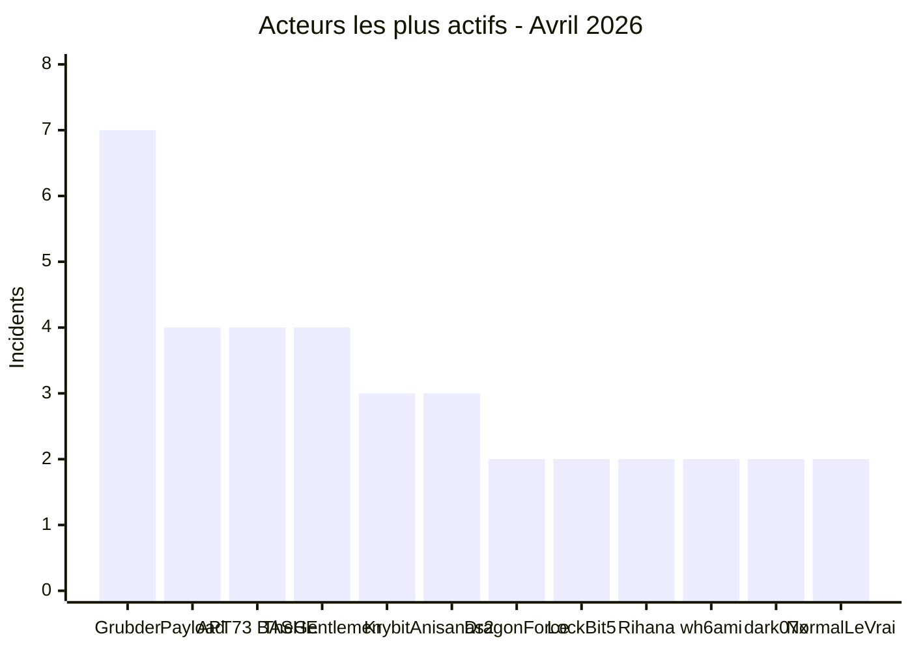

# AFRINTEL — Acteurs les plus actifs
## Avril 2026

| Acteur / Groupe | Incidents | Type dominant |
|---|---:|---|
| Grubder | 7 | Fuites de données |
| Payload | 4 | Ransomware |
| APT73 / BASHE | 4 | Ransomware |
| TheGentlemen | 4 | Ransomware |
| Krybit | 3 | Ransomware |
| Anisanas2 | 3 | Fuites de données |
| DragonForce | 2 | Ransomware |
| LockBit5 | 2 | Ransomware |
| Rihana | 2 | Fuites de données |
| wh6ami | 2 | Fuites de données |
| dark07x | 2 | Fuites de données |
| NormalLeVrai | 2 | Fuites de données |
| Autres | 23 | Mixte |

