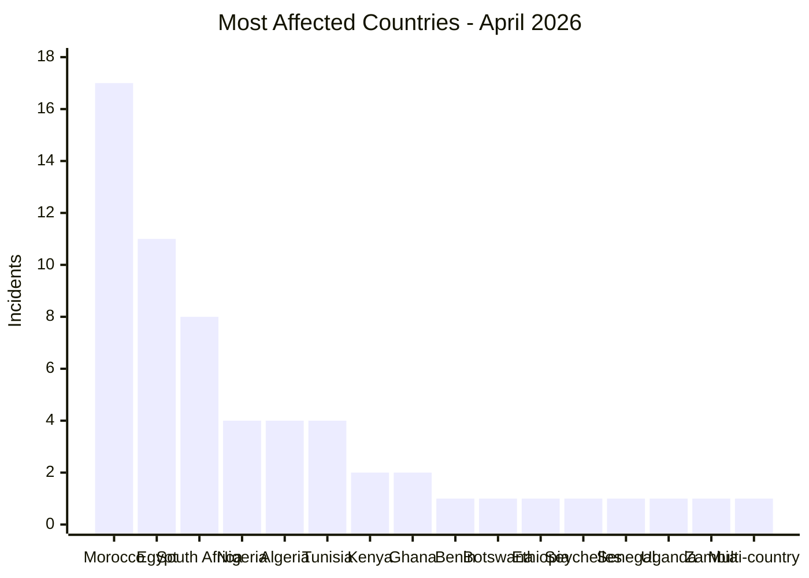

# AFRINTEL - Country Hotspots
## April 2026

| Rank | Country | Incidents | CTI Reading |
|---|---|---:|---|
| 1 | 🇲🇦 Morocco | 17 | Main data leak hotspot |
| 2 | 🇪🇬 Egypt | 11 | Main ransomware hotspot |
| 3 | 🇿🇦 South Africa | 8 | Mixed ransomware + data leaks |
| 4 | 🇳🇬 Nigeria | 4 | Government and public data exposure |
| 5 | 🇩🇿 Algeria | 4 | Insurance, government, sports |
| 6 | 🇹🇳 Tunisia | 4 | E-commerce, education, applications |
| 7 | 🇰🇪 Kenya | 2 | Government / aviation |
| 8 | 🇬🇭 Ghana | 2 | Healthcare / finance |

