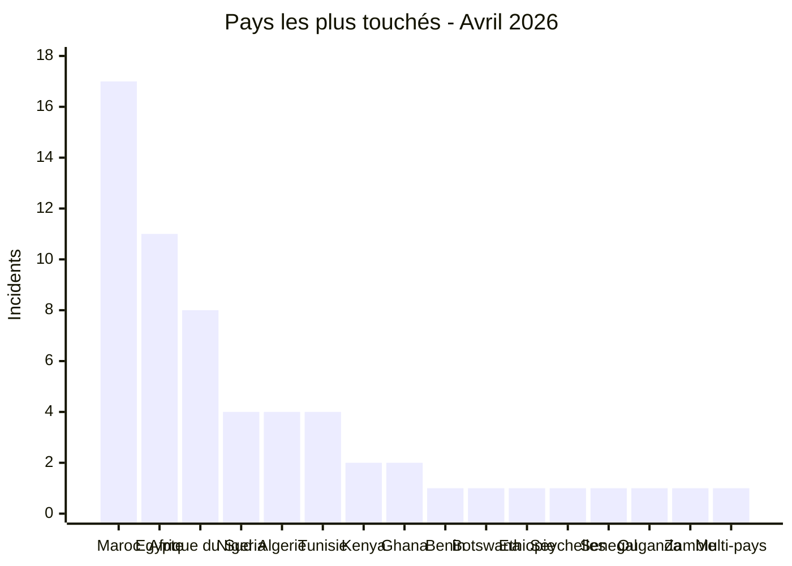

# AFRINTEL — Hotspots pays
## Avril 2026

| Rang | Pays | Incidents | Lecture CTI |
|---|---|---:|---|
| 1 | 🇲🇦 Maroc | 17 | Principal foyer de fuites de données |
| 2 | 🇪🇬 Égypte | 11 | Principal foyer ransomware |
| 3 | 🇿🇦 Afrique du Sud | 8 | Mix ransomware + fuites |
| 4 | 🇳🇬 Nigeria | 4 | Exposition gouvernementale / données publiques |
| 5 | 🇩🇿 Algérie | 4 | Assurance, gouvernement, sport |
| 6 | 🇹🇳 Tunisie | 4 | E-commerce, éducation, applications |
| 7 | 🇰🇪 Kenya | 2 | Gouvernement / aviation |
| 8 | 🇬🇭 Ghana | 2 | Santé / finance |

