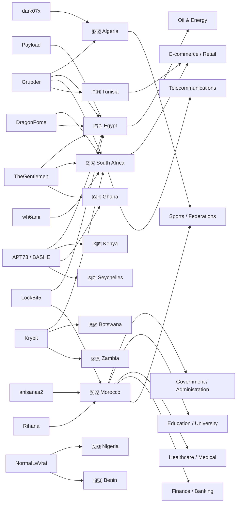

# AFRINTEL - CTI Ecosystem Map
## Actors → Countries → Sectors - April 2026

```mermaid
flowchart LR
Grubder["Grubder"] --> DZ["🇩🇿 Algeria"]
Grubder --> EG["🇪🇬 Egypt"]
Grubder --> ZA["🇿🇦 South Africa"]
Grubder --> TN["🇹🇳 Tunisia"]
Payload["Payload"] --> EG
APT73["APT73 / BASHE"] --> EG
APT73 --> KE["🇰🇪 Kenya"]
APT73 --> GH["🇬🇭 Ghana"]
APT73 --> SC["🇸🇨 Seychelles"]
TheGentlemen["TheGentlemen"] --> EG
TheGentlemen --> ZA
TheGentlemen --> GH
Krybit["Krybit"] --> ZA
Krybit --> BW["🇧🇼 Botswana"]
Krybit --> ZM["🇿🇲 Zambia"]
DragonForce["DragonForce"] --> ZA
DragonForce --> EG
LockBit5["LockBit5"] --> EG
LockBit5 --> MA["🇲🇦 Morocco"]
Anisanas2["anisanas2"] --> MA
Rihana["Rihana"] --> MA
wh6ami["wh6ami"] --> ZA
dark07x["dark07x"] --> DZ
NormalLeVrai["NormalLeVrai"] --> NG["🇳🇬 Nigeria"]
NormalLeVrai --> BJ["🇧🇯 Benin"]
MA --> Gov["Government / Administration"]
MA --> Edu["Education / University"]
MA --> Health["Healthcare / Medical"]
MA --> Finance["Finance / Banking"]
MA --> Sports["Sports / Federations"]
EG --> Energy["Oil & Energy"]
ZA --> Ecom["E-commerce / Retail"]
ZA --> Telecom["Telecommunications"]
DZ --> Sports
TN --> Ecom
```
