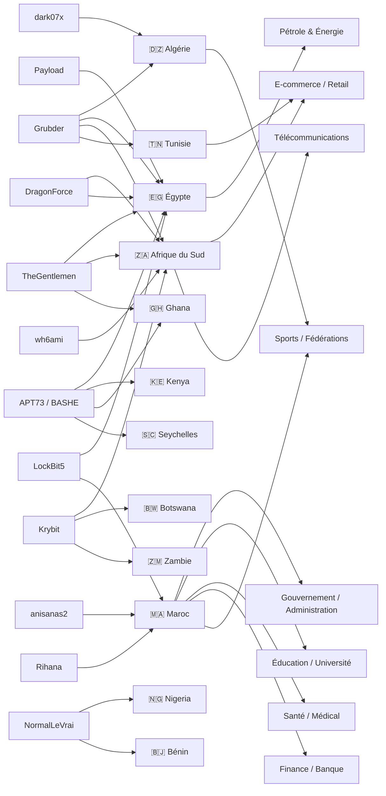

# AFRINTEL — Carte écosystème CTI
## Acteurs → Pays → Secteurs — Avril 2026

```mermaid
flowchart LR
Grubder["Grubder"] --> DZ["🇩🇿 Algérie"]
Grubder --> EG["🇪🇬 Égypte"]
Grubder --> ZA["🇿🇦 Afrique du Sud"]
Grubder --> TN["🇹🇳 Tunisie"]
Payload["Payload"] --> EG
APT73["APT73 / BASHE"] --> EG
APT73 --> KE["🇰🇪 Kenya"]
APT73 --> GH["🇬🇭 Ghana"]
APT73 --> SC["🇸🇨 Seychelles"]
TheGentlemen["TheGentlemen"] --> EG
TheGentlemen --> ZA
TheGentlemen --> GH
Krybit["Krybit"] --> ZA
Krybit --> BW["🇧🇼 Botswana"]
Krybit --> ZM["🇿🇲 Zambie"]
DragonForce["DragonForce"] --> ZA
DragonForce --> EG
LockBit5["LockBit5"] --> EG
LockBit5 --> MA["🇲🇦 Maroc"]
Anisanas2["anisanas2"] --> MA
Rihana["Rihana"] --> MA
wh6ami["wh6ami"] --> ZA
dark07x["dark07x"] --> DZ
NormalLeVrai["NormalLeVrai"] --> NG["🇳🇬 Nigeria"]
NormalLeVrai --> BJ["🇧🇯 Bénin"]
MA --> Gov["Gouvernement / Administration"]
MA --> Edu["Éducation / Université"]
MA --> Health["Santé / Médical"]
MA --> Finance["Finance / Banque"]
MA --> Sports["Sports / Fédérations"]
EG --> Energy["Pétrole & Énergie"]
ZA --> Ecom["E-commerce / Retail"]
ZA --> Telecom["Télécommunications"]
DZ --> Sports
TN --> Ecom
```
