# AFRINTEL - Ransomware vs Data Leaks
## April 2026

| Country | Ransomware | Data Leaks |
|---|---:|---:|
| 🇲🇦 Morocco | 2 | 15 |
| 🇪🇬 Egypt | 9 | 2 |
| 🇿🇦 South Africa | 3 | 5 |
| 🇳🇬 Nigeria | 0 | 4 |
| 🇩🇿 Algeria | 0 | 4 |
| 🇹🇳 Tunisia | 0 | 4 |
| 🇰🇪 Kenya | 1 | 1 |
| 🇬🇭 Ghana | 2 | 0 |
| 🇧🇯 Benin | 0 | 1 |
| 🇧🇼 Botswana | 1 | 0 |
| 🇪🇹 Ethiopia | 0 | 1 |
| 🇸🇨 Seychelles | 1 | 0 |
| 🇸🇳 Senegal | 0 | 1 |
| 🇺🇬 Uganda | 0 | 1 |
| 🇿🇲 Zambia | 1 | 0 |
| 🌍 Multi-country Africa | 0 | 1 |

```mermaid
xychart-beta
    title "Ransomware vs Data Leaks - April 2026"
    x-axis ["Morocco","Egypt","South Africa","Nigeria","Algeria","Tunisia","Kenya","Ghana"]
    y-axis "Incidents" 0 --> 16
    bar [2,9,3,0,0,0,1,2]
    bar [15,2,5,4,4,4,1,0]
```

