# AFRINTEL - Ransomware vs Fuites de données
## Avril 2026

| Pays | Ransomware | Fuites de données |
|---|---:|---:|
| 🇲🇦 Maroc | 2 | 15 |
| 🇪🇬 Égypte | 9 | 2 |
| 🇿🇦 Afrique du Sud | 3 | 5 |
| 🇳🇬 Nigeria | 0 | 4 |
| 🇩🇿 Algérie | 0 | 4 |
| 🇹🇳 Tunisie | 0 | 4 |
| 🇰🇪 Kenya | 1 | 1 |
| 🇬🇭 Ghana | 2 | 0 |
| 🇧🇯 Bénin | 0 | 1 |
| 🇧🇼 Botswana | 1 | 0 |
| 🇪🇹 Éthiopie | 0 | 1 |
| 🇸🇨 Seychelles | 1 | 0 |
| 🇸🇳 Sénégal | 0 | 1 |
| 🇺🇬 Ouganda | 0 | 1 |
| 🇿🇲 Zambie | 1 | 0 |
| 🌍 Multi-pays Afrique | 0 | 1 |

```mermaid
xychart-beta
    title "Ransomware vs fuites - Avril 2026"
    x-axis ["Maroc","Egypte","Afrique du Sud","Nigeria","Algerie","Tunisie","Kenya","Ghana"]
    y-axis "Incidents" 0 --> 16
    bar [2,9,3,0,0,0,1,2]
    bar [15,2,5,4,4,4,1,0]
```

