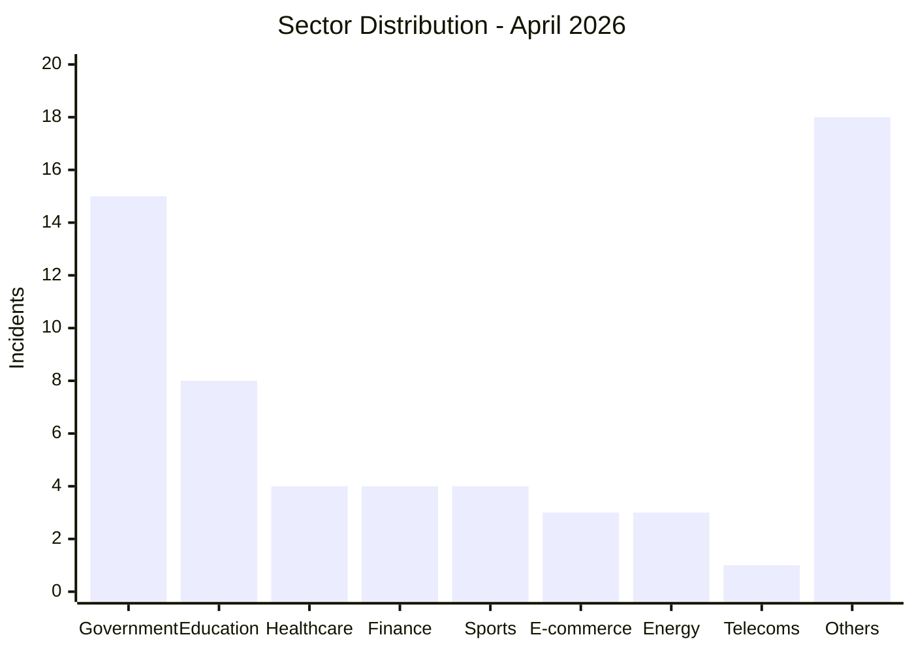

# AFRINTEL - Sector Map
## April 2026

| Sector | Incidents | Percentage |
|---|---:|---:|
| Government / Administration | 15 | 25.0% |
| Education / University | 8 | 13.3% |
| Healthcare / Medical | 4 | 6.7% |
| Finance / Banking | 4 | 6.7% |
| Sports / Federations | 4 | 6.7% |
| E-commerce / Retail | 3 | 5.0% |
| Oil & Energy | 3 | 5.0% |
| Telecommunications | 1 | 1.7% |
| Other sectors | 18 | 30.0% |

