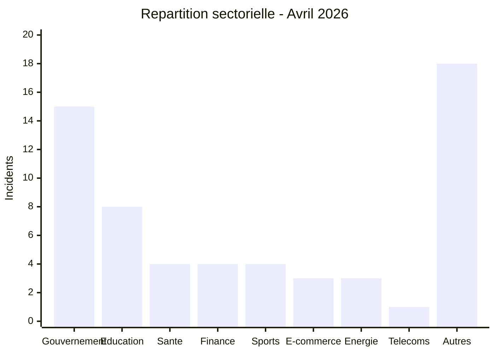

# AFRINTEL — Carte sectorielle
## Avril 2026

| Secteur | Incidents | Pourcentage |
|---|---:|---:|
| Gouvernement / Administration | 15 | 25,0 % |
| Éducation / Université | 8 | 13,3 % |
| Santé / Médical | 4 | 6,7 % |
| Finance / Banque | 4 | 6,7 % |
| Sports / Fédérations | 4 | 6,7 % |
| E-commerce / Retail | 3 | 5,0 % |
| Pétrole & Énergie | 3 | 5,0 % |
| Télécommunications | 1 | 1,7 % |
| Autres secteurs | 18 | 30,0 % |

