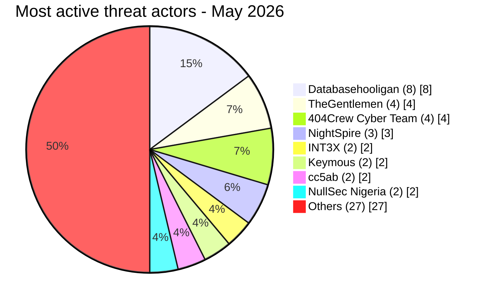
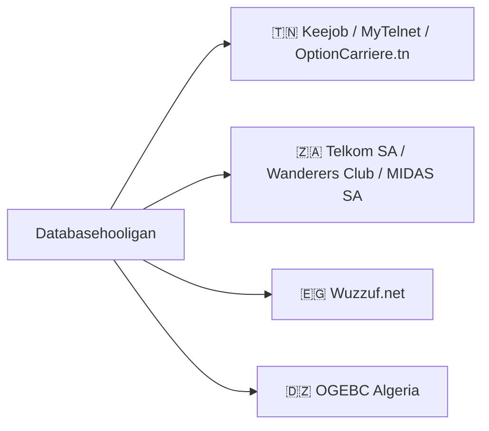
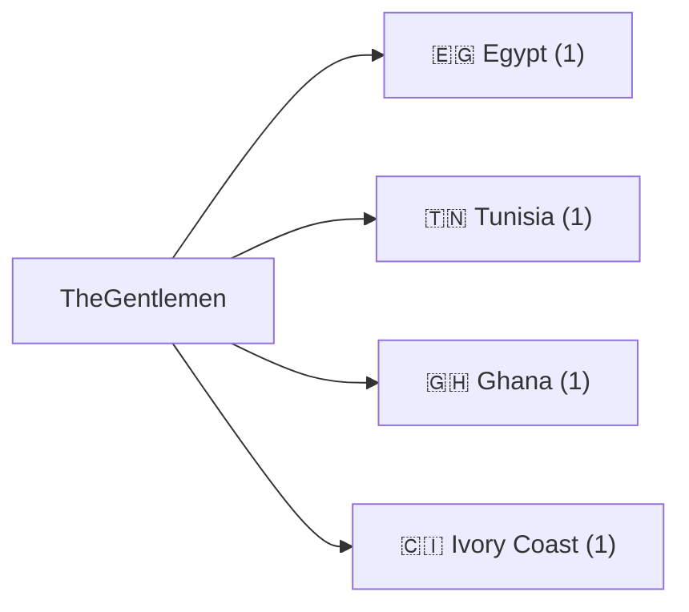
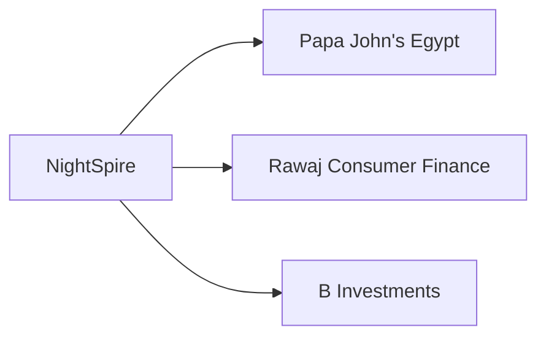
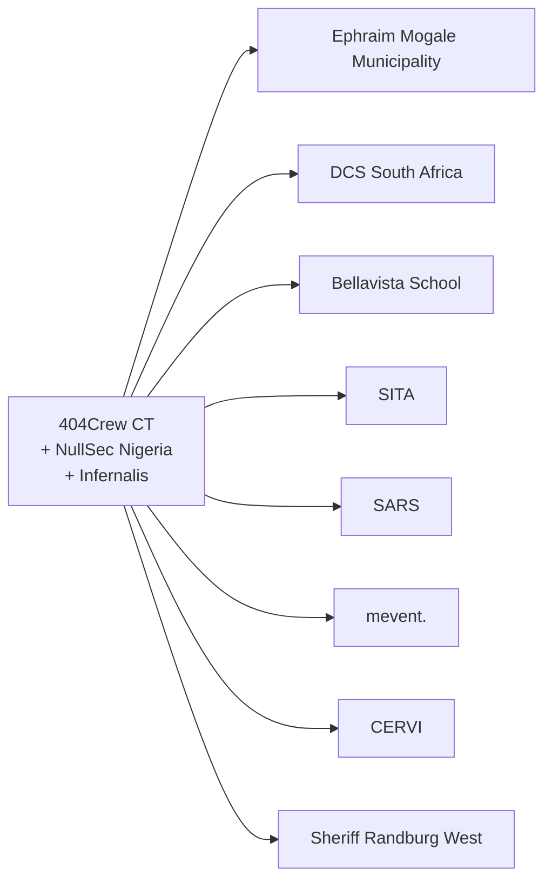

# AFRINTEL - Threat actor intelligence
## Most active actors - May 2026

## Actor profiles

### Databasehooligan, data broker (8 victims)

**Profile:** Dominant data broker. Sells structured CRM and consumer databases. Price range: $900-$1,400. Four countries in May 2026. Systematic exploitation of shared platform vulnerabilities or CRM software.

---

### TheGentlemen, ransomware (4 victims)

**Profile:** Ransomware group with notable geographic reach. Hit 4 African countries in a single month targeting industry, automotive, and food sectors.

---

### NightSpire, ransomware (3 victims, Egypt)

**Profile:** Emerging ransomware group. Concentrated campaign against Egyptian food services and finance sector. Leading ransomware group for May 2026 by African victim count.

---

### 404Crew Cyber Team, data leak coalition (4+ victims, South Africa)

**Profile:** Multi-actor coalition running OpSouthAfrica campaign. Political motivation (xenophobia grievances). Targets South African public institutions combining data leak publication with political messaging.

---

### AuditTeam, ransomware and double extortion (1 victim, Senegal)

**Profile:** Ransomware group. Attacked Tresor Public du Senegal with confirmed double extortion. Most impactful government ransomware incident of May 2026: ~1.66M records exfiltrated (national taxpayer registry, payroll, payment orders with NINEA identifiers and banking coordinates).

---

## Actor activity matrix

| Actor | Type | Ransomware | Data Leak | Access Sale | Countries |
|---|:---:|:---:|:---:|:---:|:---|
| Databasehooligan | Data broker | | 8 | | TN, ZA, EG, DZ |
| TheGentlemen | Ransomware | 4 | | | EG, TN, GH, CI |
| 404Crew CT | Coalition | | 4+ | | ZA |
| NightSpire | Ransomware | 3 | | | EG |
| INT3X | Data leak | | 2 | | EG |
| Keymous | Access/Leak | | 1 | 1 | Multi-country |
| cc5ab | Data leak | | 2 | | EG, KE |
| NullSec Nigeria | Coalition | | 2+ | | ZA |
| AuditTeam | Ransomware | 1 | | | SN |
| Kampuchean | Data broker | | 1 | | TZ |
