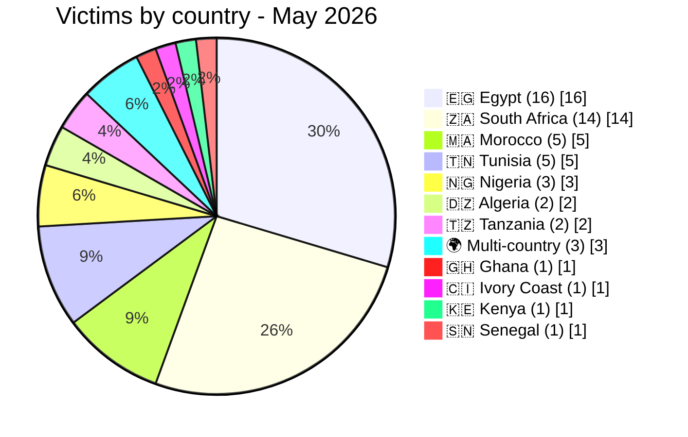
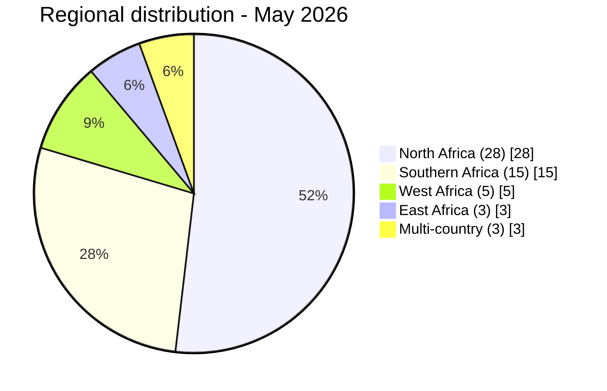

# AFRINTEL — Country Hotspots
## Most affected countries — May 2026

## Risk level by country

| Country | Incidents | Risk level |
|---|---:|:---:|
| 🇪🇬 Egypt | 16 | 🔴 Critical |
| 🇿🇦 South Africa | 14 | 🔴 Critical |
| 🇲🇦 Morocco | 5 | 🟠 High |
| 🇹🇳 Tunisia | 5 | 🟠 High |
| 🇳🇬 Nigeria | 3 | 🟠 Medium-High |
| 🇩🇿 Algeria | 2 | 🟡 Medium |
| 🇹🇿 Tanzania | 2 | 🟠 Medium-High |
| 🇬🇭 Ghana | 1 | 🟡 Low-Medium |
| 🇨🇮 Ivory Coast | 1 | 🟡 Low-Medium |
| 🇰🇪 Kenya | 1 | 🟡 Low-Medium |
| 🇸🇳 Senegal | 1 | 🟡 Low-Medium |
| 🌍 Multi-country | 3 | 🟠 Medium-High |

## Regional breakdown

