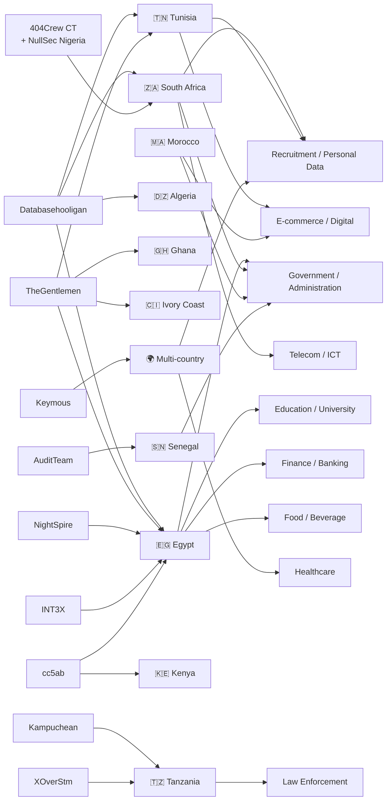

# AFRINTEL — CTI Ecosystem Map
## Actors → Countries → Sectors — May 2026

```mermaid
flowchart LR
Databasehooligan["Databasehooligan"] --> TN["🇹🇳 Tunisia"]
Databasehooligan --> ZA["🇿🇦 South Africa"]
Databasehooligan --> EG["🇪🇬 Egypt"]
Databasehooligan --> DZ["🇩🇿 Algeria"]
TheGentlemen["TheGentlemen"] --> EG
TheGentlemen --> TN
TheGentlemen --> GH["🇬🇭 Ghana"]
TheGentlemen --> CI["🇨🇮 Ivory Coast"]
NightSpire["NightSpire"] --> EG
AuditTeam["AuditTeam"] --> SN["🇸🇳 Senegal"]
INT3X["INT3X"] --> EG
C404Crew["404Crew CT\n+ NullSec Nigeria"] --> ZA
Keymous["Keymous"] --> MULTI["🌍 Multi-country"]
Kampuchean["Kampuchean"] --> TZ["🇹🇿 Tanzania"]
XOverStm["XOverStm"] --> TZ
cc5ab["cc5ab"] --> EG
cc5ab --> KE["🇰🇪 Kenya"]
EG --> GOV["Government / Administration"]
EG --> EDU["Education / University"]
EG --> FIN["Finance / Banking"]
EG --> FOOD["Food / Beverage"]
ZA --> GOV
ZA --> RECRUIT["Recruitment / Personal Data"]
ZA --> TELECOM["Telecom / ICT"]
TN --> RECRUIT
TN --> ECOM["E-commerce / Digital"]
MA["🇲🇦 Morocco"] --> GOV
MA --> ECOM
SN --> GOV
TZ --> LAW["Law Enforcement"]
MULTI --> HEALTH["Healthcare"]
MULTI --> RECRUIT
```
