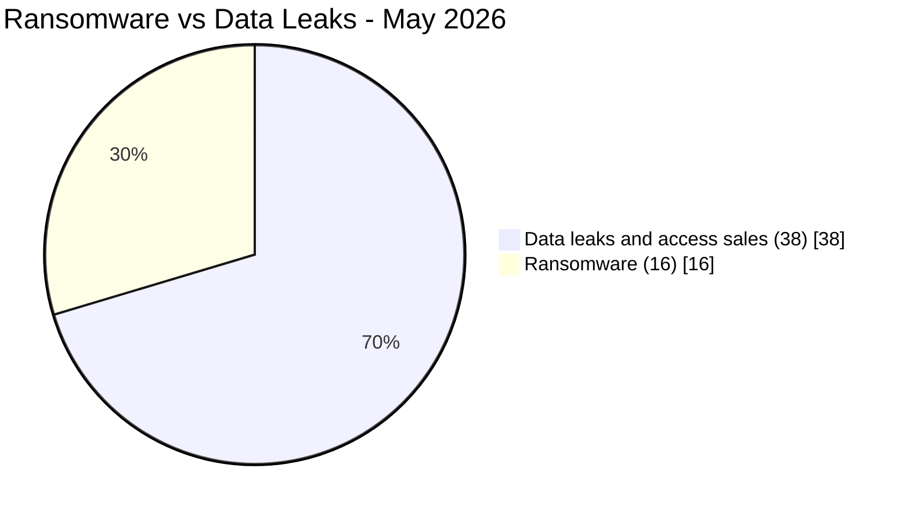
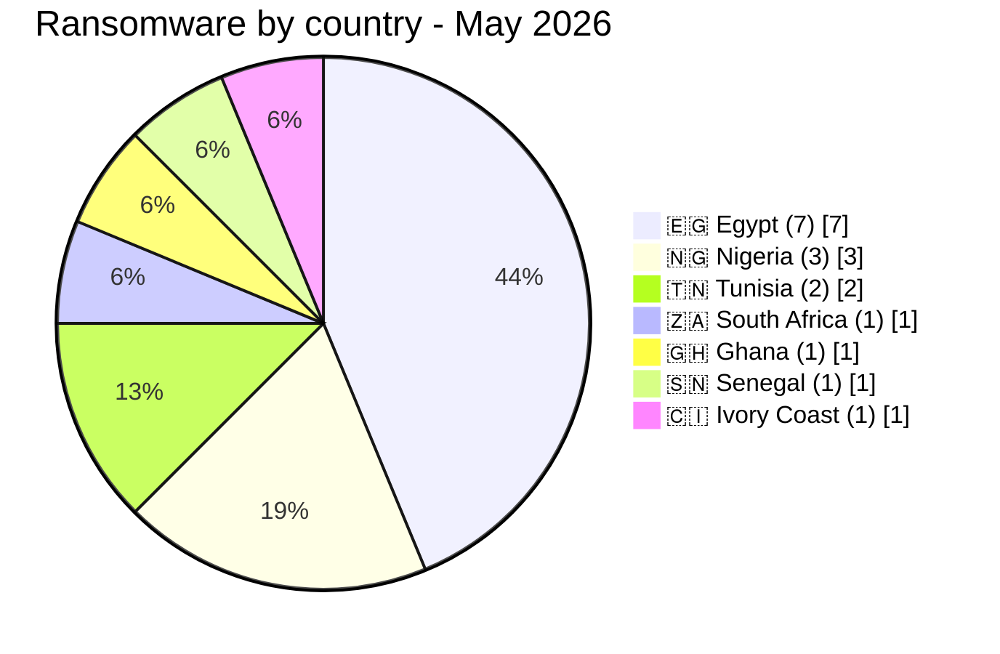
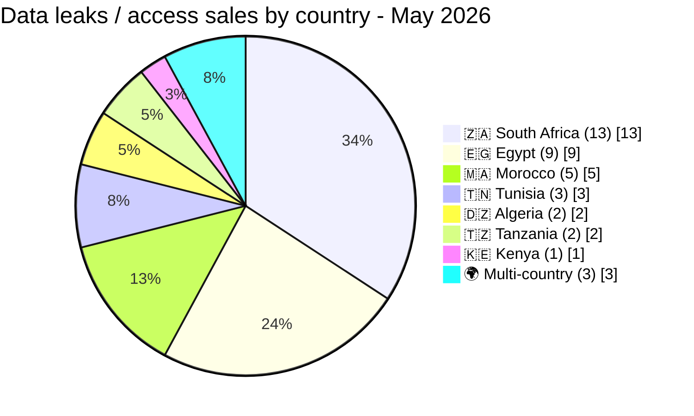

# AFRINTEL - Ransomware vs data leaks
## May 2026

## Ransomware distribution by country

## Data leaks distribution by country

## Ransomware groups active in May 2026

| Group | Victims | Countries |
|---|:---:|:---|
| NightSpire | 3 | Egypt (Papa John's, Rawaj, B Investments) |
| TheGentlemen | 4 | Egypt, Tunisia, Ghana, Ivory Coast |
| AuditTeam | 1 | Senegal (Tresor Public) |
| MedusaLocker | 1 | Nigeria |
| KillSec | 1 | Nigeria |
| 0day Syndicate | 1 | Nigeria |
| Qilin | 1 | Egypt |
| LockBit 5.0 | 1 | Egypt |
| Lamashtu | 1 | Egypt |
| PrinzEugen | 1 | South Africa (Standard Bank claim) |
| Titan | 1 | Tunisia |

## Side-by-side country comparison

| Country | Ransomware | Data Leaks | Visual |
|---|:---:|:---:|:---|
| 🇪🇬 Egypt | 7 | 9 | 🟧🟧🟧🟧🟧🟧🟧 🟦🟦🟦🟦🟦🟦🟦🟦🟦 |
| 🇿🇦 South Africa | 1 | 13 | 🟧 🟦🟦🟦🟦🟦🟦🟦🟦🟦🟦🟦🟦🟦 |
| 🇲🇦 Morocco | 0 | 5 | 🟦🟦🟦🟦🟦 |
| 🇹🇳 Tunisia | 2 | 3 | 🟧🟧 🟦🟦🟦 |
| 🇳🇬 Nigeria | 3 | 0 | 🟧🟧🟧 |
| 🇩🇿 Algeria | 0 | 2 | 🟦🟦 |
| 🇹🇿 Tanzania | 0 | 2 | 🟦🟦 |
| 🇬🇭 Ghana | 1 | 0 | 🟧 |
| 🇨🇮 Ivory Coast | 1 | 0 | 🟧 |
| 🇰🇪 Kenya | 0 | 1 | 🟦 |
| 🇸🇳 Senegal | 1 | 0 | 🟧 |
| 🌍 Multi-country | 0 | 3 | 🟦🟦🟦 |

*Legend: 🟧 Ransomware | 🟦 Data Leaks*
