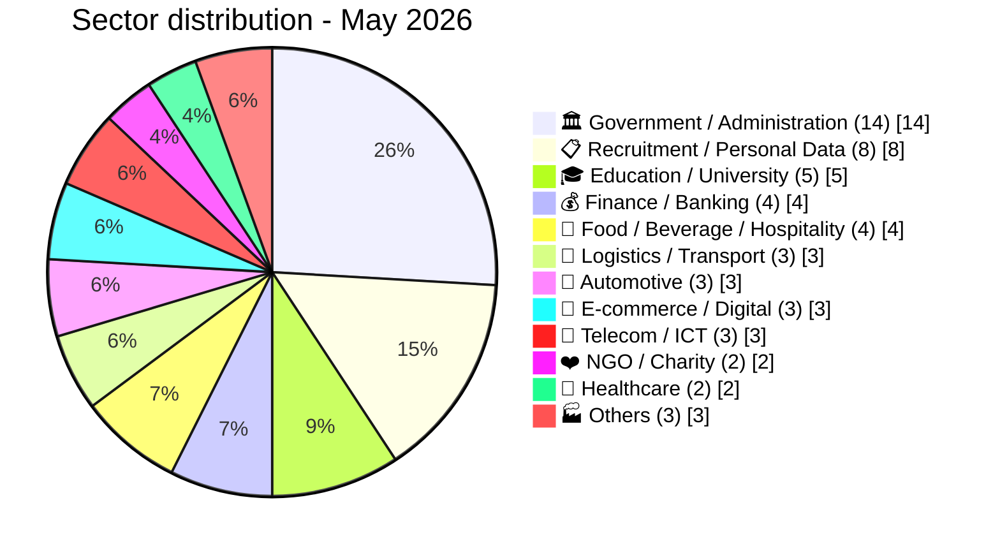

# AFRINTEL - Sector map
## Sector exposure - May 2026

## Key sector observations

- **Government / Administration (14 incidents, 25.9%):** the dominant target category in May 2026. Includes OpSouthAfrica campaign (8 SA institutions), Tresor Public du Senegal (ransomware), Tanzania Police webmail, and government credential sales.
- **Education / University (5 incidents, 9.3%):** systemic breach of Egypt's education infrastructure: Ministry of Education (26.8M records), Professional Academy for Teachers (1.2M), Mansoura University (989K), and combined Educational & HR database (37 GB). Four of five education incidents targeted Egypt alone.
- **Recruitment / Personal Data (8 incidents, 14.8%):** Databasehooligan drove this category with structured CRM databases from Telkom SA, Wanderers Club, Wuzzuf.net, MyTelnet, OptionCarriere.tn, Keejob, MIDAS SA, OGEBC Algeria.
- **Healthcare (2 incidents, 3.7%):** DHIS2 multi-country health system access sale (7 countries) is the most severe, combining public health data sovereignty risks across Mozambique, Liberia, Nigeria, Togo, and Sierra Leone.

## Sector risk matrix

| Sector | Incidents | Volume impact | Sensitivity | Priority |
|---|:---:|:---:|:---:|:---:|
| Government / Administration | 14 | High | Critical | 🔴 |
| Education / University | 5 | Very High (28M+ records) | High | 🔴 |
| Recruitment / Personal Data | 8 | High (CRM databases) | Medium | 🟠 |
| Healthcare | 2 | Medium (7 countries) | Critical | 🔴 |
| Finance / Banking | 4 | Medium | High | 🟠 |
| Law Enforcement | 1 | Medium (10K+ accounts) | Critical | 🔴 |
