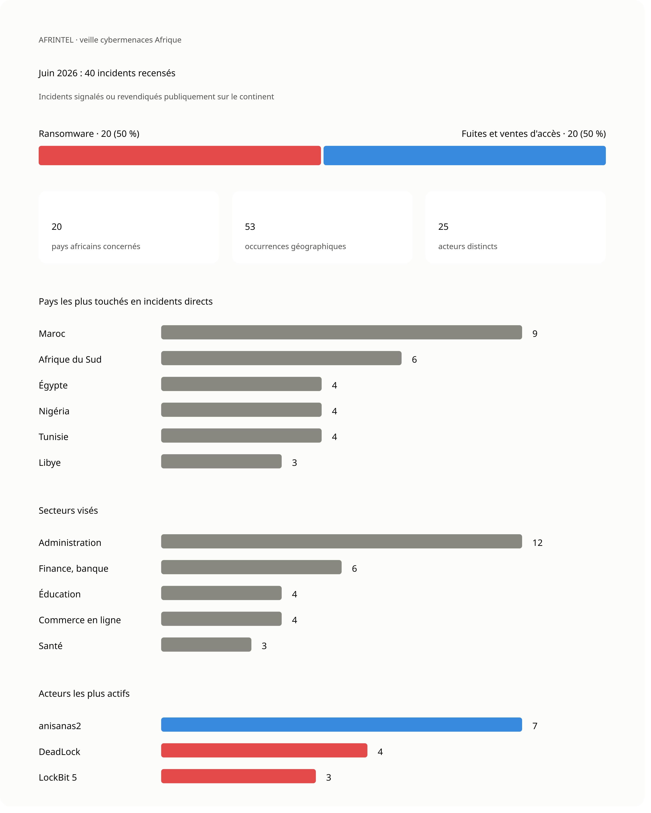

# Visual intelligence AFRINTEL - juin 2026

👉🏾 [English version](./README.md)

## Objectif

Ce dossier présente des visualisations dérivées des 40 fiches d'incidents documentées par AFRINTEL en juin 2026.

## Chiffres clés

- **40 incidents uniques**
- **20 incidents ransomware**
- **20 fuites de données ou ventes d'accès**
- **14 libellés pays directs**
- **20 pays africains représentés après éclatement de deux fiches multi-pays**
- **53 occurrences géographiques**
- **25 acteurs ou sources distincts**

## Carte visuelle de juin

## Fichiers disponibles

| Fichier | Description |
|---|---|
| [ecosystem-map_june_2026_fr.md](./ecosystem-map_june_2026_fr.md) | Relations sélectionnées entre acteurs, pays et secteurs |
| [country-hotspots_june_2026_fr.md](./country-hotspots_june_2026_fr.md) | Répartition géographique directe et développée |
| [sector-map_june_2026_fr.md](./sector-map_june_2026_fr.md) | Répartition des 40 incidents par secteur explicite |
| [ransomware-vs-leaks_june_2026_fr.md](./ransomware-vs-leaks_june_2026_fr.md) | Comparaison entre ransomware et fuites |
| [actors_june_2026_fr.md](./actors_june_2026_fr.md) | Acteurs et sources les plus actifs |
| [afrintel_juin_2026_carte.png](./afrintel_juin_2026_carte.png) | Carte visuelle de juin 2026 |

## Règles de comptage

Chaque fiche compte une fois dans le total global. Les deux fiches multi-pays comptent comme deux incidents, mais produisent 15 expositions africaines dans la vue géographique développée. La Palestine et le Yémen sont exclus de la vue géographique africaine.

Aucune double revendication étayée concernant une même victime n'a été identifiée dans les fiches de juin. Les publications répétées attribuées à anisanas2 concernent des cibles marocaines différentes et sont représentées comme une continuité d'activité de la source, pas comme une campagne d'intrusion commune.

Source : [victimes de juin](../../CyberAttackAfrica/2026/06-june/victims_FR.md).
