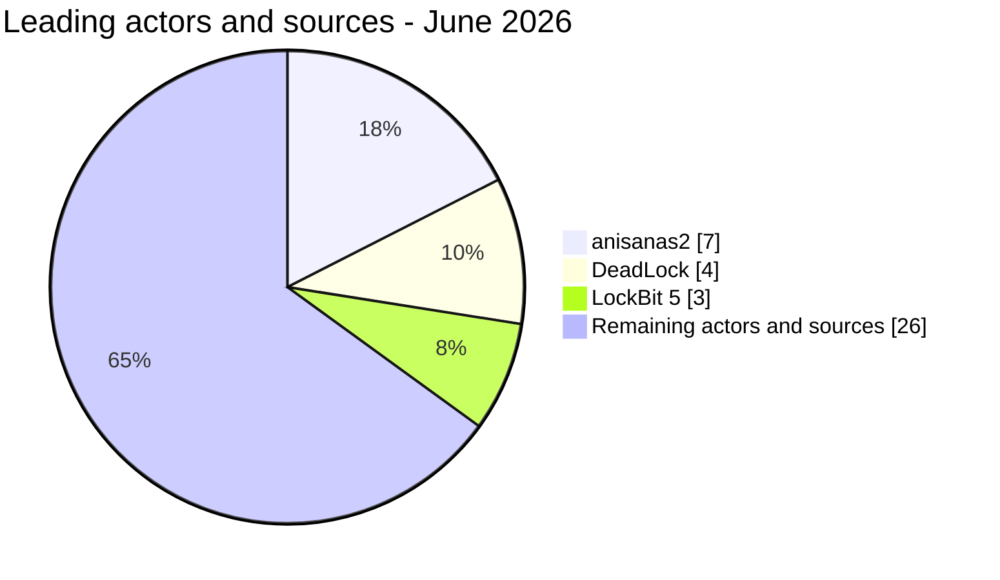

# AFRINTEL actor activity

## Most active actors and sources - June 2026

| Actor or source | Records | Activity | Geographic focus |
|---|---:|---|---|
| anisanas2 | 7 | Data publications and sales | 🇲🇦 Morocco |
| DeadLock | 4 | Ransomware | 🇬🇦 Gabon, 🇳🇬 Nigeria, 🇾🇹 Mayotte, 🇰🇪 Kenya |
| LockBit 5 | 3 | Ransomware | 🇧🇼 Botswana, 🇿🇦 South Africa, 🇲🇺 Mauritius |
| 22 remaining actors or sources | 26 | Ransomware, leaks and access sales | Multiple countries |
| **Total** | **40** | | |

The seven anisanas2 records concern different Moroccan targets. They establish repeated source activity, not a common initial-access vector or a single shared intrusion.
