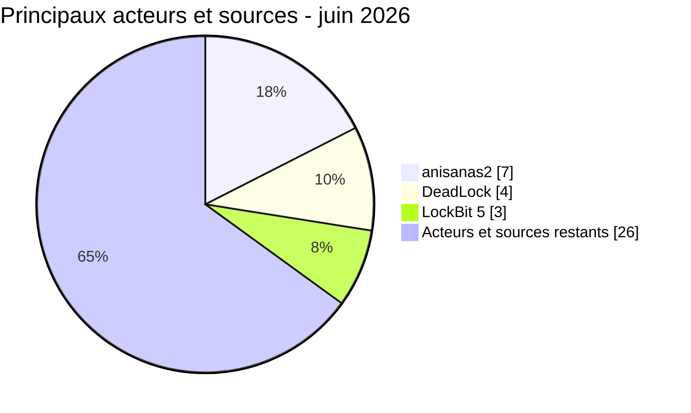

# Activité des acteurs AFRINTEL

## Acteurs et sources les plus actifs - juin 2026

| Acteur ou source | Fiches | Activité | Concentration géographique |
|---|---:|---|---|
| anisanas2 | 7 | Publications et ventes de données | 🇲🇦 Maroc |
| DeadLock | 4 | Ransomware | 🇬🇦 Gabon, 🇳🇬 Nigeria, 🇾🇹 Mayotte, 🇰🇪 Kenya |
| LockBit 5 | 3 | Ransomware | 🇧🇼 Botswana, 🇿🇦 Afrique du Sud, 🇲🇺 Maurice |
| 22 acteurs ou sources restants | 26 | Ransomware, fuites et ventes d'accès | Plusieurs pays |
| **Total** | **40** | | |

Les sept fiches anisanas2 concernent des cibles marocaines différentes. Elles établissent une activité répétée de la source, pas un vecteur d'accès initial commun ni une intrusion partagée.
