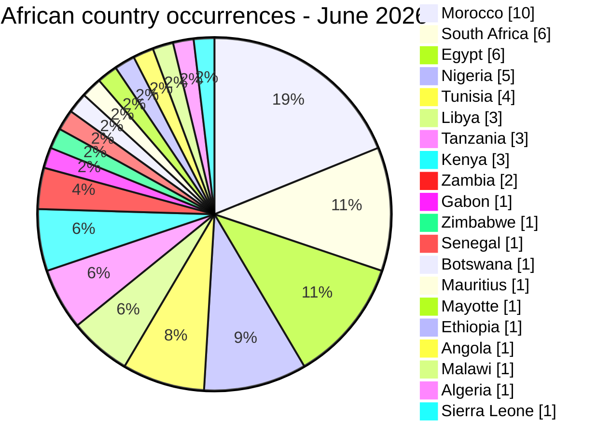

# AFRINTEL country hotspots

## Geographic exposure - June 2026

### Direct incident labels

The direct view contains 38 single-country records and two multi-country records.

| Country | Direct incidents | Chart |
|---|---:|---|
| 🇲🇦 Morocco | 9 | █████████ |
| 🇿🇦 South Africa | 6 | ██████ |
| 🇪🇬 Egypt | 4 | ████ |
| 🇳🇬 Nigeria | 4 | ████ |
| 🇹🇳 Tunisia | 4 | ████ |
| 🇱🇾 Libya | 3 | ███ |
| 🇹🇿 Tanzania | 1 | █ |
| 🇸🇳 Senegal | 1 | █ |
| 🇰🇪 Kenya | 1 | █ |
| 🇬🇦 Gabon | 1 | █ |
| 🇿🇼 Zimbabwe | 1 | █ |
| 🇧🇼 Botswana | 1 | █ |
| 🇲🇺 Mauritius | 1 | █ |
| 🇾🇹 Mayotte | 1 | █ |
| 🌍 Multi-country | 2 | ██ |
| **Total** | **40** | |

### Expanded African exposure

The expanded view totals 53 geographic occurrences across 20 African countries. It does not change the analytical total of 40 incidents.
