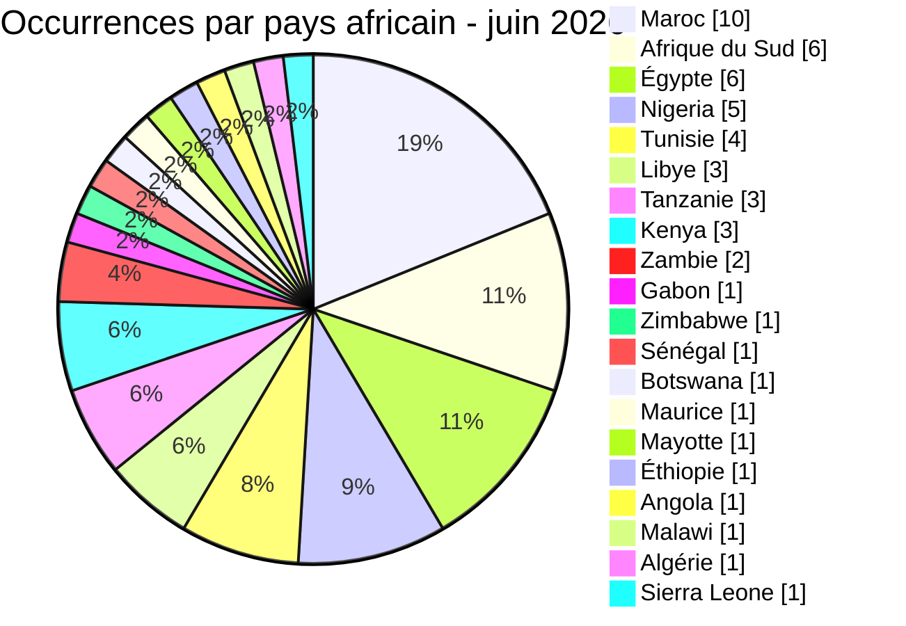

# Points chauds géographiques AFRINTEL

## Exposition géographique - juin 2026

### Libellés directs des incidents

La vue directe contient 38 fiches mono-pays et deux fiches multi-pays.

| Pays | Incidents directs | Graphique |
|---|---:|---|
| 🇲🇦 Maroc | 9 | █████████ |
| 🇿🇦 Afrique du Sud | 6 | ██████ |
| 🇪🇬 Égypte | 4 | ████ |
| 🇳🇬 Nigeria | 4 | ████ |
| 🇹🇳 Tunisie | 4 | ████ |
| 🇱🇾 Libye | 3 | ███ |
| 🇹🇿 Tanzanie | 1 | █ |
| 🇸🇳 Sénégal | 1 | █ |
| 🇰🇪 Kenya | 1 | █ |
| 🇬🇦 Gabon | 1 | █ |
| 🇿🇼 Zimbabwe | 1 | █ |
| 🇧🇼 Botswana | 1 | █ |
| 🇲🇺 Maurice | 1 | █ |
| 🇾🇹 Mayotte | 1 | █ |
| 🌍 Multi-pays | 2 | ██ |
| **Total** | **40** | |

### Exposition africaine développée

La vue développée totalise 53 occurrences géographiques dans 20 pays africains. Elle ne modifie pas le total analytique de 40 incidents.
