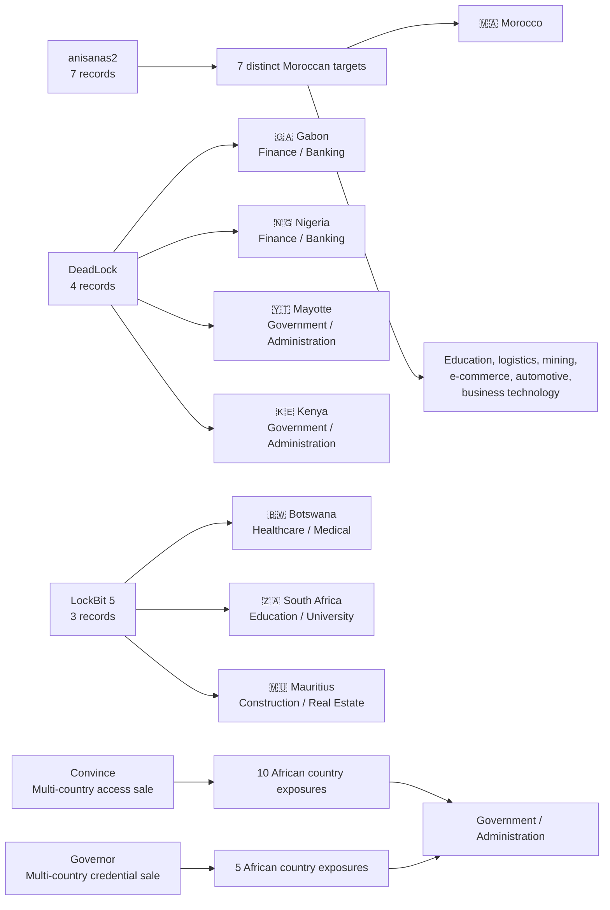

# AFRINTEL CTI ecosystem map

## Selected actor, country and sector relationships - June 2026

## Reading note

The map selects the leading actors and the two multi-country records to remain readable. Each edge is derived from an explicit June incident card. The seven anisanas2 records concern distinct organizations; the map does not represent them as one shared intrusion.
