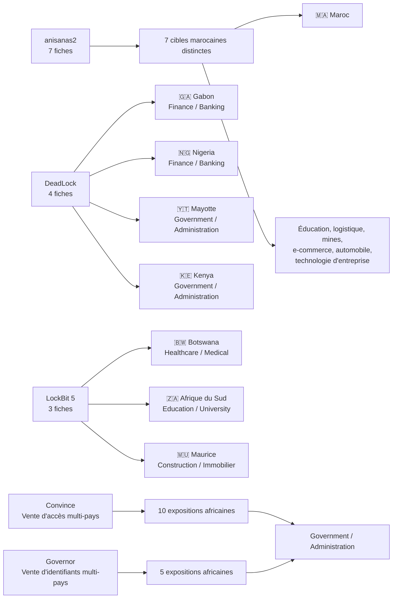

# Carte de l'écosystème CTI AFRINTEL

## Relations sélectionnées entre acteurs, pays et secteurs - juin 2026

## Note de lecture

La carte sélectionne les principaux acteurs et les deux fiches multi-pays afin de rester lisible. Chaque relation dérive d'une fiche explicite de juin. Les sept fiches anisanas2 concernent des organisations distinctes ; la carte ne les représente pas comme une intrusion partagée.
