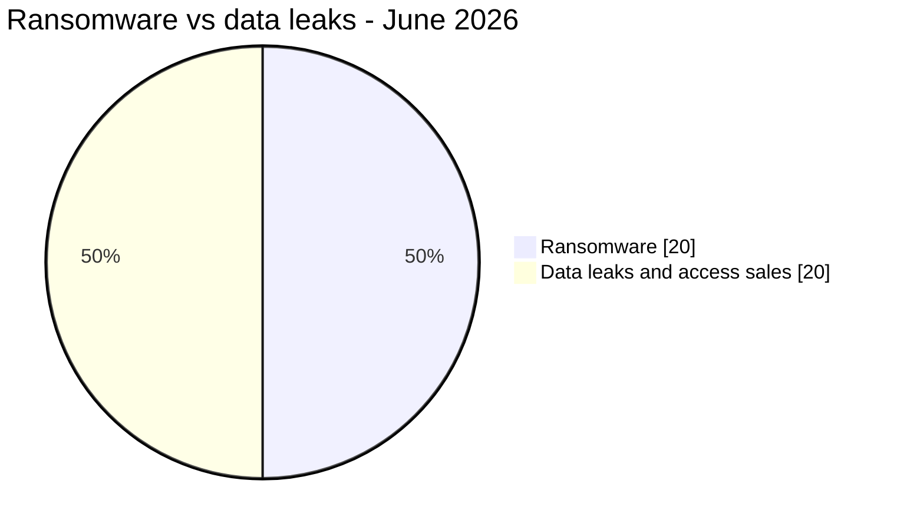

# AFRINTEL ransomware vs data leaks

## Incident distribution - June 2026

| Incident category | Records | Share |
|---|---:|---:|
| 🟧 Ransomware | 20 | 50.0% |
| 🟦 Data leaks and access sales | 20 | 50.0% |
| **Total** | **40** | **100%** |

## Expanded geographic comparison

| Country | Ransomware | Leak-related occurrences |
|---|---:|---:|
| 🇲🇦 Morocco | 1 | 9 |
| 🇿🇦 South Africa | 4 | 2 |
| 🇪🇬 Egypt | 3 | 3 |
| 🇳🇬 Nigeria | 1 | 4 |
| 🇹🇳 Tunisia | 3 | 1 |
| 🇱🇾 Libya | 1 | 2 |
| 🇹🇿 Tanzania | 0 | 3 |
| 🇰🇪 Kenya | 1 | 2 |
| 🇿🇲 Zambia | 0 | 2 |
| Remaining countries | 6 | 5 |
| **Geographic occurrences** | **20** | **33** |

The 33 leak-related occurrences result from 20 unique records after allocating the two multi-country offers to the African countries explicitly named in them.
