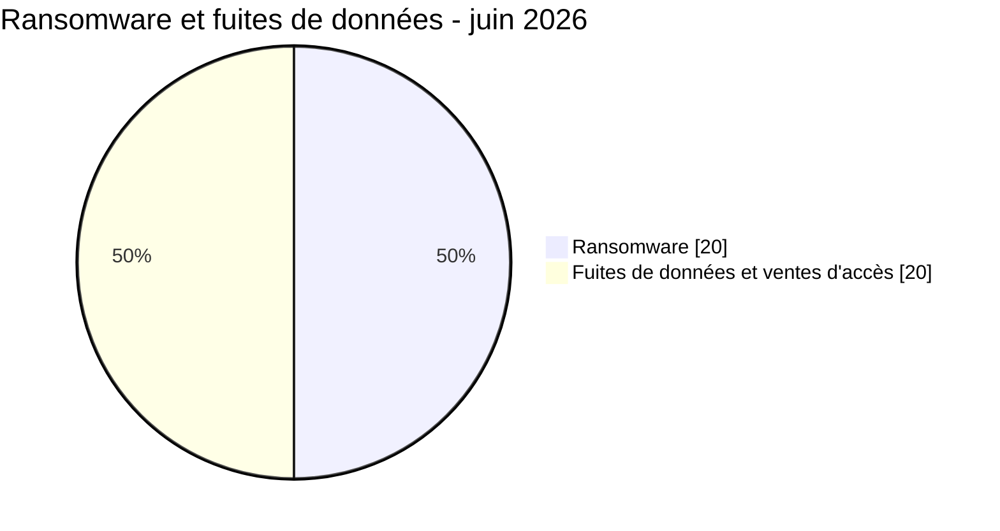

# AFRINTEL ransomware et fuites de données

## Répartition des incidents - juin 2026

| Catégorie d'incident | Fiches | Part |
|---|---:|---:|
| 🟧 Ransomware | 20 | 50,0 % |
| 🟦 Fuites de données et ventes d'accès | 20 | 50,0 % |
| **Total** | **40** | **100 %** |

## Comparaison géographique développée

| Pays | Ransomware | Occurrences liées aux fuites |
|---|---:|---:|
| 🇲🇦 Maroc | 1 | 9 |
| 🇿🇦 Afrique du Sud | 4 | 2 |
| 🇪🇬 Égypte | 3 | 3 |
| 🇳🇬 Nigeria | 1 | 4 |
| 🇹🇳 Tunisie | 3 | 1 |
| 🇱🇾 Libye | 1 | 2 |
| 🇹🇿 Tanzanie | 0 | 3 |
| 🇰🇪 Kenya | 1 | 2 |
| 🇿🇲 Zambie | 0 | 2 |
| Pays restants | 6 | 5 |
| **Occurrences géographiques** | **20** | **33** |

Les 33 occurrences liées aux fuites proviennent de 20 fiches uniques après répartition des deux offres multi-pays entre les pays africains explicitement cités.
