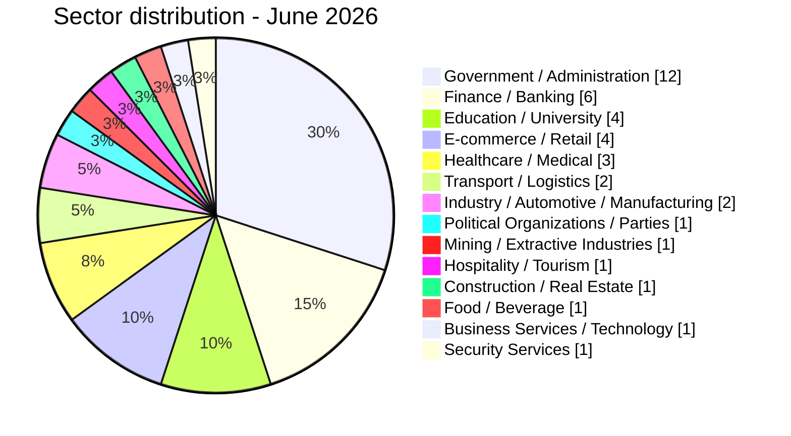

# AFRINTEL sector map

## Sector exposure - June 2026

| Sector | Incidents | Share |
|---|---:|---:|
| Government / Administration | 12 | 30.0% |
| Finance / Banking | 6 | 15.0% |
| Education / University | 4 | 10.0% |
| E-commerce / Retail | 4 | 10.0% |
| Healthcare / Medical | 3 | 7.5% |
| Transport / Logistics | 2 | 5.0% |
| Industry / Automotive / Manufacturing | 2 | 5.0% |
| Political Organizations / Parties | 1 | 2.5% |
| Mining / Extractive Industries | 1 | 2.5% |
| Hospitality / Tourism | 1 | 2.5% |
| Construction / Real Estate | 1 | 2.5% |
| Food / Beverage | 1 | 2.5% |
| Business Services / Technology | 1 | 2.5% |
| Security Services | 1 | 2.5% |
| **Total** | **40** | **100%** |

Government / Administration accounts for 12 records. Finance / Banking follows with 6. The remaining 22 records are distributed across 12 explicit sectors; no residual sector category is used.
